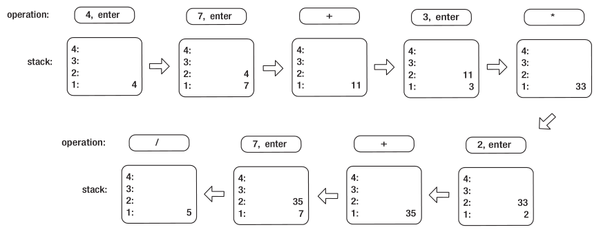

# 定义用例

## 1.1 简介

  这本书是关于编程设计的。 但是，与许多有关此主题的书不同，这本书讲授的是探索性设计，而不是指导性设计。 通常，大多数作者在撰写有关设计方面文章时，都会建立他们想要传达的原理，将这些原理抽象化，然后继续给出支持当前观点的示例。 但是，本书不是这样子。 本书定义了要解决的实际问题，并着手详细研究其解决方案。 也就是说，我定义了一个难题，然后让这个问题的解决方案来决定应该讨论哪些主题，而不是决定一个主题并创建一些琐碎的例子来支持它的教学。

  有趣的是，以上方法正是我要告诉别人在学习一门学科时不要采用的一种学习方法。我一直强调，人们应该首先学习广泛的基本原理，然后将这些原理应用到解决问题上。然而，这不是一本旨在教授设计原理的书。 更确切地说，这本书是为那些已经知道基本原理但希望加深实践知识的人准备的。 这是一本旨在教会别人从头到尾设计和实现一个现实的，尽管很小的程序。 这个过程不仅是了解设计元素。 它还包括理解何时以及如何使用所学知识，理解如何在看似等效的方法之间做出决定，以及理解各种决策的长期影响。本书对数据结构，算法，设计模式或C ++最佳实践的介绍并不全面。已经有很多书籍涵盖了这些主题。这是一本关于学习如何应用这些知识来编写有组织，有凝聚力，有意义，有目的和有实用性的代码的书。 换句话说，这本书是关于学习编写既可以完成现在的工作（开发）又可以让其他人在将来继续完成工作（维护）的代码。我称之为实用设计。

  为了探索实用设计，我们需要一个案例研究。 理想情况下，案例研究的问题应该是

* 足够大以至于不琐碎，
* 足够小以至于易处理，
* 足够熟悉，不需要特定领域的专业知识，并且
* 有趣到足以保持读者的注意力

  在考虑了上述标准之后，我决定选择一个基于堆栈的反向波兰符号（RPN）计算器作为案例研究。计算器要求的细节将在下面定义。我相信一个功能齐全的计算器的代码是非常重要的，对它的设计的详细研究可以提供足够的材料来覆盖一本书。然而，这个项目很小，所以这本书可以是一个合理的长度。当然，不需要专业领域的专业知识。我怀疑这本书的每一位读者都使用过计算器，并且对它的基本功能非常熟悉。最后，我希望让计算器RPN提供一个合适的转折点来避免无聊。

## 1.2 关于需求的几句话

  无论大小，所有程序都有需求。需求是程序必须遵守的那些功能，无论是显式的还是隐式的。 市面上已经有很多有关收集和管理软件需求的书籍（参见[28]或[21]）。 通常，尽管已经尽了最大的努力，但实际上不可能预先收集所有需求。 有时，所需的工作在经济上是不可行的。 有时，领域专家会忽略看起来似乎很明显的需求，而他们只是忽略了将所有需求与开发团队联系起来。有时，需求只有在程序开始成形后才变得显而易见。 有时，客户对自己的需求了解得不够好，无法向开发团队清楚地表达这些需求。 尽管可以使用敏捷开发方法来缓解其中的一些困难，但实际上，许多设计决策（其中一些可能具有深远的影响）必须在所有需求都知晓之前确定。

  在本书中，您不会学习收集需求的技术； 相反，需求只是简单地预先给出。嗯，大部分的需求都是预先给出的，但是有一些需求已明确保留到后面的章节，以便您可以研究如何更改设计以适应未来未知的扩展。当然，人们可以理直气壮地争辩说，因为作者知道需求将如何变化，所以最初的设计将正确地“预测”不可预见的功能。尽管这种批评是公正的，但我还是认为，设计决策背后的思考过程和讨论才更有意义。作为一名软件架构师，您的一部分工作就是预见未来的需求。虽然可以提出任何要求，但一开始就引入太多的灵活性是不经济的。在为将来的扩展进行设计时，必须始终权衡利弊：考虑在一开始就预先设计可扩展性，还是以后有需要时再进行更改。

## 1.3 逆波兰符号

  我想任何正在阅读本书的人都熟悉计算器的基本操作。但是，除非您从小使用惠普计算器，否则您可能不熟悉基于堆栈的RPN计算器的工作原理(如果您不熟悉堆栈的工作原理，请参阅[5])。简单地说，将输入的数字压入堆栈，并对堆栈中已有的数字执行操作。二元运算符(如加法)从堆栈中弹出最上面的两个数字，将这两个数字相加，然后将结果压入堆栈。一元运算符(如正弦函数)从堆栈顶部弹出一个数字，将该数字用作操作数，然后将结果压入堆栈。对于那些熟悉基本编译器行话的人来说，RPN用作操作的后缀表示法(有关后缀表示法的详细讨论，请参阅[1])。下面的列表描述了我对反向波兰语记法相对于传统语法的几个优势的看法：

* 所有操作都可以不用括号表示。

* 可以同时显示多个输入和输出。

* 大型计算可以简单地分解为多个简单的操作。

* 中间结果可以简单地保留和重复使用。

  尽管RPN乍一看似乎令人难以置信，但是一旦您习惯了RPN，当您承担执行比简单算术更复杂的任务时，就会诅咒所有不使用RPN的计算器。
  为了确保RPN计算器的操作清晰易懂，我们来看一个简短的示例。 假设我们希望评估以下表达式：
  

  $$
  \frac{(4+7)*3+2}{7}
  $$

在典型的非RPN计算器上，我们将键入((4+7)\*3+2)/7，然后按=键。在RPN计算器上，我们将改为键入4 7+3\*2+7/，其中每个数字后面都有一个Enter命令，以便将输入压入堆栈。请注意，对于许多计算器来说，为了减少键输入，诸如+之类的操作还可以用于隐式地输入堆栈上的前一个数字。图1-1显示了在RPN计算器上逐步执行的上述计算。

## 1.4 计算器的需求

一旦了解了逆波兰表示法的性质，计算器的其余功能应从需求描述中直接体现出来。 如果RPN仍不清楚，我建议您在继续之前花一些时间来理解这个概念。 鉴于此，现在对计算器的需求定义如下：

* 计算器将基于堆栈；堆栈大小不应该硬编码。

* 计算器将使用RPN执行操作。

* 计算器将仅对浮点数进行操作；应当采用一种输入数字（包括科学计数法）的技术。

* 计算器将具有撤消和重做操作的能力；撤消/重做堆栈的大小应该不受限制。

* 计算器将能够交换堆栈的前两个元素。

* 计算器将能够从堆栈顶部删除（擦除）元素。

* 计算器将能够清除整个堆栈。

* 计算器将能够从堆栈顶部复制元素。

* 计算器将能够从堆栈顶部取反元素。

* 计算器将执行四个基本的算术运算：加法，减法，乘法和除法。不允许除以0。

* 计算器将实现三个基本的三角函数及其反函数：sin，cos，tan，arcsin，arccos和arctan。三角函数的参数将以弧度给出。

* 计算器将实现
  $$
  y^x
  $$
  和
  $$
  \sqrt[x]{y}
  $$
  的功能

* 计算器将实现运行时插件结构，以扩展计算器可执行的操作。
* 计算器将同时实现命令行界面（CLI）和图形用户界面（GUI）。
* 计算器将不支持无穷或虚数。
* 计算器将具有容错能力（即，如果用户输入错误，则不会崩溃），但不需要处理浮点异常。

既然计算器有了要求，就应该起一个名字。 我选择将其称为pdCalc计算器，它是实用设计计算器的缩写。 由于我缺乏命名创意，请接受我的歉意。

本书的其余部分将详细研究满足上述要求的计算器的完整设计。 除了描述最终设计的决策之外，我还将讨论替代方案，以便您了解为何做出最终决策以及不同决策可能带来的后果。 请注意，本书介绍的最终设计不是唯一可以满足要求的设计，甚至可能不是满足要求的最佳设计。 我鼓励有抱负的读者尝试替代设计，并扩展计算器以满足他或她自己的需求和兴趣。

## 1.5 源代码

在本书的整个内容中，您将在设计计算器时检查许多代码段。 这些代码片段中的大多数直接从pdCalc的GitHub源代码库中获取（有关下载源代码的说明，请参阅附录A）。 我将指出文本中的代码与存储库中的代码之间的任何重大差异。 有时，代码片段由一些小的，人为的示例组成。 这些代码段不属于pdCalc的源存储库。 所有代码都在GPL版本3 [7]下可用。 我强烈建议您尝试使用源代码并以您认为合适的任何方式对其进行修改。

为了构建pdCalc，您将需要访问C ++ 14兼容编译器和Qt（版本4或5）。由于项目具有固有的Qt依赖关系（并且由于我喜欢Qt Creator IDE），因此我将Qt项目文件用于构建系统，将Qt Test用于单元测试框架。我已经使用gcc / mingw在Linux和Windows上构建并测试了该程序，但是代码也应该在附加系统上或使用附加编译器进行构建和执行，而几乎不需要修改源代码。要移植到其他平台，必须对qmake项目文件进行一些调整。因为我希望本书的读者倾向于具有多年经验的开发人员，所以我怀疑从源代码构建代码将是一项相当琐碎的任务。但是，为了完整起见，我在附录A中包含了构建指南。此外，我还包括了附录B以解释pdCalc的源代码，库和可执行文件的组织方式。尽管这两个附录出现在本书的末尾，但是如果您打算构建pdCalc并在阅读本文时探索其完整实现，则不妨先阅读它们。