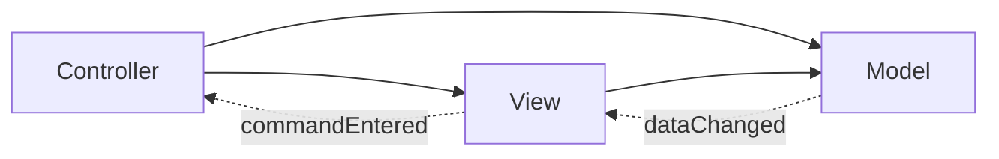

# 分解

软件是复杂的，是人类有史以来最复杂的工作之一。当您第一次阅读大型编程项目的需求文档时，您可能会不知所措。那是预料之中的； 任务是压倒性的！ 因此，大型编程项目通常从分析开始。

项目的分析阶段包括花费时间探索问题域，以便完全理解问题，明确要求并解决客户域和开发者域之间的任何歧义。在没有完全理解问题的情况下，作为架构师或开发人员的您绝对没有机会开发可维护的设计。但是，对于本书选择的案例研究，您应该熟悉该领域（如果不熟悉，则不妨在这里停下来参加分析练习）。因此，我们将跳过正式的，单独的分析阶段。 也就是说，分析的各个方面永远不能被完全跳过，我们将在设计构建过程中探索几种分析技术。分析与设计的这种有意的结合强调了这两个活动之间的相互作用，以证明即使对于最简单的问题领域，生产出良好的设计也需要一些正式的技术来分析问题。

作为软件设计师，解决固有问题复杂性最重要的技术之一就是层次分解。大多数人倾向于通过以下两种方式之一分解问题：自上而下或自下而上。自上而下的方法是先查看全貌，然后再细分问题，直到达到最底层。在软件设计中，绝对最底层是各个功能的实现。 但是，自上而下的设计可能会停止实施，并最终通过设计对象及其公共接口来结束。自下而上的方法将从单个功能或对象级别开始，并反复组合组件，直到最终涵盖整个设计。

对于我们的案例研究，自顶向下和自底向上方法将在设计的各个阶段使用。 我发现以自顶向下的方式开始分解直到定义了大容量模块及其接口，然后从下至上实际设计这些模块是可行的。在处理输入法的分解之前，让我们首先研究一个良好分解具备哪些元素。

## 2.1 良好的分解具备的元素

什么是良好的分解？ 显然，我们可以将功能随机划分为不同的模块，并将完全没有联系的组件组合在一起。以计算器为例，我们可以将算术运算符和GUI放在一个模块中，而将三角函数和堆栈以及错误处理放在另一个模块中。 这是一种分解，只是不是非常有用的一种。

通常，一个好的设计将显示出模块化，封装，内聚和低耦合的属性。在面向对象设计的背景下，许多开发人员已经看到了良好分解的许多原理。毕竟，将代码分解为对象，本身就是一个分解过程。 让我们首先在抽象的上下文中研究这些原理。 随后，我将继续讨论通过将这些原理应用于我们的项目中。

模块化或将组件分解为独立交互的部分（模块）很重要，其原因有这些。 首先，它可以立即将一个大而复杂的问题划分为多个，更小，更易于处理的组件。 虽然很难一次为整个计算器实现代码，但是实现一个独立运行的堆栈是非常合理的。 其次，一旦将组件拆分为不同的模块，就可以定义单元测试，以验证各个模块，而无需在测试开始之前完成整个程序。 第三，对于大型项目，如果定义了具有清晰边界和接口的模块，则可以在多个程序员之间分配开发工作量，从而通过需要修改相同的源文件来防止它们不断干扰彼此的进度。

好的设计的其余原理，封装，内聚和低耦合，都描述了模块应具备的特性。基本上，它们可以防止意大利面条式代码。封装或信息隐藏是指一旦定义了模块，其内部实现（数据结构和算法）就对其他模块隐藏。相应地，一个模块不应利用任何其他模块的私有实现。这并不是说模块不应该相互交互。 相反，封装要求模块只能通过明确定义的接口（最好是有限的接口）相互交互。这种明显的分离确保了内部模块的实现可以独立地修改，而不必担心破坏外部的相关代码，前提是这些接口保持固定并且满足接口所保证的约定。

凝聚力是指模块内部的代码应该是自洽的，或者顾名思义，是凝聚的。 也就是说，模块中的所有代码在逻辑上都应该组合在一起。 回到我们的不良计算器设计示例，将算术代码与用户界面代码混合的模块将缺乏内聚性。没有逻辑纽带将两个概念绑定在一起（除了它们都是计算器的组成部分）。 如果缺少凝聚力，那么像我们的计算器这样的小代码就无法完全理解，通常来说，大型，无凝聚力的代码库很难理解，维护和扩展。

内聚力差可以通过以下两种方式之一来体现：要么将不应该在一起的代码挤在一起，要么将应该在一起的代码分开。首先，因为逻辑子组件之间没有明确的界限，所以几乎不可能将代码功能分解为易于管理的抽象。在后一种情况下，读取或调试不熟悉的代码（尤其是第一次）可能会非常令人沮丧，因为通过代码的典型执行路径似乎是随机地从一个文件跳到另一个文件。两种表现形式都会适得其反，因此我更喜欢有凝聚力的代码。

最后，我们将研究耦合。 耦合表示组件的互连性，无论是功能耦合还是数据耦合。当一个模块的逻辑流程需要调用另一个模块以完成其动作时，就会发生功能耦合。相反，数据耦合是指通过直接共享（例如，一个或多个模块指向一组共享数据）或通过数据传递（例如，一个模块将指向内部数据结构的指针返回给 另一个模块）。主张零耦合显然是荒谬的，因为这种状态意味着没有模块可以与任何其他模块进行任何形式的通信。但是，在良好的设计中，我们会努力实现低耦合。最低应该有多低？ glib答案尽可能低，同时仍保持必要的功能。现实情况是，在不损害代码复杂度的情况下最小化耦合是一种具有经验的技能。与封装一样，通过确保模块仅通过明确定义的有限接口相互通信，可以实现低耦合。高度耦合的代码难以维护，因为一个模块的设计中的微小更改可能会导致看似无关的模块导致许多无法预料的级联更改。请注意，虽然封装可以保护模块A免受模块B内部实现的更改，但低耦合可以保护模块A免受模块B接口的更改。

## 2.2 选择架构

尽管现在很想遵循上述准则，并开始将我们的计算器分解为看似合理的组成部分，但最好首先看看是否有人已经解决了我们的问题。由于在编程中往往会出现类似的问题，因此软件架构师已创建了用于解决这些问题的模板目录。 这些原型称为模式。模式通常有多种。 本书将研究的两类模式是设计模式和架构模式。

设计模式是概念模板，用于解决软件设计过程中出现的类似问题； 它们通常应用于本地决策。在计算器的详细设计过程中，我们将贯穿本书反复遇到设计模式。 但是，要想实现最高层次的分解，就需要一种全局范围的模式，该模式将定义总体设计策略或软件体系结构。这种模式自然称为架构模式。

架构模式在概念上与设计模式相似； 两者的主要区别在于适用范围。设计模式通常应用于特定类或一组相关类，而架构模式通常会概述整个软件系统的设计。请注意，我指的是软件系统而不是程序，因为架构模式可以扩展到简单的程序边界之外，以包括硬件接口或多个独立程序的耦合。我们的案例研究特别感兴趣的两种架构模式是多层架构和模型视图控制器（MVC）架构。在将它们应用于pdCalc之前，我们将在摘要中检查这两种模式。将架构模式应用于我们的案例研究将代表计算器的第一层次成功分解。

### 2.2.1 多层架构

### 2.2.2 模型-视图-控制器架构

### 2.2.3 架构模式应用到计算器程序

### 2.2.4 选择计算器的架构

人们很快就发现这两种架构将计算器划分为相同的模块。 实际上，在架构级别上，这两个相互竞争的架构仅在耦合方面有所不同。因此，在这两种架构之间进行选择时，我们只需要考虑它们的两种通信模式之间的利弊。

显然，三层体系结构与MVC体系结构之间的主要区别在于用户界面（UI）与堆栈之间的通信模式。在三层体系结构中，仅允许UI和堆栈通过命令分派器间接通信。这种分离的最大好处是减少了系统中的耦合。 用户界面i和堆栈无需了解对方的接口。缺点当然是，如果程序需要大量直接的UI和堆栈通信，则将要求命令调度程序代理此通信，这会降低命令调度程序模块的内聚性。MVC体系结构的权衡恰恰相反。 这是以牺牲额外的耦合为代价的，ui可以直接与堆栈交换消息，避免了命令分派器执行与其主要目的无关的附加功能的尴尬。因此，架构的确定，简化为只要检查ui是否经常需要直接连接到堆栈。

在RPN计算器中，堆栈充当程序输入和输出的存储库。 通常，用户希望看到的输入和输出与堆栈上的显示完全相同。这种情况有利于MVC架构，因为它在视图和数据之间具有直接交互作用。即计算器的视图不需要命令分派器转换数据与用户之间的通信，因为不需要转换数据。因此，我选择了模型视图控制器作为pdCalc的体系结构。诚然，对于我们的案例研究，与三层体系结构相比，mvc体系结构的优势很小。如果我选择使用三层体系结构，则pdcalc仍将具有完全有效的设计。

## 2.3 接口

尽管在选择MVC架构完成了第一级分解，但我们尚不能宣布胜利。虽然我们定义了三个最高级别的模块，但是我们还必须定义它们的公共接口。但是，如果不使用某种形式化的方法来捕获问题中的所有数据流，我们很可能会错过接口的关键必要元素。 因此，我们转向一种面向对象的分析技术，即用例。

用例是一种分析技术，可生成用户对系统执行的特定操作的描述。本质上，用例定义了工作流程。 重要的是，用例未指定实现。在用例生成期间应咨询客户，特别是在用例发现需求含糊不清的情况下。有关用例和用例图的详细信息，请参见Booch等人《统一建模语言用户指南》。

为了设计pdCalc的高层模块的接口，我们将首先定义最终用户与计算器交互的用例。每个用例都应定义一个工作流程，我们应提供足够的用例以满足计算器的所有技术要求。然后可以研究这些用例，以发现模块之间所需的最小交互。这些通信模式将定义模块的公共接口。 此用例分析的另一个好处是，如果我们现有的模块不足以实现所有工作流，那么我们将发现顶层设计中对其他模块的需求。

### 2.3.1 虚拟键盘用例

#### 2.3.1.1 用例: 用户输入一个字符

场景：用户输入一个字符， 输入后，用户可以看到字符。

#### 2.3.1.2 用例：用户删除一个字符

场景：用户输入一个指令，系统删除最后一个字符

#### 2.3.1.3 用例：用户切换到符号键盘

场景：用户输入一个指令，系统切换成符号键盘。

### 2.3.2 用例分析

Table 2-2. 整个第一级分解的公共接口

|                    | functions                       | events                 |
| ------------------ | ------------------------------- | ---------------------- |
| User Interface     | void postMessage(const string&)| commandEntered(string) |
| Command Dispatcher | void commandEntered(const string&) |                        |
| Data               | void push(double) | dataChanged() |

将所有UI命令事件组合为一个带有字符串参数的事件，而不是将每个命令作为一个单独的事件发出，这可以达到多种设计目的。首先，也是最直接的证明，这种选择会使接口简单。 现在，我们只需要一对函数来处理来自所有命令的事件，而无需在UI和每个命令中的命令分配器中使用单独的函数对。这包括需求中的已知命令以及将来扩展中可能衍生的任何未知命令。但是，更重要的是，此设计可提高凝聚力，因为现在UI无需了解有关其触发的任何事件的任何信息。取而代之的是，将对命令事件的解密置于命令分配器中，该逻辑自然属于该命令分配器。为命令创建一个commandEntered()事件甚至直接影响命令，图形用户界面按钮以及插件的实现。 当我们在第4、6和7章再次遇到这些主题时，我将再作讨论。

### 2.3.3 关于实际实施的简要说明

## 2.4 我们当前设计的评估

## 2.5 下一步

