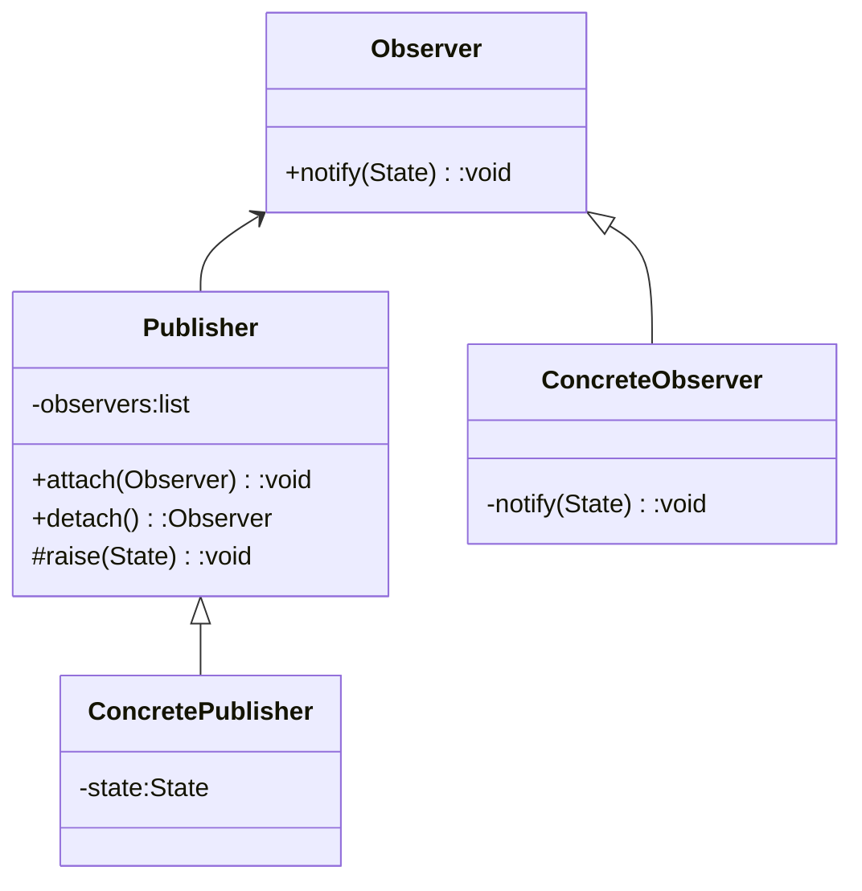
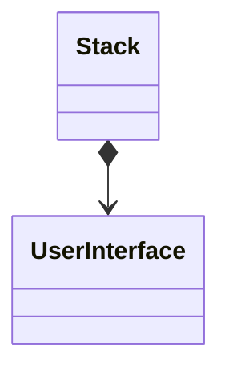
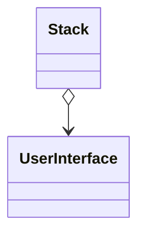
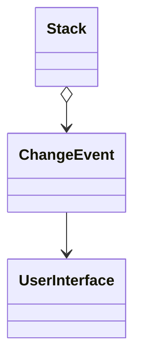

# The Stack

堆栈是我们将设计和实现的计算器的第一个模块。 尽管我在第2章中定义了该模块的公共接口，但关于其实现的内容却很少。 在C ++中，模块不是定义的语言概念。 因此，实际上我们只需要将堆栈分解为功能和类的逻辑分组，然后将其称为我们的模块即可。 因此，这是我们开始的地方。 如果您对堆栈数据结构的机制有些不熟悉，那么现在是查阅您喜欢的数据结构和算法书籍的好时机。 我个人最喜欢的是Cormenet [5]。

## 3.1 Stack模块的分解

分解堆栈模块时要问的第一个问题是：“堆栈应分成多少块？” 用面向对象的说法，我们问：“我们需要多少个对象，它们是什么？” 在这种情况下，答案是显而易见的：其一，堆栈本身。 本质上，整个堆栈模块是单个数据结构的体现，可以轻松地将其封装为单个类。 此类的公共接口已在第2章中进行了描述。

一个人可能会问的第二个问题是：“我是否真的需要构建一个类，还是可以直接使用标准模板库（STL）堆栈类？” 这实际上是一个很好的问题。 所有设计书籍都宣告，当您可以从库中使用一个数据结构时，尤其是当该数据结构可以在STL中找到时，就永远不要编写自己的数据结构，该STL被保证是符合标准的C ++发行版的一部分。 确实，这是明智的建议，我们不应重写堆栈数据结构的机制。 但是，我们也不应该将STL堆栈直接用作系统中的堆栈。 相反，我们将编写自己的堆栈类，该堆栈类将STL容器封装为私有成员。

假设我们选择使用STL堆栈来实现我们的堆栈模块。存在一些理由更倾向于封装STL容器（或任何供应商的数据结构）而不是直接利用。首先，通过包装STL堆栈，我们为其余的计算器添加了接口保护。也就是说，我们通过将堆栈的接口与其实现分开（还记得封装吗？），使其他计算器模块免受潜在的底层实现影响。这种预防措施可以在使用供应商软件时尤其重要，因为此设计决策会将更改本地化为包装器的实现，而不是堆栈模块的接口。如果供应商修改了其产品的接口（供应商像这样偷偷摸摸的）或您决定将一个供应商的产品换成另一种，则这些更改只会在本地影响您的堆栈模块的实现，而不会影响堆栈模块的调用方。即使底层实现是标准化的，例如ISO标准化STL堆栈，接口保护程序也使您能够更改底层实现而不会影响从属模块。例如，如果您改变主意，后来又决定使用向量而不是堆栈来重新实现堆栈模块，该怎么办？

包装STL容器而不是直接使用它的第二个原因是，此决定使我们可以限制接口以完全符合我们的要求。在第2章中，我们花费了大量精力来设计能够满足pdCalc所有用例的堆栈模块的有限，最小接口。通常，基础实现可能会提供比您实际希望提供的功能更多的功能。如果我们直接选择STL堆栈作为堆栈模块，那么这个问题就不会很严重，因为STL堆栈的接口与我们为计算器堆栈定义的接口非常相似，这不足为奇。但是，假设我们选择了Acme Corporation的RichStack类及其67个公共成员函数，将它们解包后用作我们的堆栈模块。忽略阅读设计规范的初级开发人员可能会在不知不觉中违反了我们的堆栈模块的某些隐式设计合同，方法是调用不应在应用程序上下文中公开公开的RichStack函数。尽管这种滥用可能与该模块的文档化接口不一致，但切勿依赖其他开发人员实际阅读或遵守该文档（很遗憾，但事实如此）。如果您可以通过编译器可以强制执行的语言构造（例如访问限制）强行防止误用发生，请执行此操作。

包装STL容器的第三个原因是扩展或修改基础数据结构的功能。 例如，对于pdCalc，我们需要添加STL堆栈类中不存在的两个函数（getElements（）和swapTop（）），并将错误处理从标准异常转换为自定义错误事件。 因此，包装器类使我们能够修改STL的标准容器接口，以便我们可以遵循自己内部设计的接口，而不受STL提供给我们的功能的约束。

正如人们可能期望的那样，上述封装方案经常发生，因此已被编码为一种设计模式，即适配器（包装）模式[6]。 如Gamma等所述，适配器模式用于将类的接口转换为客户端期望的另一个接口。 通常，适配器提供某种形式的转换功能，从而还可以充当其他不兼容类之间的代理。

在模式的原始描述中，对适配器进行了抽象，以允许单个消息使用适配器类层次结构通过多态性包装多个不同的适配器。 为了满足pdCalc的堆栈模块的需求，一个简单的具体适配器类就足够了。

请记住，存在设计模式可以辅助设计和交流。 尽量不要完全按照文本中的规定陷入实施模式的陷阱。 使用文献作为指导来帮助您弄清设计，但是最终，宁愿实施适合您的应用程序的最简单解决方案，而不是最类似于学术理想的解决方案。

我们应该问的最后一个问题是：“我的堆栈应该是通用的（即模板化的）吗？”答案也许是响亮的。从理论上讲，设计抽象数据结构以封装任何数据类型是合理的做法。如果数据结构的最终目标是出现在一个库中或由多个项目共享，则应该对数据结构进行概括。但是，在单个项目的上下文中，我不建议至少首先不要使数据结构通用。通用代码更难编写，更难维护，更难测试。除非预先存在多种类型的使用情况，否则我发现编写通用代码是不值得的。我完成了太多的项目，在这些项目上我花了更多的时间设计，实施和测试通用数据结构，而仅将其用于一种类型。实际上，如果您有一个非通用的数据结构，突然发现确实需要将其用于其他类型，那么重构所需的难度通常不会比从一开始就将该类设计为通用的困难。此外，现有测试将很容易适应通用接口，从而为单一类型建立的正确性提供基线。因此，我们将堆栈设计为双重特定的。

## 3.2 Stack类

现在，我们已经确定我们的模块将由一个类（一个用于基础堆栈数据结构的适配器）组成，让我们对其进行设计。 设计课程时要问的第一个问题是“如何使用该课程？” 例如，您是否正在设计一个抽象基类以被继承并因此被多态使用？ 您是否主要将类设计为纯旧数据（POD）存储库？ 在任何给定时间都会存在此类的许多不同实例吗？ 给定实例的生存期是多少？ 谁通常拥有此类的实例？ 实例将被共享吗？ 此类可以同时使用吗？ 通过询问这些问题和其他类似问题，我们发现了堆栈的以下功能需求列表：

* 系统中仅应存在一个堆栈。

* 堆栈的生命周期是应用程序的生命周期。

* UI和命令调度程序都需要访问堆栈；两者都不应该拥有堆栈。

* 堆栈访问不是并发的。

只要满足上述前三个条件，该类就很适合单例模式[6]。

### 3.2.1 单例模式

单例模式用于创建一个类，其中系统中仅应存在一个实例。 单例类不是它的任何使用者拥有的类，但该类的单个实例也不是全局变量（但是，有人认为单例模式是变相的全局数据）。 为了不依赖荣誉系统，采用语言机制来确保仅存在单个实例。

另外，在单例模式中，实例的生存期通常是从首次实例化到程序终止。 根据实现的不同，可以创建单例以确保线程安全或仅适用于单线程应用程序。 有关不同的C ++单例实现的精彩讨论可以在Alexandrescu [2]中找到。 对于我们的计算器，我们将使用最简单的实现目标的实现。

为了派生简单的单例实现，我们参考了C ++语言的知识。 首先，如前所述，没有其他类拥有单例实例，单例的实例也不是全局对象。 这意味着单例类需要拥有其单个实例，并且所有权访问权限应该是私有的。 为了防止其他类实例化我们的单例，我们还需要将其构造函数和赋值运算符设为私有或删除。 其次，知道系统中仅应存在一个单例实例立即意味着我们的类应静态保存其实例。 最后，其他类将需要访问此单个实例，我们可以通过公共静态函数提供该实例。 结合以上几点，我们为清单3-1中所示的单例类构造了框架。

清单3-1. 单例框架

```c++
class Singleton {
public:
    static Singleton& Instance()
    {
    // Since it's a static variable, if the class has already been created,
    // it won't be created again.
    // And it **is** thread-safe in C++11.
        static Singleton instance;
        return instance;
    }
    void foo() {}
private:
    // prevent public instantiation, copying, assignment, movement,
    // & destruction
    Singleton() {/* constructor */}
    Singleton(const Singleton&) = delete;
    Singleton& operator=(const Singleton&) = delete;
    Singleton(Singleton&&) = delete;
    Singleton&& operator=(Singleton&&) = delete;
    ~Singleton() {/* desctructor */}
};
```

Singleton类的静态实例保存在函数范围内，而不是在类范围内，以防止在一个单例类的构造函数依赖于另一个单例的情况下发生不可控制的实例化顺序冲突。 C++的实例化排序规则的详细信息不在本书的讨论范围之内，但是有关单例的详细信息，请参见Alexandrescu [2]。

现在我们有了Singleton类的框架，让我们看看如何使用它。 比如为了访问实例并调用foo()函数，我们只需使用以下代码：

```c++
Singleton::Instance().foo();
```

在第一次调用Instance()函数时，实例变量将被静态实例化，并返回对该对象的引用。 因为在函数作用域中静态分配的对象会保留在内存中，直到程序终止，所以实例对象不会在Instance()函数作用域的结尾处被破坏。 在以后对Instance()的调用中，实例变量的实例化将被跳过（该变量已从上一个函数调用构造并存储在内存中），并且仅返回对该实例变量的引用。 请注意，虽然基础单例实例是静态保存的，但是foo()函数本身并不是静态的。

好奇的读者现在可能会问：“为什么要麻烦所有持有该类的实例？ 为什么不简单地使Singleton类的所有数据和所有功能静态化呢？” 原因是因为单例模式允许我们在需要实例语义的地方使用Singleton类。 这些语义的一种特别重要的用法是在回调的实现中。 例如，以Qt的信号和插槽机制（您将在第6章中遇到信号和插槽）为例，可以将其粗略地解释为功能强大的回调系统。 为了将一个类中的信号连接到另一类中的插槽，我们必须提供指向两个类实例的指针。 如果我们在没有私有实例化Singleton类的情况下（即仅利用静态数据和静态函数）实现了Singleton，那么将我们的Singleton类与Qt的信号和时隙一起使用是不可能的。

### 3.2.2 Stack模块作为一个单例类

现在，我们拥有堆栈模块的基本设计。 我们已经决定将整个模块封装在一个类中，该类实际上充当STL容器的适配器。 我们已经确定我们的一个类符合单例的模型标准，并且该单例类将在第2章中设计公共接口。结合这些设计元素为我们提供类的初始声明，如清单3-2所示。

清单3-2. Stack单例

```c++
class Stack
{
    class StackImpl;
public:
    static Stack& Instance();
    void push(double);
    double pop();
    void getElements(int, std::vector<double>&) const;
    void swapTop();
private:
    Stack();
    ~Stack();
    Stack(const Stack&) = delete;
    Stack& operator=(const Stack&) = delete;
    Stack(Stack&&) = delete;
    Stack&& operator=(Stack&&) = delete;
private:
    std::unique_ptr<StackImpl> pimpl_;
};
```

因为本书的重点是设计，所以除非详细说明或说明设计的关键要素，否则本文中未提供每个成员函数的实现。 提醒一下，可以从GitHub存储库下载pdCalc的完整实现。 有时，存储库源代码将是文本中出现的理想化接口的更复杂的变体。 这将是本书其余部分的通用格式。

对于那些不熟悉pimpl习惯用法（将一个类的实现放置在单独的私有实现类中）的读者来说，pimpl成员变量将显得非常神秘。 别担心 您将在下面的部分中回顾此原则。

在暂时退出有关Stack类设计的讨论之前，我们先绕道而过，并讨论相关的实现细节。 我们花了很多时间来回顾在Stack设计中使用适配器模式来隐藏基础数据结构的重要性。 该决定的理由之一是它提供了在不影响依赖于Stack接口的类的情况下，无缝更改基础实现的能力。 问题是，“为什么Stack的底层实现会发生变化？”

在我的Stack实现的第一个版本中，我为基础数据结构STL堆栈选择了明显的选择。 但是，使用STL堆栈很快遇到了效率问题。 我们的Stack类的界面提供了getElements（）函数，该函数使用户界面可以查看计算器堆栈的内容。 不幸的是，STL堆栈的界面没有提供类似的功能。 看到除STL堆栈顶部元素之外的其他元素的唯一方法是依次弹出堆栈，直到到达感兴趣的元素为止。 显然，由于我们只是在尝试查看堆栈中的元素，而不是更改堆栈本身，因此我们需要立即将所有条目推回堆栈中。 有趣的是，出于我们的目的，STL堆栈证明是不适合实现堆栈的数据结构！ 必须有一个更好的解决方案。

幸运的是，STL提供了另一个适合我们任务的数据结构，即deque。双端队列是一种STL数据结构，其行为类似于vector，不同之处在于deque允许将元素推入其前部和后部。尽管优化了vector以使其生长，同时仍提供连续性保证，但deque被优化以通过牺牲连续性来快速生长和收缩。此功能正是有效实现堆栈所需的设计折衷。实际上，实现STL堆栈的最常见方法只是包装STL双端队列（是的，就像我们的堆栈一样，STL的堆栈也是适配器模式的一个示例）。幸运的是，STL双端队列也接受无损迭代，这是我们实现Stack的getElements（）方法所需的STL堆栈中的其他缺失要求。很好的是，我使用封装从其界面隐藏了Stack的实现。意识到可视化STL堆栈的局限性之后，我能够更改Stack类的实现，以使用STL双端队列，而不会影响pdCalc的其他模块。

#### 3.2.2.1 pImpl习惯用法

如果您选择查看pdCalc实现的GitHub存储库版本，您会注意到pimpl习惯用法（桥模式的C++专门化）隐藏了许多实际的类实现。 对于不熟悉此术语的人，它是指向实现的简写表示法。 实际上，您无需在头文件中声明所有类的实现，而是直接声明一个指向“隐藏”实现类的指针，并在实现文件中完全声明和定义此“隐藏”类。 如果只在包含完整声明的源文件中取消引用pimpl变量，则允许包含和使用不完整类型（pimpl变量）。 例如，考虑下面的类A，该类具有由函数f（）和g（）组成的公共接口； 具有函数u（），v（）和w（）的私有实现； 和私有数据v_和m_：

```c++
class A
{
public:
void f();
void g();
private:
void u();
void v();
void w();
vector<double> v_;
map<string, int> m_;
};
```

我们使用pimpl习惯用法，而不是将A的私有接口直观地暴露给此类的消费者，而是这样写的：

```c++
class A
{
class AImpl;
public:
void f();
void g();
private:
unique_ptr<AImpl> pimpl_;
};
```

其中u，v，w，v，和 m现在都是AImpl类的一部分，它们仅在与类A相关的实现文件中声明和定义。为了确保AImpl无法被任何其他类访问，我们声明此实现 类是完全由A. Sutter和Alexandrescu [27]定义的私有类，简要说明了pimpl习语的优点。 主要优点之一是，通过将A类的专用接口从A.h移到A.cpp，当仅更改A的专用接口时，我们不再需要重新编译任何消耗A类的代码。 对于大型软件项目，在编译过程中可以节省大量时间。

就个人而言，我在编写的大多数代码中都使用pimpl习惯用法。 我的一般规则的例外是私有接口非常有限的代码或计算密集型的代码（即，在pimpl的间接开销很大的代码）。 除了仅在类AImpl发生更改时不必重新编译包括A.h的文件带来的编译好处之外，我发现pimpl习惯用法还为代码增加了明显的清晰度。 这种清晰性源自隐藏帮助程序功能和类的功能，而不是将它们列出在头文件中的功能。 以这种方式，头文件实际上仅反映了接口的基本要素，因此至少在可见接口级别防止了类膨胀。 对于任何其他只使用您的类的程序员，实现细节在视觉上都是隐藏的，因此不会分散您希望有据可查的，有限的公共接口的注意力。

在继续完成Stack的接口之前，请注意，此处使用pimpl习惯用法完全向Stack类用户隐藏了对基础堆栈数据结构的选择。 此选择是一个实现细节，应向用户隐藏。 pimpl习惯用法使我们能够完全隐藏它，即使从视觉检查也是如此。 pImpl成语确实是封装的缩影。

## 3.3 增加事件

### 3.3.1 Observer Pattern

因为事件是C++应该实现的普遍功能，所以您可以放心，存在描述事件的设计模式。 这种模式是观察者。 观察者模式是发布者和监听者的抽象实现的一种标准方法。 正如模式名称所暗示的那样，在这里，监听者就是观察者。

在Gamma等人描述的模式中，具体的发布者实现抽象的发布者接口，而具体的观察者实现抽象的观察者接口。名义上，实现是通过公共继承实现的。 每个发布者拥有其观察者的容器，并且发布者的接口允许添加和删除观察者。当事件发生（引发）时，发布者遍历其观察者集合，并通知每个观察者事件已发生。通过虚拟调度，每个具体的观察者根据自己的实现处理此通知消息。

观察者可以通过两种方式之一从发布者接收状态信息。首先，具体的观察者可以有一个指向要观察的具体发布者的指针。通过此指针，观察者可以查询事件发生时发布者的状态。这种机制称为拉语义。 另外，可以实现推送语义，从而发布者将状态信息与事件通知一起推送给观察者。在图3-1中找到了展示推送语义的观察者模式的简化类图。



#### 3.3.1.1 增强观察者模式实现

在计算器的实际实现中，除了图3-1所示的抽象之外，还添加了其他一些功能。首先，在图中，每个发布者都拥有一个观察者列表，当事件发生时，所有观察者都将得到通知。但是，此实现意味着发布者仅具有一个事件，或者发布者具有多个事件，但是无法消除对每个事件调用哪个观察者的歧义。相反，更好的发布者实现将观察者列表关联数组。 以这种方式，每个发布者可以具有多个不同的事件，每个事件仅通知有兴趣观看该特定事件的观察者。从技术上讲，关联数组中的键可以是设计人员选择的任何合适的数据类型，但我选择将字符串用于计算器。也就是说，发布者通过名称区分各个事件。 此选择增强了可读性，并使运行时可以灵活地添加事件（例如，选择枚举值作为键）。

一旦发布者类可以包含多个事件，则在调用attach()或detach()时，程序员需要能够通过名称指定事件。因此，必须从图3-1中的显示方式适当地修改这些方法签名，以包括事件名称。对于添加，方法签名是通过添加事件的名称来完成的。调用者只需使用具体的观察者实例和该观察者要附加到的事件的名称来调用attach方法。但是，将观察者从发布者中分离出来，需要稍微复杂一些的机制。由于发布者中的每个事件都可以包含多个观察者，因此程序员需要能够区分观察者以进行分离。自然，此要求也导致命名观察者，并且必须修改detach函数签名以容纳观察者和事件的名称。

为了便于与观察员分离，每个事件的观察员都应间接存储并以其名称引用。因此，我们没有存储观察者列表的关联数组，而是选择使用观察者关联数组的关联数组。

在现代C++中，程序员可以选择使用标准库的map或unordered_map来实现关联数组。这两个数据结构的规范实现分别是红黑树和哈希表。 由于关联数组中元素的顺序并不重要，因此我为pdCalc的Publisher类选择了unordered_map。 但是，对于订阅每个事件的观察者人数可能很少，任何一种数据结构都将是同样有效的选择。

到目前为止，我们还没有确切指定观察者在发布者中的存储方式，只是将它们存储在关联数组中。因为观察者是多态使用的，所以语言规则要求它们必须由指针或引用保存。那么问题就变成了，发布者应该拥有观察者，还是仅仅引用其他类拥有的观察者？如果我们选择引用这条路（通过引用或原始指针），则将要求发布者以外的其他类拥有为观察者分配的内存。这种情况是有问题的，因为尚不清楚在任何特定情况下谁应该拥有观察者。因此，每个开发人员都可能会选择不同的选项，从长远来看，对观察者的维护会陷入混乱。更糟糕的是，如果观察者的所有者释放了观察者的记忆而又未将观察者与发布者分离，则触发发布者的事件将导致崩溃，因为发布者将持有对观察者的无效引用。由于这些原因，我更喜欢让发布者拥有其观察者的内存。

避开引用后，我们必须使用拥有的语义，并且由于C++的多态机制，我们必须通过指针实现所有权。

在现代C ++中，指针类型的唯一所有权是通过unique_ptr实现的（请参阅“现代C ++设计说明”侧边栏上的拥有语义以了解设计含义）。综合以上所有建议，我们能够为发布者类设计最终的公共接口，如清单3-3所示。

清单3-3. Publish Class的公共接口

```c++
// Publisher.h
class Observer;
class Publisher
{
    class PublisherImpl;
public:
    void attach(const string& eventName,
                unique_ptr<Observer> observer);
    unique_ptr<Observer> detach(const string& eventName,
                                const string& observerName);
    //...
private:
    unique_ptr<PublisherImpl> publisherImpl_;
};

// Publisher.cpp
class Publisher::PublisherImpl
{
    //...
private:
    using ObserversList = unordered_map<string, unique_ptr<Observer>>;
    using Events = unordered_map<string, ObserversList>;
    Events events_;
};
```

观察者类的接口比发布者类的接口要简单一些。但是，因为我还没有描述如何处理事件数据，我们还没有准备好设计观察者接口。我将在第3.3.1.2节讲述事件数据和观察者类接口。

> **现代C++设计说明：拥有语义和unique_ptr**
>
> 在C++中，拥有对象的概念意味着当不再需要该对象时，有责任删除其内存。在C++11之前，尽管任何人可以实现他自己的智能指针，但是语言本身对指针所有权没有标准语义的表达。通过原始指针传递内存更像是一个信任问题。也就是说，如果“新建”一个指针并通过原始指针将其传递给库，你则希望该库在完成后删除该指针的内存。或者，该库的文档可能会通知您在执行某些操作后删除内存。 如果没有标准的智能指针，则在最坏的情况下，您的程序或泄漏内存。 在最好的情况下，您必须使用非标准智能指针连接到库。
>
> c ++ 11通过标准化从boost库中大量借用的一组智能指针，纠正了未知指针所有权的问题。从而，unique_ptr允许程序员正确实现唯一所有权。本质上，unique_ptr确保在任何时候只存在一个指针实例。由于语言强制执行这些规则，unique_ptrs的复制和固定分配并没有被实现。而是使用移动语义来确保所有权转移（显式函数调用也可以用于手动管理内存）。需要记住的一点是不要混合使用unique_ptrs和原始指针。
>
> 从设计的角度来看，unique_ptr表示我们可以使用标准C ++编写接口，该接口明确表示唯一所有权语义。正如在观察者模式的讨论中所见的那样，唯一的所有权语义在任何设计中都很重要，这样的设计是其中一个类创建的内存要由另一类拥有。例如，在计算器的事件系统中，事件的发布者应拥有其观察者，而发布者将很少有足够的信息来创建其观察者。因此，重要的是能够在一个位置为观察者创建内存，但能够将该内存的所有权传递给另一位置（发布者）。unique_ptr提供该服务。 因为观察者是通过unique_ptr传递给发布者的，所以所有权将转移给发布者，并且当发布者不再需要观察者时，智能指针会删除观察者的内存。或者，任何类都可以从发布者中收回观察员。 由于detach（）方法以unique_ptr返回观察者，因此发布者通过将观察者的内存转移回调用者，从而明显放弃了观察者内存的所有权。

观察者模式的上述实现显式地实施了这种设计，发布者拥有其观察者。使用此实现的最自然的方法涉及创建小型专用的中间Observer类，这些类本身包含指向应响应事件的实际类的指针或引用。例如，在第2章中，我们知道pdCalc的用户界面是堆栈类的观察者。 但是，我们是否真的希望用户界面是如图3-2a所示由堆栈拥有的（公开继承）观察者？不，图3-2c描绘了一个更好的解决方案。 在这里，Stack拥有一个ChangeEvent Observer的堆栈，当Stack发生更改时，它会通知UserInterface。这种模式使Stack和UserInterface保持真正独立。当您在第5章学习第一个用户界面时，我们将谈论有关该主题的更多内容。

(a) Publisher owns observer


(b) Publisher shares observer

(c) Publisher owns intermediary to observer


图3-2. 观察者模式的不同拥有策略

现代C++确实为观察者模式的所有权语义提供了另一种明智的选择：共享所有权。如上所述，Stack拥有UserInterface是不合理的。但是，有些人可能认为创建额外的ChangeEvent中间类替代直接将用户界面设为观察者同样不合理。唯一可用的中间选项似乎是让Stack引用用户界面。但是，我之前曾说过，让发布者引用其观察者是不安全的，因为观察者可能会从发布者下面消失，留下了悬挂的引用。这个悬挂的引用问题可以被解决吗？

幸运的是，现代C++再次以共享语义进行了拯救（正如图3-2b所示）。在这种情况下，观察者使用shared_ptr共享（请参见下面shared_ptr的侧边栏），而发布者保留对weak_ptr（shared_ptr的相对）观察者的引用。 weak_ptrs是专门为减轻对共享对象的引用的悬挂问题而设计的。Meyers [19]在第20条中描述了由发布者共享观察者所有权的这种设计。就个人而言，我更喜欢使用拥有语义和轻量级专用观察器类的设计。

>**现代C++设计说明：共享语义和shared_ptr**
>
>unique_ptr使程序员能够安全地表达唯一所有权，而shared_ptr使程序员能够安全地表达共享所有权。在C++ 11标准之前，C++通过原始指针或引用启用了数据共享。因为只能在构造期间初始化对类数据的引用，所以对于延期绑定数据，只能使用原始指针。因此，两个类经常共享一个数据，每个类都包含指向公共对象的原始指针。当然，该方案的问题是不清楚哪个对象拥有共享对象。尤其是，这种模糊性意味着不确定何时可以安全地删除此类共享对象，以及哪个拥有对象应尽早释放内存。 shared_ptrs在标准库级别纠正了这一难题。
>
>shared_ptr通过引用计数实现共享语义。 当新对象指向shared_ptr时，内部引用计数增加（通过构造函数和赋值强制执行）。 当shared_ptr超出范围时，将调用其析构函数，这将减少内部引用计数。 当计数变为零时，最终shared_ptr的销毁将触发基础内存的回收。 与unique_ptr一样，显式成员函数调用也可以用于手动管理内存。Josuttis [8]对使用shared_ptr的机制进行了详尽的详细描述。 与unique_ptr一样，必须注意不要混用指针类型。 当然，此规则的例外是与weak_ptr混合使用。 此外，引用计数会同时占用时间和空间，因此读者在部署共享指针之前应熟悉这些折衷方法。
>
>在设计方面，shared_ptr构造使程序员可以共享堆内存，而无需直接跟踪对象的所有权。对于计算器，按值传递事件数据是不可选项。因为事件数据对象存在于层次结构中，所以按值传递事件数据对象将导致切片。但是，使用原始指针（或引用）传递事件数据也是有问题的，因为无法在共享它们的类之间知道这些数据对象的寿命。自然，发布者在引发事件时分配内存。由于观察者可能希望在事件处理完成后保留内存，因此发布者无法在事件处理后简单地重新分配内存。而且，因为可以为任何给定事件调用多个观察者，所以发布者也不能将数据的唯一专有权转移给任何给定观察者。因此，C ++ 11中标准化的shared_ptr提供了处理这种情况的理想语义。

#### 3.3.1.2 处理事件数据

在描述观察者模式时，我提到存在两种不同的范例来处理事件数据：pull和push语义。 在pull语义中，仅向观察者通知事件已发生。 然后，观察者还有责任来获取可能需要的任何其他数据。 实现非常简单。 观察者维护对可能需要从其获取状态信息的任何对象的引用，并且观察者响应事件而调用成员函数以获取此状态。

pull语义具有多个优点。 首先，观察者可以在处理事件时准确选择要获取的状态。 其次，将潜在未使用的参数传递给观察者时，不会浪费不必要的资源。 第三，pull语义易于实现，因为事件不需要携带数据。 但是，pull语义也有缺点。 首先，pull语义增加了耦合，因为观察者需要持有对发布者的引用并要了解其状态获取接口。 其次，观察者只能访问发布者的公共接口。 此访问限制使观察者无法从发布者那里获取私有数据。

与pull语义不同，push语义通过使发布者在事件发生时发送与事件相关的状态数据来实现。 观察者然后接收此状态数据作为notify回调的参数。 该接口通过在抽象的Observer基类中使notify函数成为纯虚函数来强制执行推送语义。

用于事件处理的push语义也有优点和缺点。 第一个优点是push语义减少了耦合。 发布者和观察者都不需要了解彼此的界面。 他们只需要服从抽象事件接口。 其次，发布者可以在推送状态时将私有信息发送给观察者。 第三，作为引发事件的对象，发布者可以精确地发送处理事件所需的数据。 push语义的主要缺点是，在观察者不需要发布者推送的状态数据的情况下，它们实施起来会稍微困难一些，并可能带来不必要的开销。 最后，请注意，在特殊情况下，通过向推入数据添加回调引用，可以始终使用拉语义简化使用推式语义的设计。 反之则不成立，因为推送语义需要事件处理机制内的专用基础结构。

基于上述推式和拉式语义之间的权衡，我选择为pdCalc的事件处理实现推式语义。 推式语义的主要缺点是实现的潜在计算开销。 但是，由于我们的应用程序不是性能密集型应用程序，因此这种模式的耦合性降低，并且发布者保持的参数控制超过了轻微的性能开销。 现在，我们的任务是设计一种用于通过推送语义传递事件数据的实现。

为了实现事件处理的推式语义，必须对接口进行标准化，以便在引发事件时将参数从发布者传递给观察者。 理想情况下，每个发布者/观察者对都要对要传递的参数的类型达成一致，并且在引发事件时，发布者将在观察者上调用适当的成员函数。 但是，这种理想情况实际上在我们的发布者/观察者类层次结构中是不可能的，因为实际的发布者并不了解实际的观察者的接口。 实际的发布者只能通过在Publisher基类中调用raise()函数来引发事件。 反过来，raise（）函数通过观察者基类的虚拟notify（）函数以多态形式通知实际的观察者。 因此，我们寻求一种通用的技术，用于通过抽象的raise/notify接口传递自定义数据。

解决我们困境的方法非常简单。 我们为事件数据创建并行对象层次结构，并将事件数据通过此抽象状态接口从发布者传递给观察者。 此层次结构中的基类EventData是一个空类，仅包含虚拟析构函数。 然后，每个需要参数的事件都会继承此基类，并实现任何认为适当的数据处理方案。 引发事件时，发布者通过EventData基类指针将数据传递给观察者。 收到数据后，具体的观察者将状态数据向下转换为具体的数据类，然后通过派生类的具体接口提取必要的数据。 尽管具体的发布者和具体的观察者必须在数据对象的接口上达成一致，但是具体的发布者和具体的观察者都不需要知道彼此的接口。 因此，我们保持松散的耦合。

为了巩固以上观点，让我们研究一下计算器的Stack如何实现状态数据。 回顾第二章，堆栈实现了两个事件，stackChanged（）事件和error（string）事件。 在此上下文中，stackChanged（）事件没有意义，因为该事件不携带任何数据。 但是，错误事件确实会携带数据。 考虑清单3-4中所示的堆栈错误情况的类层次结构。

清单3-4. 事件数据结构

```c++
// Publisher.h
class EventData {
public:
    virtual ~EventData();
};
// Stack.h
class StackEventData : public EventData {
public:
    enum class ErrorConditions {Empty, TooFewArguments};
    StackEventData(ErrorConditions e): err_(e) {}
    
    static const char* Message(ErrorConditions ec);
    const char* message() const;
    ErrorConditions error() const {return err_;}
private:
    ErrorConditions err_;
};
```

StackEventData类定义如何将堆栈的事件数据打包并发送到观察堆栈的类。 当堆栈模块中发生错误时，Stack类将引发一个事件，并将有关该事件的信息推送给其观察者。 在这种情况下，堆栈会创建一个StackEventData实例，该实例指定构造函数中的错误类型。 可以使用message（）函数将包含有限错误条件集的枚举类型转换为字符串。 当观察者收到事件发生的通知后，他们便可以自由使用或忽略此信息。 如果您要注意，是的，我巧妙地将error（）接口的签名从字符串更改为EventData。

作为一个具体示例，假设由于弹出了空堆栈而触发了错误。 为了引发此事件，堆栈调用以下代码（实际实现略有不同，因为堆栈被包装在pimpl中）：

```c++
parent_.raise(Stack::StackError, make_shared<StackEventData>(StackEventData::ErrorConditions::Empty));
```

raise（）函数的第一个参数是解析为“错误”的静态字符串。 回想一下，为了处理多个事件，发布者为每个事件命名。 在这里，Stack :: StackError静态变量保存此事件的名称。 使用变量代替直接使用字符串，以防止由于错误输入事件名称而导致运行时错误。 raise（）函数的第二个参数创建StackEventData实例，并使用空堆栈错误条件对其进行初始化。 请注意，该实现使用shared_ptr传递事件数据。 该决定将在下面有关共享语义的侧栏中讨论。 尽管尚未引入StackObserver类，但为完整起见，我注意到可以用以下代码来解释事件：

```c++
StackObserver::notify(shared_ptr<EventData> d)
{
    shared_ptr<StackEventData> p = dynamic_pointer_cast<StackEventData>(d);
    if (p) {
        // do something with the data
    } else {
        // uh oh, what event did we just catch ?!
    }
}
```

现在您已经了解了事件数据，让我们最后编写抽象的Observer接口。 毫不奇怪，这正是您所期望的。 参见清单3-5。

清单3-5. 抽象观察者接口

```c++
class Observer {
public:
    explicit Observer(const string& name);
    virtual ~Observer();
    virtual void notify(shared_ptr<EventData>)=0;
};
```

### 3.3.2 Stack作为事件发布者

构造Stack的最后一步只是将所有组件放在一起。 清单3-1将Stack显示为单例。 为了实现事件，我们只需修改此代码即可从Publisher基类继承。 现在我们必须问自己，这种继承是公开的还是私有的？

通常，在面向对象的编程中，人们使用公共继承来表示is-a关系。 即，公共继承表示派生类是基类的一种或特殊化的关系。 更准确地说，is-a关系遵循Liskov可替换性原则（LSP）[29]，该原则规定（通过多态性）以基类指针（引用）为参数的函数必须能够接受派生的类指针 （参考）。 简而言之，只要可以互换使用基类，则派生类必须可用。 人们提到继承时，通常是指公共继承。

私有继承用于表示实现关系。 简单来说，私有继承用于将一个类的实现嵌入到另一个类的私有实现中。 它不遵循LSP，并且实际上，如果继承关系是私有的，则C ++语言不允许将派生类替换为基类。 为了完整起见，紧密相关的受保护继承在语义上与私有继承相同。 唯一的区别是，在私有继承中，基类实现在派生类中变为私有，而在受保护继承中，基类实现在派生类中变为受保护。

现在，我们的问题已被简化为：Stack是发布者，还是Stack实现了发布者？ 答案是yes和yes。 那无济于事，那么我们该如何选择呢？

为了消除这种情况下我们应该使用公共继承还是私有继承的疑惑，我们必须更深入地研究Stack类的用法。 公共继承或is-a关系将表明我们打算以多态方式使用Stack作为发布者。 然而，这种情况并非如此。 尽管Stack类是发布者，但在可以用LSP代替发布者的上下文中，它不是发布者。 因此，我们应该使用私有继承来表明在堆栈中使用发布者实现的意图。 同样，我们可以声明Stack提供了发布者服务。 如果您一直在跟踪存储库源代码，那么您可能会注意到一个很大的暗示，那就是私有继承就是答案。 Publisher类是使用非虚拟的受保护析构函数实现的，因此不可用于公共继承。

熟悉面向对象设计的读者可能会想知道为什么我不问无处不在的has-a问题，表示所有权或聚合关系。 也就是说，为什么堆栈不应该简单地拥有发布者并重用其实现，而不是私有地继承它呢？ 许多设计人员几乎都更喜欢使用聚合来代替私有继承，他们认为，如果在这两者之间做出选择，则应该始终倾向于使用导致松散耦合的语言功能（继承是一种比聚合更强的关系）。 这种观点是有道理的。 但是，就我个人而言，我只是更喜欢接受权衡更强耦合以获得更高清晰度的技术。 我认为私有继承比聚合更清楚地说明了实现Publisher服务的设计意图。 这个决定没有正确或错误的答案。 在代码中，您应该选择适合自己口味的样式。

从Publisher类私有继承的另一个结果是Publisher的attach（）和detach（）方法变为私有。 但是，如果任何其他类打算订阅Stack的事件，则它们必须成为Stack的公共接口的一部分。 因此，实现者必须选择利用using语句或转发成员函数来将attach（）和detach（）提升到Stack的公共接口中。 在这种情况下，任何一种方法都是可以接受的，并且实现者可以自由使用他或她的个人偏好。

### 3.3.3 完整的Stack接口

我们终于可以编写完整的Stack公共接口了。 参见清单3-6。

清单3-6.

```c++
class Stack : private Publisher {
public:
    static Stack& Instance();
    void push(double, bool suppressChangeEvent = false);
    double pop(bool suppressChangeEvent = false);
    void swapTop();
    std::vector<double> getElements(std::size_t n) const;
    using Publisher::attach;
    using Publisher::detach;
};
```

如本章所述，Stack是一个单例类（请注意Instance（）方法），用于实现Publisher服务（请注意Publisher类的私有继承以及将attach（）和detach（）方法提升到公共环境 接口）。 Stack类的公共部分与清单3-2中描述的EventData类一起，包含了第2章表2-2中引入的堆栈模块的完整接口。尽管我尚未描述Stack的任何具体观察者， 我们已经为pdCalc完全定义了我们的事件系统，该系统基于久经考验的真实观察者模式。 至此，我们准备设计pdCalc的下一个组件，即命令分派器模块。

## 3.4 快速测试记录

在结束第一章介绍pdCalc的源代码之前，我应该暂停一下，并谈谈测试。 尽管测试绝不是本书的主要探索主题，但它仍然是任何高质量实现中不可或缺的一部分。 除了在GitHub上找到的计算器的源代码外，我还包括了我所有的自动化单元测试代码。 因为我选择将Qt用于pdCalc的图形用户界面框架（请参阅第6章），所以Qt Test框架是构建pdCalc的单元测试套件的自然选择。 首先，此选择不会在项目上添加任何其他库依赖项，并且保证测试框架可在已移植Qt的所有平台上工作。 就是说，许多高质量的C ++单元测试框架中的任何一个都足够满足要求。

就个人而言，我发现即使对小型项目进行编程，单元测试也必不可少。 首先，单元测试提供了一种确保代码按预期运行的方法。 其次，单元测试使您可以看到模块在开发用户界面之前就可以正常工作。 早期测试可实现早期错误检测，而软件工程的一个众所周知的事实是，早期错误检测可导致错误修复成本成倍降低。 我还发现，在开发周期的早期阶段看到模块完全正常工作是有动机的。 最后，单元测试还使您知道代码更改前后代码的功能相同。 由于迭代是设计和实施的基本要素，因此即使您认为完成了代码，代码也会多次更改。 在每次构建时自动运行全面的单元测试将确保新的更改不会意外地破坏任何现有的功能单元。

因为我非常重视测试（这是我尝试教给新的专业开发人员的第一门课程），所以我努力确保pdCalc代码测试的完整性。 测试代码不仅为读者提供了一个范例（我希望），而且还向我保证，在编写本书的整个代码开发部分中，我的代码都是正确的。 但是，尽管我竭尽全力编写无错误的代码，并且即使在对源代码进行了无数次的审查之后，我相信最终产品中仍然存在错误。 请随时通过电子邮件将发现的所有错误发送给我。 我将尽最大努力将实时更正合并到GitHub存储库中的代码中，并且贡献归功于第一个向我报告了错误的读者。


