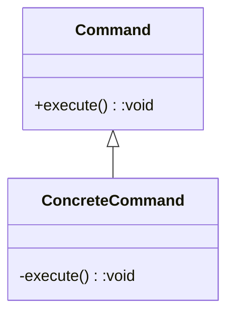
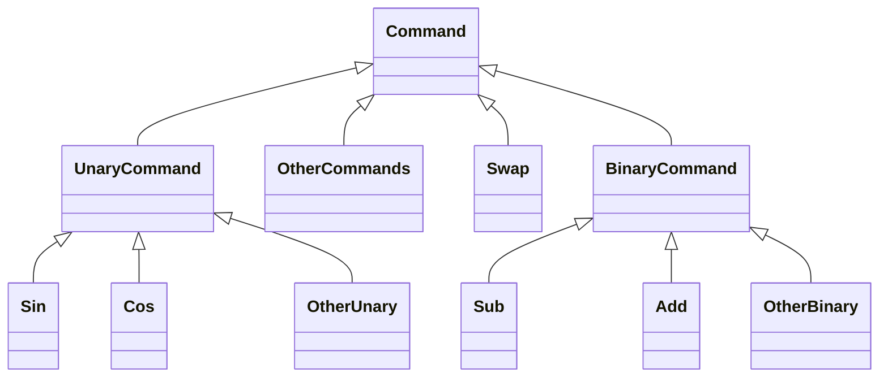

# The Command Dispatcher

命令分配器是计算器的核心。 作为MVC框架中的控制器，命令分发程序负责应用程序的整个业务逻辑。 本章不仅讨论计算器的命令分配器模块的特定设计，而且更广泛地讨论松散耦合的命令基础结构的灵活设计。

## 4.1 Command Dispatcher模块的分解

在分解堆栈时，我们提出的第一个问题是：“应将堆栈分成多少个组件？” 现在，我们向命令调度程序询问相同的问题。 为了回答这个问题，让我们考虑命令分配器必须封装的功能。 命令调度程序的功能是：

* 存储已知命令的集合，
* 接收并解释对这些命令的请求，
* 调度命令请求（包括撤消和重做功能），以及
* 执行实际操作（包括更新计算器的状态）。

在第二章中，我讨论了高内聚。 在类层面，为高内聚而设计意味着每个类只能做一件事情，而且应该做得很好。 在顶层的分解中，命令分配器确实只做一件事：它解释命令。 但是，在任务级别，从上面的功能列表中，它显然必须执行多个任务。 因此，我们将命令分配器分为几个不同的类，每个类只执行一种任务。 因此，我们有以下几类：

* CommandRepository：存储可用命令列表
* CommandDispatcher：接收并解释执行命令的请求
* CommandManager：调度命令并管理撤消和重做
* 命令层次结构：执行命令

本章的其余部分专门描述上述类和类层次结构列表的设计和重要实现细节。

## 4.2 Command类

在分解的这个阶段，我发现切换到自底向上的设计方法更有用。 在严格的自顶向下方法中，我们可能会从CommandDispatcher开始，该类接收并解释命令请求，然后逐步处理到命令本身。 但是，在这种自下而上的方法中，我们将从研究命令本身的设计开始。 我们从称为命令模式的抽象开始。

### 4.2.1 命令模式

命令模式是一种简单但功能非常强大的行为模式，它以对象的形式封装了请求。 从结构上讲，该模式被实现为抽象命令基类，该类提供了用于执行请求的接口。 具体命令仅实现接口。 在最简单的情况下，抽象接口仅由一个命令组成，用于执行该命令封装的请求。 简单实现的类图如图4-1所示。


图4-1. 命令模式的简单架构

本质上，该模式有两件事。 首先，它将命令的请求者与命令的调度程序分离。 其次，它将对动作的请求封装到一个对象中，否则该请求可以通过函数调用来实现。 该对象可以携带状态，并具有超出请求本身即时生存期的扩展生存期。

实际上，这两个功能给我们带来了什么？ 首先，因为请求者与调度程序是分离的，所以用于执行命令的逻辑不必与负责执行命令的类驻留在同一类或同一模块中。 这显然减少了耦合，但同时也增加了凝聚力，因为可以为系统必须执行的每个唯一命令创建一个唯一类。 其次，由于请求现在被封装在命令对象中，并且其生命周期不同于操作的生命周期，因此命令可能会延迟时间（例如，排队命令），并且会被撤消。 撤消操作之所以成为可能，是因为已执行的命令可以保留足够的数据，以将状态恢复到命令执行之前的瞬间。 当然，将排队功能与撤消功能结合在一起可以为实现命令模式的所有请求创建无限的撤消/重做。

### 4.2.2 有关实施撤消/重做的更多信息

pdCalc的要求之一是实现无限的撤消和重做操作。 大多数书籍都指出，可以通过仅使用undo命令扩展抽象命令接口来通过命令模式来实现撤消。 但是，这种简单的处理掩盖了正确实现撤消功能所需的实际细节。

实现撤消和重做涉及两个不同的步骤。 首先（显然），必须在具体的命令类中正确实现撤消和重做。 其次，必须实现数据结构以在命令对象被分派时跟踪和存储它们。 自然地，此数据结构必须保留命令执行的顺序，并且能够调度撤消，重做或执行新命令的请求。 撤消/重做数据结构将在下面的第4.4节中详细介绍。 目前讨论撤消和重做的实现。

实现撤消和重做操作本身通常很简单。 重做操作与命令的执行功能相同。 假设系统的状态在第一次执行命令之前和在调用撤消命令之后是相同的，则重做命令的实现基本上是免费的。 当然，这立即意味着执行撤消实际上是将系统状态恢复到刚执行命令之前的状态。

撤销可以通过两种类似但略有不同的机制来实现，每种机制都以不同的方式负责恢复系统状态。第一种机制完全按照名称undo的含义进行操作：它采用系统的当前状态，并从字面上反转forward命令的过程。在数学上，即撤消被实现为要执行的逆运算。例如，如果正向操作要在堆栈顶部取数字的平方根，那么撤消操作将是堆栈顶部取数字的平方。这种方法的优势在于，无需存储额外的状态信息即可实现撤消。缺点是该方法不适用于所有可能的命令。让我们来看一下前面例子的反面。也就是说，考虑对堆栈顶部的数字取平方。撤消操作将取平方运算结果的平方根。但是，原始数字是平方的正数还是负数？在不保留其他状态信息的情况下，反转方法会崩溃。

将撤消实现为相反操作的替代方法是在第一次执行命令之前保留系统的状态，然后将撤消实现为还原为该先前状态。 回到我们平方的例子
运算既可以计算平方，也可以将顶数保存在堆栈中。 然后，通过从堆栈中删除结果并从执行正向操作之前开始保存状态来实现撤消操作。 由于所有命令都被实现为允许携带状态的具体命令类的实例，因此命令模式启用了此过程。 这种实现撤消方法的有趣之处在于，操作本身不需要数学上的逆运算。 注意，在我们的示例中，撤消甚至不需要知道什么是正向操作。 它只需要知道如何用已保存状态替换栈顶元素即可。

在应用程序中使用哪种机制实际上取决于应用程序执行的不同操作。 当运算没有反函数时，存储状态是唯一的选择。 当逆运算的计算成本过高时，通常最好存储状态。 当状态的存储成本很高时，假设存在反向操作，则最好通过反转来实现撤消。 当然，由于每个命令是作为一个单独的类实现的，因此无需为整个系统做出如何实现撤消的全局决定。 给定命令的设计者可以在逐个命令的基础上自由选择最适合该特定操作的方法。 在某些情况下，即使是混合方法（存储和反转操作的单独部分）也可能是最佳的。 在下一节中，我们将检查我为pdCalc所做的选择。

#### 4.2.3 在计算器上应用命令模式

为了执行，撤消和重做计算器中的所有操作，我们将实现命令模式，每个计算器操作将由其自己的具体类封装，该具体类从抽象的Command类派生。 从上面有关命令模式的讨论中，我们可以看到必须做出两个决定才能将模式应用于计算器。 首先，我们必须确定每个命令必须支持哪些操作。 该操作集合将定义Command基类的抽象接口。 其次，我们必须选择一种策略来支持撤消。 确切地说，此决定始终由特定的具体命令的执行者决定。 但是，通过选择状态重建或在命令反转，我们可以实现一些基础架构以简化命令实现者的撤消操作。 我们将连续解决这两个问题。

#### 4.2.3.1 命令接口

选择要包含在抽象Command类中的公共功能与为计算器中的所有命令定义接口相同。 因此，决不能掉以轻心。 尽管每个具体命令将执行不同的功能，但是所有具体命令必须可以彼此替代（请参阅LSP）。 因为我们希望接口尽量少而完整，所以我们必须确定最少数量的函数，这些函数可以抽象地表达所有命令所需的操作。

要包括的前两个命令是最明显且最容易定义的。 它们分别是execute（）和undo（），分别用于执行命令的正向和反向操作的函数。 这两个函数返回void且不需要参数。 不需要参数，因为计算器的所有数据都是通过Stack类处理的，该类可通过单例模式进行全局访问。 此外，Command类将需要一个构造函数和一个析构函数。 因为该类旨在成为具有虚函数的接口类，所以析构函数应该是虚的。 清单4-1展示了我们在接口上的首次尝试。

清单4-1. 命令接口的首次尝试

```c++
class Command
{
public:
    virtual ~Command();
    void execute();
    void undo();
protected:
    Command();
private:
    virtual void executeImpl() = 0;
    virtual void undoImpl() = 0;
};
```

在清单4-1中，读者将立即注意到构造函数受到保护，execute（）和undo（）都是公共的和非虚拟的，并且存在单独的executeImpl（）和undoImpl（）虚拟函数。 构造函数受到保护的原因是向实现者发送信号，指出Command类无法直接实例化。 当然，由于该类包含纯虚函数，因此编译器始终会阻止直接实例化Command类。 使构造函数受保护有点多余。 另一方面，使用虚拟功能和非虚拟功能的组合来定义公共接口，应该进行更详细的说明。

通过混合公共非虚拟功能和私有虚拟功能来定义类的公共接口是一种设计原理，称为非虚拟接口（NVI）模式。 NVI模式指出，应始终使用将调用转发给私有虚拟函数的非虚拟公共函数来定义多态接口。这种模式背后的原因很简单。由于具有虚拟功能的基类充当接口类，因此客户端应仅通过多态性通过基类的接口访问派生类的功能。通过使公共接口成为非虚拟接口，基类实现程序保留了在分派之前拦截虚拟函数调用的功能，以便为所有派生类实现的执行添加前提条件或后置条件。将虚拟功能设置为私有强制消费者使用非虚拟接口。在不需要先决条件或后置条件的琐碎情况下，非虚拟功能的实现将简化为对虚拟功能的转发调用。即使在琐碎的情况下也坚持使用NVI模式的额外冗长性是有保证的，因为它可以保留设计灵活性，以便将来以零的计算开销进行扩展，因为可以内联转发函数调用。在Sutter [27]中详细讨论了NVI模式背后的更深入的原理。

现在让我们考虑一下execute（）或undo（）是否需要前置条件或后置条件； 我们从execute（）开始。 从第2章中的用例快速浏览中，我们可以看到，只有首先满足一组前提条件，才能执行pdCalc必须完成的许多操作。 例如，要计算两个数字相加，我们必须在堆栈上有两个数字。 显然，加法有一个先决条件。 从设计的角度来看，如果我们在执行命令之前捕获此先决条件，则可以在先决条件错误引起执行问题之前对其进行处理。 我们绝对希望在调用executeImpl（）之前将前提条件作为基础类execute（）实现的一部分进行检查。

必须为所有命令检查哪些先决条件？ 也许和其他命令一样，所有命令在堆栈上必须至少有两个数字？ 让我们研究另一个用例。 考虑采用数字的正弦值。 该命令仅需要一个数字即可。 啊，前提条件是特定于命令的。 对于有关前提条件的一般处理的问题，正确的答案是要求派生类通过让execute（）首先调用checkPreconditionsImpl（）虚拟函数来检查其自身的前提条件。

那么execute（）的后置条件呢？ 事实证明，如果满足每个命令的前提条件，则所有命令在数学上都是定义明确的。 太好了，不需要后置条件检查！ 不幸的是，数学上的正确性不足以确保使用浮点数进行无错误的计算。 例如，即使使用数学方法定义了加法运算，但使用pdCalc要求的双精度数字时，浮点加法运算也会导致正溢出。 但是，幸运的是，我们从第1章开始的要求指出，可以忽略浮点错误。 因此，从技术上讲，我们无需处理浮点错误，并且根本不需要后置条件检查。

为了使代码相对简单，我选择遵守要求并忽略pdCalc中的浮点异常。 如果我想主动参与设计并捕获浮点错误，则可以使用checkPostconditions（）函数。 因为浮点错误对于所有命令都是通用的，所以后置条件检查可能已经在基类级别上进行了处理。

通过使用NVI模式了解先决条件和后置条件的需求，我们可以为清单4-2中所示的execute（）编写以下简单实现。

清单4-2. execute的简单实现

```c++
void Command::execute()
{
    checkPreconditionsImpl();
    executeImpl();
    return;
}
```

鉴于checkPreconditionsImpl（）和executeImpl（）必须由派生类调用和处理，难道我们不就将这两个操作都集中到一个函数调用中了吗？ 我们可以，但是这个决定会导致设计欠佳。 首先，将这两个操作合并到一个executeImpl（）函数调用中，我们将要求一个函数执行两个不同的操作，从而失去内聚性。 其次，通过使用单独的checkPreconditionsImpl（）调用，我们可以选择强制派生类实现者检查先决条件（通过使checkPrecodnitionsImpl（）为纯虚拟）或提供（可选）默认条件实现来进行先决条件检查。 最后，谁说checkPreconditionsImpl（）和executeImpl（）将分派到同一派生类？ 请记住，层次结构可以深入多个层次。

与execute（）函数类似，可以假设撤消命令需要先决条件检查。 但是，事实证明，我们实际上不必检查撤消先决条件，因为它们在构造上始终是正确的。 也就是说，由于只能在成功执行了执行命令之后才调用撤消命令，因此可以保证满足undo（）的前提条件（当然，假设execute（）的正确实现）。 与正向执行一样，对于undo（）而言，不需要后置条件检查。

对execute（）和undo（）的前提条件和后置条件的分析导致在虚拟接口中仅添加了一个函数checkPreconditionImpl（）。但是，为了使该功能的实现完整，我们必须确定该功能的正确签名。首先，该函数的返回值应该是什么？我们既可以选择使返回值无效并通过异常处理前提条件失败，也可以选择将返回值设为可以表明前提条件未满足的类型（例如，布尔值在前提条件失败时返回false或枚举，指示发生的故障类型）。对于pdCalc，我选择通过异常处理前提条件失败。由于不需要直接调用程序execute（）函数来处理错误，因此该策略具有更大的灵活性。此外，可以将异常设计为携带可通过派生命令扩展的自定义描述性错误消息。这与使用枚举类型形成对比，枚举类型必须由基类实现者完全定义。

在指定checkPrecondition Impl（）签名时，我们必须解决的第二个问题是该函数是选择纯虚函数还是具有默认实现。 的确，大多数命令都需要满足一些先决条件，但这并不是每个命令都适用。 例如，在堆栈中输入新数字不需要先决条件。 因此，checkPreconditionImpl（）不应是纯虚函数。 相反，它被赋予不执行任何操作的默认实现，等效于声明满足先决条件。

由于命令中的错误是通过checkPreconditionImpl（）函数检查的，因此任何命令的正确实现都不应引发异常，除非checkPreconditionImpl（）除外。 因此，为了增加接口保护，Command类中的每个纯虚函数都应标记为noexcept。 为了简洁起见，我经常在文本中跳过此关键字； 但是，noexcept不会出现在实现中。 这个说明符实际上仅在插件命令的实现中很重要，这在第7章中进行了讨论。

下一个要添加到Command类的函数集是用于多态复制对象的函数。 该集合包括一个受保护的副本构造函数，一个公共的非虚拟clone（）函数和一个私有的cloneImpl（）函数。 在设计的这一点上，为什么命令必须是可复制的理由尚无充分理由。 但是，当我们检查CommandRepository的实现时，推理将变得清楚。 为了保持连续性，现在，我将讨论复制接口的实现。

对于为多态使用而设计的类层次结构，简单的副本构造函数是不够的，并且必须通过克隆虚拟函数来执行对象的副本。 考虑以下仅显示副本构造函数的缩写命令层次结构：

```c++
class Command
{
protected:
    Command(const Command&);
};
class Add : public Command
{
public:
    Add(const Add&);
};
```

我们的目标是复制多态使用的命令。 让我们看下面的示例，其中通过Command指针保存一个Add对象：

```c++
Command* p = new Add;
```

根据定义，复制构造函数将对自己的类类型的引用作为其参数。 因为在多态设置中我们不知道基础类型，所以我们必须尝试按以下方式调用复制构造函数：

```c++
auto p2 = new Command{*p};
```

上述构造是非法的，将无法编译。 因为Command类是抽象类（并且其副本构造函数受到保护），所以编译器将不允许创建Command对象。 但是，并非所有层次结构都具有抽象基类，因此在合法的情况下，可能会想尝试这种构造。 谨防。 这种构造将分割层次结构。 也就是说，p2将被构造为Command实例，而不是Add实例，并且p中的任何Add状态都将在副本中丢失。

鉴于我们不能直接使用复制构造函数，我们如何在多态环境中复制类？ 解决方案是提供一个虚拟克隆操作，该操作可以按如下方式使用：

```c++
Command* p2 = p->clone();
```

在这里，非虚拟clone（）函数将克隆操作分派给派生类的cloneImpl（）函数，该函数的实现只是调用带有取消引用的此指针作为其参数的自己的副本构造函数。 对于上面的示例，扩展的接口和实现如下：

```c++
class Command
{
public:
    Command* clone() const { return cloneImpl(); }
protected:
    Command(const Command&) { }
private:
    virtual Command* cloneImpl() const = 0;
};
class Add : public Command
{
public:
    Add(const Add& rhs) : Command{rhs} { }
private:
    Add* cloneImpl() const { return new Add{*this}; }
};
```

这里唯一有趣的实现功能是cloneImpl（）函数的返回类型。 注意，基类将返回类型指定为Command *，而派生类将返回类型指定为Add *。 这种构造称为返回类型协方差，该规则指出派生类中的重写函数返回的类型可能比虚拟接口中的返回类型更具特异性。 协方差允许克隆函数始终返回适合于调用克隆的层次结构级别的特定类型。 此功能对于具有公共克隆功能并允许从层次结构的所有级别进行克隆调用的实现非常重要。

我选择使用帮助消息功能和相应的虚拟实现功能完善命令接口。 此帮助功能的目的是强制各个命令实现者提供可通过用户接口中的帮助命令查询的命令的简要文档。 帮助功能对于命令的功能不是必需的，并且将其包含在设计中是可选的。 但是，即使在像计算器这样简单的程序中，也提供一些内部命令用法的文档总是很不错的。

结合以上所有信息，我们最终可以为Command类编写完整的抽象接口； 参见清单4-3。

清单4-3. Command类的完整抽象接口

```c++
class Command
{
public:
    virtual ~Command();
    void execute();
    void undo();
    Command* clone() const;
    const char* helpMessage() const;
protected:
    Command();
    Command(const Command&);
private:
    virtual void checkPreconditionsImpl() const;
    virtual void executeImpl() noexcept = 0;
    virtual void undoImpl() noexcept = 0;
    virtual Command* cloneImpl() const = 0;
    virtual const char* helpMessageImpl() const noexcept = 0;
};
```

如果查看Command.h中的源代码，还将看到一个虚拟的deallocate（）函数。 该函数专用于插件，将在第7章中讨论其对接口的附加功能。

> **现代C++设计说明：override关键字**
>
> C ++ 11中引入了override关键字。 从功能上讲，它可以防止常见的错误，而这对于新C ++程序员而言往往是令人惊讶的。 考虑以下代码片段：
>
> ```c++
> class Base
> {
> public:
>     virtual void foo(int);
> };
> class Derived : public Base
> {
> public:
>     void foo(double);
> };
> Base* p = new Derived;
> p->foo(2.1);
> ```
>
> 调用哪个函数？ 大多数C ++新手程序员都认为调用了Derived::foo（）是因为他们期望Derived的foo（）会覆盖Base的实现。 但是，由于foo（）函数的签名在基类和派生类之间有所不同，因此Base的foo（）实际上隐藏了Derived的实现，因为重载不会在作用域边界上发生。 因此，无论参数的类型如何，调用p-> foo（）都会调用Base的foo（）。 有趣的是，出于相同的原因
>
> ```c++
> Derived d;
> d->foo(2);
> ```
>
> 只能调用Derived::foo()。
>
> 在C ++ 03和C ++ 11中，以上代码的行为完全相同，但在技术上是正确的。 但是，从C ++ 11开始，派生类可以选择使用override关键字标记覆盖函数：
>
> ```c++
> class Derived : public Base
> {
> public:
>     void foo(double) override;
> };
> ```
>
> 现在，编译器会将声明标记为错误，因为程序员已明确声明应重写派生函数。 因此，添加override关键字通过允许程序员消除其意图，从而避免了令人困惑的错误的发生。
>
> 从设计角度来看，override关键字将功能明确标记为替代。 尽管这似乎并不重要，但是在处理大型代码库时，它非常有用。 在实现派生类（其基类位于代码的另一个不同部分）时，可以方便地了解哪些函数将覆盖基类函数，而哪些不必忽略基类的声明。

#### 4.2.3.2 撤销策略

在为命令定义了抽象接口之后，我们接下来继续设计撤消策略。 从技术上讲，由于界面中的undo（）命令是纯虚拟的，因此我们可以简单地撒手不管，声称实现undo是每个具体命令的问题。 但是，这既不够优雅又效率低下。 相反，我们为所有命令（或至少命令组）寻求某种功能上的共性，这可能使我们能够在命令层次结构中比每个叶节点更高的级别上实现撤消。

如前所述，可以通过命令反转或状态重构（或两者的某种组合）来实现撤消。 已经显示出命令反转是有问题的，因为对于某些命令，逆问题是不适当的（特别是它有多种解决方案）。 因此，让我们将状态重构作为pdCalc的通用撤消策略进行研究。

我们从加法操作的用例开始分析。加法从堆栈中删除两个元素，将它们加在一起，然后返回结果。可以通过从堆栈中删除结果并恢复原始操作数来实现简单的撤消，前提是这些操作数由execute（）命令存储。现在，考虑减法，乘法或除法。也可以通过删除结果并恢复其操作数来撤消这些命令。对所有命令实施撤消是否是如此简单，以至于我们只需要在execute（）期间存储堆栈中的前两个值，然后通过删除命令的结果并恢复存储的操作数来实施撤消？不。考虑正弦，余弦和切线。它们每个都从堆栈中获取一个操作数，并返回单个结果。考虑交换。它从堆栈中获取两个操作数，并返回两个结果（操作数的顺序相反）。不能对所有命令实施完全统一的撤消策略。就是说，我们不应该只是放弃希望，而是返回为每个命令单独执行撤消操作。

仅仅因为我们计算器中的所有命令都必须来自Command类，所以没有规则要求此继承是图4-1中描述的直接继承。 相反，请考虑图4-2中所示的命令层次结构。 尽管某些命令仍直接继承自Command基类，但我们创建了两个新的子类，可以从中继承更多专用的命令。 实际上，不久将看到，这两个新的基类本身就是抽象的。



图4-2. 计算器命令模式的多层次结构

我们之前的用例分析确定了两个重要的操作子类别，分别对其成员进行统一撤消操作：二元命令（接受两个操作数并返回一个结果的命令）和一元命令（接受一个操作数并返回一个结果的命令）。 因此，我们可以通过通用地处理这两类命令的撤消操作来显着简化实现。 虽然仍然需要单独使用一元或二元命令系列的命令来单独实现undo（），但这两个子类别约占计算器核心命令的75％。 创建这两个抽象将节省大量工作。

让我们研究一下UnaryCommand类。 根据定义，所有一元命令都需要一个参数并返回一个值。 例如，f（x）= sin（x）从堆栈中取一个数x，并将结果f（x）返回到堆栈中。 如前所述，将所有一元函数作为一个族一起考虑的原因是，不管该函数是什么，所有一元命令都同时执行正向执行和撤消操作，只是功能f有所不同。 此外，它们还必须最低限度地满足相同的前提条件。 即，堆栈上必须至少有一个元素。

在代码中，通过覆盖UnaryCommand基类中的executeImpl（），undoImpl（）和checkPreconditionsImpl（）并创建一个新的unaryOperation（）纯虚拟（将每个命令的精确实现委托给一个对象）来实施一元命令的上述常见特征。 进一步派生的类。 结果是一个UnaryCommand类，清单4-4中包含以下声明。

清单4-4. UnaryCommand类

```c++
class UnaryCommand : public Command
{
public:
    virtual ~UnaryCommand();
protected:
    void checkPreconditionsImpl() const override;
    UnaryCommand() { }
    UnaryCommand(const UnaryCommand&);
private:
    void executeImpl() override;
    void undoImpl() override;
    virtual double unaryOperation(double top) const = 0;
    double top_;
};
```

为了完整起见，让我们检查Command中三个重写功能的实现。 检查前提很简单； 我们确保堆栈上至少有一个元素。 如果不是，则抛出异常：

```c++
void UnaryCommand::checkPreconditionsImpl() const
{
    if(Stack::Instance().size() < 1)
        throw Exception{"Stack must have one element"};
}
```

executeImpl（）命令也非常简单：

```c++
void UnaryCommand::executeImpl()
{
    top_ = Stack::Instance().pop(true);
    Stack::Instance().push( unaryOperation(top_) );
}
```

顶部元素从堆栈中弹出，并存储在UnaryCommand的状态中，以用于撤消。 请记住，因为我们已经检查了前提条件，所以可以确信unaryOperation（）会正确完成。 具有特殊前提条件的命令仍然需要实现checkPreconditionsImpl（），但它们至少可以将一元前提条件检查向上委托给UnaryCommand的checkPreconditionImpl（）函数。 一口气，我们然后将一元函数操作分派到另一个派生类，并将其结果推回堆栈。

UnaryCommand的executeImpl（）函数唯一的特点是堆栈的pop命令的布尔参数。 该布尔值可选地抑制堆栈更改事件的发出。 因为我们知道以下对堆栈的push命令将立即再次更改堆栈，所以无需发出两个后续的堆栈更改事件。 抑制该事件使命令实现者可以将命令的动作集中到一个用户明显的事件中。 尽管此Stack的pop（）布尔值参数不是原始设计的一部分，但为了方便起见，现在可以将此功能添加到Stack类中。 请记住，设计是迭代的。

要检查的最后一个成员函数是undoImpl（）：

```c++
void UnaryCommand::undoImpl()
{
    Stack::Instance().pop(true);
    Stack::Instance().push(top_);
}
```

此功能也具有预期的明显实现。 一元运算的结果从堆栈中删除，并且在executeImpl（）执行期间存储在类的top_成员中的前一个top元素被还原到堆栈中。

作为使用UnaryCommand类的示例，我们提供sine命令的部分实现：

```c++
class Sine : public UnaryCommand
{
private:
    double unaryOperation(double t) const override { return std::sin(t); }
};
```

显然，使用UnaryCommand作为基类而不是最高级别的Command类的优点是，我们消除了实现undoImpl（）和checkPreconditionsImpl（）的需要，并且用稍微更简单的unaryOperation()代替了executeImpl（）的实现。 我们不仅需要总体上更少的代码，而且因为undoImpl（）和在所有一元指令中，checkPreconditionsImpl（）都是相同的，我们也减少了代码重复，这始终是肯定的。

二元命令以类似于一元命令的方式实现。 唯一的区别是，用于执行该操作的函数将两个命令用作操作数，并且相应地必须存储这两个值以进行撤消。 BinaryCommand类的完整定义可以在Command和从GitHub存储库的源代码中找到的Command.h头文件中的UnaryCommand类。

#### 4.2.3.3 Concrete Commands

上面的Command，UnaryCommand和BinaryCommand类的定义完成了抽象接口，用于在计算器中使用命令模式。 正确设置这些接口包含了大部分命令设计。 但是，到目前为止，我们的计算器还没有一个具体的命令（除了部分Sine类实现之外）。 本部分最终将纠正该问题，并且计算器的核心功能将初具规模。

计算器的核心命令均在CoreCommands.h文件中定义，其实现可在相应的CoreCommands.cpp文件中找到。 什么是核心命令？ 我将核心命令定义为包含从第1章中列出的要求中提炼的功能的命令集。对于计算器必须执行的每个不同操作，都有一个唯一的核心命令。 为什么将这些称为核心命令？ 它们是核心命令，因为它们是与计算器一起编译和链接的，因此在加载计算器时立即可用。 实际上，它们是计算器的固有部分。 这与插件命令相反，插件命令可以在运行时动态地加载计算器。 插件命令将在第7章中详细讨论。

尽管可能会怀疑我们现在需要执行分析以确定核心命令，但事实证明该分析已经完成。 具体来说，核心命令是由第2章用例中描述的操作定义的。精明的读者甚至会记得用例中的异常列表定义了每个命令的前提。 因此，参考必要的用例，可以轻松得出核心命令。 为了方便起见，它们都列在表4-1中。

表4-1. 核心命令

Command: EnterCommand, SwapTopOfStack, DropTopOfStack, Duplicate, ClearStack

UnaryCommand: Sine, Cosine, Tangent, Arcsine, Arccosine, Arctangent, Negate

BinaryCommand: Add, Subtract, Multiply, Divide, Power, Root

在将上述核心命令列表与第2章中的用例进行比较时，请注意，尽管用户可以要求计算器执行这两种操作，但它们中明显没有撤消和重做命令。 这两个“命令”是特殊的，因为它们作用于系统中的其他命令。 因此，在命令模式的意义上，它们未实现为命令。 相反，它们由尚未讨论的CommandManager进行内在处理，CommandManager是负责请求命令，调度命令以及请求撤消和重做操作的类。 撤消和重做操作（与每个命令定义的撤消和重做操作相反）将在下面的第4.4节中详细讨论。

每个核心命令的实现，包括先决条件的检查，正向操作和撤消实现，都是相对简单的。 大多数命令类可以用大约20行代码实现。 如果感兴趣的读者希望检查详细信息，可以参考其源代码。

#### 4.2.3.4 An Alternative to Deep Command Hierarchies

为每个操作创建一个单独的Command类是实现命令模式的非常经典的方法。 但是，现代C++为我们提供了一种非常引人注目的替代方案，使我们能够简化层次结构。 具体来说，我们可以使用lambda表达式（请参见侧栏）来封装操作，而不是创建其他派生类，然后使用标准函数类（请参见侧栏）将这些操作存储在UnaryCommand或BinaryCommand级别的类中。 为了使讨论更加具体，让我们考虑BinaryCommand类的替代局部设计，如清单4-5所示。

清单4-5. 替代局部设计

```c++
class BinaryCommandAlternative final : public Command
{
    using BinaryCommandOp = double(double, double);
public:
    BinaryCommandAlternative(const string& help,
                             function<BinaryCommandOp> f);
private:
    void checkPreconditionsImpl() const override;
    const char* helpMessageImpl() const override;
    void executeImpl() override;
    void undoImpl() override;
    double top_;
    double next_;
    string helpMsg_;
    function<BinaryCommandOp> command_;
};
```

现在，我们声明一个具体的最终类（请参见侧边栏），该类接受一个可调用的目标，并通过调用该目标来实现executeImpl（），而不是通过延迟到binaryOperation（）虚拟函数来实现executeImpl（）的抽象BinaryCommand。 实际上，BinaryCommand和BinaryCommandAlternative之间唯一的实质区别是executeImpl（）命令的实现中的细微差别。 参见清单4-6。

清单4-6.细微的差别

```c++
void BinaryCommandAlternative::executeImpl()
{
    top_ = Stack::Instance().pop(true);
    next_ = Stack::Instance().pop(true);
    // invoke callable target instead of virtual dispatch:
    Stack::Instance().push( command_(next_, top_) );
}
```

现在，以一个示例为例，而不是声明一个Multiply类并实例化一个Multiply对象，例如

```c++
auto mult = new Multiply;
```

我们创建了一个可以乘法的BinaryCommandAlternative，如

```c++
auto mult = new BinaryCommandAlternative{ "help msg",
[](double d, double f){ return d * f; } };
```

为了完整起见，我提到因为没有任何类可以进一步从BinaryCommandAlternative派生，所以我们必须直接在构造函数中而不是派生类中处理帮助消息。 此外，按照实现，BinaryCommandAlternative仅处理二元前提条件。 但是，可以以类似于二元操作的方式来处理其他前提条件。 也就是说，构造函数可以接受并存储一个lambda，以便在对checkPreconditionImpl（）中的两个堆栈参数进行测试之后执行前提条件测试。

显然，通过创建UnaryCommandAlternative类，可以像处理二元命令一样处理一元命令。 有了足够的模板，我敢肯定您甚至可以将二元和一元命令统一为一个类。 不过要事先警告。 太多的聪明，虽然对水冷却器印象深刻，但通常不会导致可维护的代码。 在这个扁平化的命令层次结构中，为二元命令和一元命令保留单独的类可能会在简洁性和可理解性之间取得适当的平衡。

BinaryCommand的executeImpl（）和BinaryCommandAlternative的executeImpl（）之间的实现差异很小。但是，您不应低估这种变化的幅度。最终结果是在命令模式的实现中存在重大的设计差异。在一般情况下，一个比另一个好吗？我认为不能明确地作出这样的表述。每个设计都有权衡。 BinaryCommand策略是命令模式的经典实现，大多数有经验的开发人员都会将其识别为命令模式。源代码非常易于阅读，维护和测试。对于每个命令，仅创建一个仅执行一个操作的类。另一方面，BinaryCommandAlternative非常简洁。只有一个类存在，而不是为n个操作提供n个类，并且每个操作都由构造函数中的lambda定义。如果精简代码是您的目标，那么这种另类的风格很适合。但是，由于lambda根据定义是匿名对象，因此不命名系统中的每个二元操作都会失去一些清晰度。

对于pdCalc，深层命令层次结构或浅层命令层次结构，哪种策略更好？ 就个人而言，我更喜欢深层的命令层次结构，因为命名每个对象都带来了清晰度。 但是，对于这样简单的操作（例如加法和减法），我认为可以提出一个很好的论据，即减少行数比通过匿名操作所损失的更多。 由于个人喜好，我使用深层次结构和BinaryCommand类实现了大多数命令。 尽管如此，我还是通过BinaryCommandAlternative实现了乘法，以说明实际的实现。 在生产系统中，我强烈建议选择一种策略或另一种策略。 在同一系统中实现这两种模式肯定比采用一种模式更容易混淆，即使所选的一种模式被认为不是最佳的。

> **现代C++设计说明：lambdas，standard function和final关键字**
>
> Lambda，标准函数和final关键字实际上是三个独立的现代C ++概念。 因此，我将分别说明它们。
>
> **Lambdas：**
>
> Lambda（更正式地讲是lambda表达式）可以被认为是匿名函数对象。 关于lambda的最简单推理方法是考虑它们的功能对象是否等效。 定义lambda的语法如下：
>
> ```
> [capture-list](argument-list){function-body}
> ```
>
> 上面的lambda语法等同于一个函数对象，该对象通过构造函数将捕获列表存储为成员变量，并为operator（）const成员函数提供由参数列表提供的参数和由函数体提供的功能体。 通常从函数主体中推导出operator（）的返回类型，但如果需要，可以使用替代函数返回类型语法（即，-> ret在参数列表和函数主体之间）手动指定。
>
> 考虑到lambda表达式和函数对象之间的等效性，lambda实际上并不为C ++提供新功能。 在C ++ 11中使用lambda可以完成的任何事情都可以在C ++ 03中使用不同的语法完成。 但是，lambda确实提供了一种引人注目的简洁语法，用于声明内联匿名函数。 Lambda的两个非常常见的用例分别是stL算法的谓词和C ++ 11异步任务的目标。 一些人甚至认为，lambda语法是如此引人注目，以至于不再需要用高级代码编写循环，因为可以用lambda和算法来代替它们。 我个人认为这种观点过于极端。
>
> 在二元命令的替代设计中，您看到了lambda的另一种用法。 它们可以存储在对象中，然后按需调用以提供用于实现算法的不同选项。 在某些方面，这种范例编码了策略模式的微观应用。 为了避免与命令模式混淆，我在正文中没有特别介绍策略模式。 有兴趣的读者可以参考Gamma等[6]的详细信息。
>
> **Standard function:**
>
> 函数类是C ++标准库的一部分。 此类为所有可调用目标提供了通用包装，将可调用目标转换为函数对象。 本质上，任何可以像函数一样调用的C ++构造都是可调用目标。 这包括函数，lambda和成员函数。
>
> 标准功能提供了两个非常有用的功能。 首先，它提供了用于与任何可调用目标接口的通用工具。 也就是说，在模板编程中，将可调用目标存储在函数对象中可统一目标上的调用语义，而与底层类型无关。 其次，函数可以存储其他难以存储的类型，例如lambda表达式。 在BinaryCommandAlternative的设计中，我们利用函数类来存储lambda，以实现小的算法，从而将策略模式叠加到命令模式上。 尽管未在pdCalc中实际使用，但函数类的泛型性质实际上使BinaryCommandAlternative构造函数可以接受除lambda之外的可调用目标。
>
> **final关键字：**
>
> C ++ 11中引入的final关键字使类设计者可以声明不能从其继承类或不能进一步覆盖虚拟函数。 对于那些来自C＃或Java的程序员，您会知道C ++在最后（双关语意）添加了此功能，已经晚了。
>
> 在C ++ 11之前，需要使用讨厌的hack来防止类的进一步派生。 从C ++ 11开始，final关键字使编译器可以强制执行此约束。 在C ++ 11之前，许多C ++设计人员认为final关键字是不必要的。 希望某个类是不可继承的设计师，可以使析构函数成为非虚拟的，从而暗示从该类派生不属于该设计师的意图。 任何看过从stL容器继承代码的人都将知道开发人员趋向于遵循编译器未强制执行的意图的程度。 您多久听到一位开发人员说：“总的来说，这是个坏主意，但是，不用担心，在我的特殊情况下，这很好。 在发出这条经常发表的评论之后，几乎不可避免地要进行为期一周的调试会议，以跟踪隐蔽的错误。
>
> 为什么要防止从类继承或覆盖先前声明的虚函数？ 可能是因为您遇到一种情况，即继承在被语言很好地定义的同时，在逻辑上根本没有任何意义。 pdCalc的BinaryCommandAlternative类就是一个具体的例子。 尽管您可以尝试从中派生并重写executeImpl（）成员函数（即没有final关键字），但该类的目的是终止层次结构并通过可调用目标提供二元操作。 从BinaryCommandAlternative继承是超出其设计范围。 因此，防止派生可能会防止细微的语义错误。

## 4.3 命令库

我们的计算器现在具有满足其要求所需的所有命令。 但是，我们尚未定义存储命令并随后按需访问它们所必需的基础结构。 在本节中，我们将探讨几种用于存储和检索命令的设计策略。

### 4.3.1 The Command Repository Class

乍一看，实例化新命令似乎是要解决的琐碎问题。 例如，如果用户请求将两个数字相加，则以下代码将执行此功能：

```c++
Command* cmd = new Add;
cmd->execute();
```

太棒了！ 问题解决了吧？ 并不是的。 该代码如何称呼？ 该代码在哪里出现？ 如果添加了新的核心命令（即需求变更）会怎样？ 如果动态添加新命令（如在插件中）怎么办？ 似乎很容易解决的问题实际上比最初预期的要复杂。 让我们通过回答上述问题来探索可能的设计替代方案。

首先，我们问如何调用代码的问题。计算器的部分要求是同时具有命令行界面（CLI）和图形用户界面（GUI）。显然，初始化命令的请求将在用户界面的某个位置派生，以响应用户的操作。让我们考虑一下用户界面如何处理减法。假设GUI上有一个减号按钮，并且单击该按钮时，将调用一个函数来初始化和执行减号命令（我们暂时将忽略撤消）。现在考虑CLI。当识别出减法令牌时，将调用类似的函数。最初，可能希望我们可以调用相同的功能，只要该功能存在于业务逻辑层而不是用户界面层中即可。但是，GUI回调的机制使此操作不可能实现，因为它将在GUI的小部件库上的业务逻辑层中产生不希望的依赖关系（例如，在Qt中，按钮回调是类中的插槽，这要求将回调的类设置为一个Q_OBJECT）。或者，GUI可以部署双重间接方式来分派每个命令（每次单击按钮将调用一个函数，该函数将在业务逻辑层中调用一个函数）。这种情况看起来既不优雅又不高效。

虽然上述策略看起来很麻烦，但是这种初始化方案的结构缺陷比不便更严重。 在我们为pdCalc采用的模型-视图-控制器体系结构中，不允许视图直接访问控制器。 由于命令属于控制器，因此由UI直接初始化命令违反了我们的基础架构。

我们如何解决这个新问题？ 回顾表2-2，命令分配器的唯一公共接口是事件处理函数commandEntered（const string＆）。 此实现实际上回答了我们最初提出的前两个问题：初始化和执行代码如何调用以及它位于何处？ 必须通过从UI到命令分配器的事件，使用通过字符串编码的特定命令，间接触发此代码。 代码本身必须驻留在命令分派器中。 请注意，此接口的另一个好处是，在创建新命令时，可以消除CLI和GUI之间的重复。 现在，两个用户界面都可以通过引发commandEntered事件并通过字符串指定命令来简单地创建命令。 您将分别在第5章和第6章中看到每个用户界面如何实现引发此事件。

根据以上分析，我们有动机向命令分配器添加一个新类，以负责拥有和分配命令。 我们将此类称为CommandRepository。 目前，我们假设命令调度程序的另一部分（CommandDispatcher类）接收到commandEntered（）事件，并从CommandRepository请求适当的命令（通过commandEntered（）的字符串参数），以及另一个组件 命令分派器（CommandManager类）的命令随后执行命令（并处理撤消和重做）。 也就是说，我们已经将命令的初始化和存储与它们的调度和执行分离了。 CommandManager和CommandDispatcher类是后续部分的主题。 现在，我们将重点介绍命令存储，初始化和检索。

我们从CommandManager类的以下骨架接口开始：

```c++
class CommandRepository
{
public:
    unique_ptr<Command> allocateCommand(const string&) const;
};
```

从上面的接口，我们看到给定一个字符串参数，存储库分配了相应的命令。 该接口使用智能指针返回类型来明确表明调用者拥有新构建命令的内存。

现在，让我们考虑一下allocateCommand（）的实现。 此练习将帮助我们修改设计以获得更大的灵活性。

```c++
unique_ptr<Command> CommandRepository::allocateCommand(const string& c) const
{
    if(c == "+") return make_unique<Add>();
    else if(c == "-") return make_unique<Subtract>();
    // ... all known commands ...
    else return nullptr;
}
```

上面的界面简单有效，但是由于需要系统中每个命令的先验知识而受到限制。 通常，由于多种原因，这种设计将是非常不希望的且不方便的。 首先，向系统添加新的核心命令将需要修改存储库的初始化功能。 其次，部署运行时插件命令将需要完全不同的实现。 第三，此策略在特定命令的实例化及其存储之间创建了不必要的耦合。 相反，我们更喜欢CommandRepository仅依赖于Command基类定义的抽象接口的设计。

通过应用称为原型模式[6]的简单模式可以解决上述问题。 原型模式是一种存储原始对象的创建模式，只需复制原型即可创建这种类型的新对象。 现在，考虑一种将CommandRepository仅仅视为命令原型容器的设计。 此外，让所有原型都由Command指针存储，例如，使用字符串作为键（可能与commandEntered（）事件中引发的字符串相同）存储在哈希表中。 然后，可以通过添加（或删除）新的原型命令来动态添加（或删除）新命令。 为了实现此策略，我们在CommandRepository类中添加了以下内容：

```c++
class CommandRepository
{
public:
    unique_ptr<Command> allocateCommand(const string&) const;
    void registerCommand(const string& name, unique_ptr<Command> c);
private:
    using Repository = unordered_map<string, unique_ptr<Command>>;
    Repository repository_;
};
```

注册命令的实现非常简单：

```c++
void CommandRepository::registerCommand(const string& name, unique_ptr<Command> c)
{
    if( repository_.find(name) != repository_.end() )
        // handle duplicate command error
    else
        repository_.emplace( name, std::move(c) );
}
```

在这里，我们检查命令是否已在存储库中。 如果是，那么我们将处理错误。 如果不是，那么我们将命令参数移到存储库中，该命令将成为命令名称的原型。 注意，使用unique_ptr表示注册命令会将此原型的所有权转移到命令存储库。 在实际使用中，所有核心命令都是通过CoreCommands.cpp文件中的一个函数注册的，每个插件内部都存在一个类似的函数来注册插件命令（在第7章中检查插件的构造时，将看到此接口。 ）。 这些函数分别在计算器初始化期间和插件初始化期间被调用。 可选地，可以使用显而易见的实现通过注销命令来扩充命令存储库。

使用我们的新设计，我们可以按如下方式重写allocateCommand（）函数：

```c++
unique_ptr<Command> CommandRepository::allocateCommand(const string& name) const
{
    auto it = repository_.find(name);
    if( it != repository_.end() )
    {
        return unique_ptr<Command>( it->second->clone() );
    }
    else return nullptr;
}
```

现在，如果在存储库中找到该命令，则将返回原型的副本。 如果未找到命令，则返回nullptr（或者，可能引发异常）。 原型的副本在unique_ptr中返回，表明调用者现在拥有此命令副本。 注意Command类中clone（）函数的使用。 克隆函数最初被添加到Command类中，以期将来有理由。 显而易见，为了实现原型模式，我们需要clone（）函数以多态复制Commands。 当然，如果在设计Command类时没有预见性为所有命令实现克隆功能，现在就可以轻松添加它。 请记住，您不会在一开始就获得完美的设计，因此请习惯于迭代设计的想法。

本质上，registerCommand（）和allocateCommand（）体现了CommandRepository类的最低限度完整的接口。 但是，如果检查该类包含的源代码，则会发现一些区别。 首先，其他功能已添加到接口。 附加功能主要是便利和语法糖。 其次，整个接口都隐藏在一个pimpl后面。 第三，我使用别名CommandPtr，而不是直接使用unique_ptr <Command>。 就本章而言，只需将CommandPtr定义为以下using语句即可：

```c++
using CommandPtr = std::unique_ptr<Command>;
```

可以在Command.h中找到的真实别名稍微复杂一些。 在第7章中将对此进行详细说明。相应地，我使用函数MakeCommandPtr（）而不是make_unique <Command>（）来创建CommandPtrs。

最后，尚未讨论的存储库代码中接口中影响设计的唯一其他部分是选择使CommandRepository为单例。 做出此决定的原因很简单。 无论系统中存在多少个不同的命令分配器（有趣的是，我们最终都会看到有多个命令分配器的情况），函数的原型永远不会改变。 因此，将CommandRepository设置为单例可以集中存储，分配和检索计算器的所有命令。

> **现代C++设计说明：uniform initialization**
>
> 您可能已经注意到，我通常使用花括号进行初始化。 对于长期使用C ++进行编程的开发人员，使用花括号初始化类（即，调用其构造函数）可能看起来很奇怪。 虽然我们习惯于使用列表语法来初始化数组，但是
>
> ```c++
> int a[] = { 1, 2, 3 };
> ```
>
> 使用花括号初始化类是C ++ 11中的新功能。 尽管括号仍可用于调用构造函数，但使用花括号的新语法（称为统一初始化）是现代C ++的首选语法。 尽管这两种初始化机制在功能上执行相同的任务，但是新语法具有三个优点：
>
> 1. 统一初始化non-narrowing:
>
> ```c++
> class A { A(int a); };
> A a(7.8); // ok, truncates
> A a{7.8}; // error, narrows
> ```
>
> 2. 统一的初始化（结合初始化列表）允许使用列表初始化用户定义的类型：
>
> ```c++
> vector <double> v{ 1.1, 1.2, 1.3 }; // valid since C++11; initializes vector with 3 doubles
> ```
>
> 3. 统一初始化永远不会错误地解析为一个函数：
> ```c++
> struct B { B(); void foo(); };
> B b(); // Are you declaring a function that returns a B?
> b.foo(); // error, requesting foo() in non-class type b
> B b2{}; // ok, default construction
> b2.foo(); // ok, call B::foo()
> ```
> 使用统一初始化时，只有一个大警告：列表构造函数总是在任何其他构造函数之前调用。 典型示例来自stL向量类，该类具有一个初始化程序列表构造函数和一个接受整数以定义向量大小的单独构造函数。 如果使用花括号，则初始化器列表构造函数会在任何其他构造函数之前调用，因此存在以下不同行为：
>
> ```c++
> vector<int> v(3); // vector, size 3, all elements initialized to 0
> vector<int> v{3}; // vector with 1 element initialized to 3
> ```
>
> 幸运的是，上述情况很少发生。 但是，这样做时，您必须了解统一初始化和函数样式初始化之间的区别。
>
> 从设计的角度来看，统一初始化的主要优点是可以将用户定义的类型设计为接受具有相同类型值的列表以进行构造。 因此，可以使用值列表对容器（例如向量）进行静态初始化，而不是先进行默认初始化再进行连续赋值。 这项现代的C ++功能使派生类型的初始化可以使用与内置数组类型相同的语法进行初始化，而C ++ 03缺少此语法功能。

### 4.3.2 注册核心命令

现在，我们定义了计算器的核心命令，以及一个用于按需加载和提供命令的类。 但是，我们尚未讨论将核心命令加载到CommandRepository中的方法。 为了正常运行，所有核心命令的加载只能执行一次，并且必须在使用计算器之前执行。 本质上，这定义了命令分派器模块的初始化要求。 由于退出程序时无需注销核心命令，因此不需要终结函数。

调用命令分配器的初始化操作的最佳位置是计算器的main（）函数。 因此，我们仅创建一个全局RegisterCoreCommands（）函数，在CoreCommands.h标头中声明它，在CoreCommands.cpp文件中实现它，然后从main（）调用它。 创建全局函数而不是在CommandRepository的构造函数中注册核心命令的原因是为了避免将CommandRepository与命令层次结构的派生类耦合在一起。 当然，注册功能可以称为InitCommandDispatcher（）之类的东西，但是我更喜欢一个更具体地描述功能的名称。

隐式地，我们只是将接口扩展到命令分派器（最初在表2-2中定义），尽管相当简单。 我们是否应该能够提前预见界面的这一部分？ 可能不是。 与第二章的高级分解相比，这种设计决定需要对接口进行更新，其级别要比第二章的高级分解要详细得多。我发现在开发过程中稍微修改关键接口是设计程序的一种可接受的方法。 要求不变性的设计策略过于僵化，难以实用。 但是，请注意，在开发过程中轻松接受关键接口修改与发布后接受关键接口修改相反，只有在充分考虑更改将如何影响已经使用您的代码的客户之后，才能做出决定。

## 4.4 命令管理器

设计了命令基础结构并在系统中创建了用于在系统中存储，初始化和检索命令的存储库后，我们现在可以设计一个负责按需执行命令以及管理撤消和重做的类。 此类称为CommandManager。 本质上，它通过在每个命令上调用execute（）函数并随后以适合于实现无限撤消和重做的方式保留每个命令来管理命令的生存期。 我们将从定义CommandManager的接口开始，并通过讨论实现无限撤消和重做的策略来结束本节。

### 4.4.1 The Interface

CommandManager的接口非常简单明了。 CommandManager需要一个接口来接受要执行的命令，撤消命令和重做命令。 可选地，还可以包括用于查询撤销和重做操作的可用数量的接口，这对于GUI的实现可能是重要的（例如，对于重做大小等于零，使重做按钮变灰）。 一旦命令传递到CommandManager，CommandManager便拥有该命令的生存期。 因此，CommandManager的接口应强制拥有所有权。 结合起来，我们为CommandManager提供了以下完整的接口：

```c++
class CommandManager
{
public:
    size_t getUndoSize() const;
    size_t getRedoSize() const;
    void executeCommand(unique_ptr<Command> c);
    void undo();
    void redo();
};
```

在CommandManager.h中列出的实际代码中，该接口还定义了一个枚举类，用于在构造过程中选择撤消/重做策略。 我提供此选项仅出于说明目的。 生产代码将仅实现一种撤消/重做策略，而不能使基础数据结构在构造时可自定义。

### 4.4.2 Implementing Undo and Redo

要实现无限的撤消和重做，我们必须具有一个可动态增长的数据结构，该结构能够按命令执行的顺序存储和重新访问命令。 尽管可以设计出许多不同的数据结构来满足这一要求，但我们将研究两种同样好的策略。 两种策略都已为计算器实现，并且可以在CommandManager.cpp文件中看到。

考虑图4-3中的数据结构，我将其称为列表策略。执行命令后，将其添加到列表（实现可以是列表，向量或其他合适的有序容器），并且更新指针（或索引）以指向最后执行的命令。每当调用undo时，当前指向的命令都将被撤消，并且指针将向左移动（先前命令的方向）。调用重做时，命令指针向右移动（以后命令的方向），并执行新指向的命令。当前命令指针到达最左端（不再存在要撤消的命令）或最右端（不再存在要重做的命令）时，存在边界条件。这些边界条件可以通过禁用使用户能够调用命令的机制来处理（例如，分别使撤消或重做按钮变灰），也可以通过简单地忽略会导致指针超出边界的撤消或重做命令来处理。 。当然，每次执行新命令时，必须先刷新当前命令指针右侧的整个列表，然后才能将新命令添加到撤消/重做列表中。为了防止撤消/重做列表成为具有多个重做分支的树，必须刷新列表。

或者，考虑图4-4中的数据结构，我将其称为堆栈策略。 我们没有维护命令的执行顺序，而是维护两个堆栈，一个堆栈用于撤消命令，一个堆栈用于重做命令。 执行新命令后，将其推入撤消堆栈。 通过从撤消堆栈中弹出顶部条目，撤消命令并将命令推入重做堆栈来撤消命令。 通过从重做堆栈中弹出顶部条目，执行命令并将命令推入撤消堆栈来重做命令。 存在边界条件，边界条件很容易由堆栈的大小标识。 执行新命令需要刷新重做堆栈。

实际上，通过堆栈或列表策略在执行撤消和重做之间进行选择在很大程度上是个人喜好。 列表策略仅需要一个数据容器，所需的数据移动较少。 但是，由于不需要索引或指针移位，因此堆栈策略的实现稍微容易一些。 也就是说，这两种策略都非常容易实现，并且只需要很少的代码。 一旦实现并测试了这两种策略，只要通过命令模式实现命令，CommandManager便可以轻松地在将来需要撤消和重做功能的项目中重用。 为了获得更大的通用性，可以将CommandManager模板化为抽象的Command类。 为简单起见，我选择为前面讨论的抽象Command类专门实现包含的CommandManager。

## 4.5 The Command Dispatcher

命令分派器模块的最后一个组件是CommandDispatcher类本身。 尽管此类可以更恰当地命名为CommandInterpreter，但我保留了CommandDispatcher的名称，以强调该类充当命令分派器模块与计算器其余部分的接口。 也就是说，就其他模块而言，CommandDispatcher类是命令调度程序模块的整体。

如前所述，CommandDispatcher类起两个主要作用。 第一个角色是充当命令调度程序模块的接口。 第二个角色是解释每个命令，从CommandRepository，并将每个命令传递给CommandManager以执行。 我们将依次解决这两个角色。

### 4.5.1 The Interface

对于命令分派器模块实现中的所有复杂情况，CommandDispatcher类的接口非常简单（大多数接口也是如此）。 如第2章所述，命令调度程序的接口完全由一个用于执行命令的函数组成； 该命令本身由字符串参数指定。 自然，此函数是前面讨论的executeCommand（）事件处理程序。 因此，CommandDispatcher类的接口由以下给出：

```c++
class CommandDispatcher
{
public:
    CommandDispatcher(UserInterface& ui);
    void executeCommand(const string& command);
private:
    unique_ptr<CommandDispatcherImpl> pimpl_;
};
```

回想一下，计算器的基本体系结构基于模型-视图-控制器模式，并且CommandDispatcher被允许直接访问模型（堆栈）和视图（用户界面）。 因此，CommandDispatcher的构造函数引用了一个抽象的UserInterface类，其详细内容将在第5章中进行讨论。由于堆栈是作为一个单例实现的，因此不需要直接引用堆栈。 按照我的惯常惯例，CommandDispatcher的实际实现被推迟到私有实现类CommandDispatcherImpl。

上面一种替代设计是使CommandDispatcher类直接成为观察者。 如第3章所述，我更喜欢使用中间事件观察器的设计。 在第5章中，我将讨论CommandIssuedObserver代理类的设计和实现，以代理用户界面和CommandDispatcher类之间的事件。

### 4.5.2 Implementing Details

通常，在本书中，我不会讨论pimpl类中包含的实现细节。 但是，在这种情况下，CommandDispatcherImpl类的实现特别有启发性。 CommandDispatcherImpl类的主要功能是实现功能executeCommand（）。 此功能必须接收命令请求，解释这些请求，检索命令，请求命令执行并优雅地处理未知命令。 如果我们从上至下开始分解命令调度程序模块，那么尝试干净地实现此功能将非常困难。 但是，由于采用了自下而上的方法，executeCommand（）的实现很大程度上是将现有组件粘合在一起的一种练习。 考虑以下实现，其中manager_对象是CommandManager类的实例，如清单4-7所示。

```c++
void CommandDispatcher::CommandDispatcherImpl::executeCommand(const string& command)
{
    double d;
    if( isNum(command, d) )
        manager_.executeCommand( MakeCommandPtr<EnterNumber>(d) );
    else if(command == "undo")
        manager_.undo();
    else if(command == "redo")
        manager_.redo();
    else
    {
        auto c = CommandRepository::Instance().allocateCommand(command);
        if(!c)
        {
            ostringstream oss;
            oss << "Command " << command << " is not a known command";
            ui_.postMessage( oss.str() );
        }
        else
        {
            try
            {
                manager_.executeCommand( std::move(c) );
            }
            catch(Exception& e)
            {
                 ui_.postMessage( e.what() );
            }
        }
    }

    return;
}
```

第5-10行处理特殊命令。 特殊命令是未在命令库中输入的任何命令。 在上面的代码中，这包括输入新数字，撤消和重做。 如果未遇到特殊命令，则假定可以在命令库中找到该命令。 在第13行进行此请求。如果从命令存储库返回了nullptr，则在第16-18行处理错误。 否则，命令由命令管理器执行。 注意，命令的执行在try / catch块中处理。 通过这种方式，我们能够捕获由命令前提条件失败引起的错误，并在用户界面中报告这些错误。 CommandManager的实现可确保不满足先决条件的命令不会输入到撤消堆栈中（按执行顺序很简单）。

在CommandDispatcher.cpp中找到的executeCommand（）的实际实现与上面的代码略有不同。 首先，实际的实现包括两个附加的特殊命令。 这些附加的特殊命令中的第一个是帮助。 可以发出help命令来为命令存储库中当前的所有命令打印简短的说明性消息。 虽然该实现通常将帮助信息打印到用户界面，但我只在CLI中公开了help命令（即，我的GUI的实现没有帮助按钮）。 第二个特殊命令处理存储过程。 存储过程在第8章中进行了解释。此外，我将try / catch块放置在其自己的函数中。 这样做只是为了缩短executeCommand（）函数，并将命令解释的逻辑与命令执行分开。

## 4.6 Revisiting Earlier Decisions

至此，我们已经完成了计算器的两个主要模块：堆栈和命令分配器。 让我们重新审视原始设计，以讨论出现的重大细微偏差。

回顾第二章，我们的原始设计通过在堆栈和命令分配器中引发事件来处理错误，这些事件将由用户界面处理。 做出此决定的原因是为了保持一致性。 虽然命令分派器具有对用户界面的引用，但堆栈没有。 因此，我们决定简单地让这两个模块通过事件通知用户错误。 但是，精明的读者会注意到，如上所述的命令调度程序永远不会引发异常。 而是在发生错误时直接调用用户界面。 那么我们是否没有破坏故意设计到系统中的一致性？ 否。实际上，我们在设计命令分派器的过程中隐式地重新设计了系统的错误处理机制，以使堆栈或命令分派器都不会引发任何错误事件。 让我们检查一下原因。

正如我刚才所说，从其实现中可以明显看出，命令调度程序不会引发错误事件，但是堆栈事件会发生什么呢？我们没有更改Stack类的源代码，那么如何消除错误事件呢？在原始设计中，当通过引发事件发生错误时，堆栈会间接通知用户界面。两种可能的堆栈错误情况是弹出一个空堆栈并交换大小不足的堆栈的顶部两个元素。在设计命令时，我意识到，如果一个命令触发了这些错误情况之一，则将通知用户界面，但不会通知命令分派器（它不是堆栈事件的观察者）。在这两种错误情况下，一条命令都会完成，尽管不会成功，并且会错误地放置在撤消堆栈上。然后我意识到，要么命令分派器必须捕获堆栈错误并防止错误地放置在撤消堆栈上，要么不应该允许命令产生堆栈错误。如最终设计所示，我选择了在执行命令之前使用前提条件的更简单，更简洁的实现方式，以防止发生堆栈错误，从而隐式地抑制了堆栈错误。

最大的问题是，为什么我不更改描述原始设计的文字和相应的代码以反映错误报告中的更改？简而言之，我希望读者看到确实发生了错误。设计是一个反复的过程，一本试图通过实例来教授设计的书应该包含这个事实而不是隐藏它。设计应具有一定的流动性（但可能具有较高的粘度）。尽管遇到证据表明原始设计有缺陷，但尽早修改错误的设计比坚持下去要好得多。更改错误的设计的时间越晚，修复它的成本就会越高，并且开发人员在尝试实施错误时将承受更多的痛苦。至于更改代码本身，我将在执行重构时从生产系统中的Stack类中删除多余的代码，除非将Stack类设计为可在通过事件处理错误的另一个程序中重用。毕竟，作为通用设计，通过引发事件来报告错误的机制没有缺陷。事后看来，这种机制根本不适用于pdCalc。