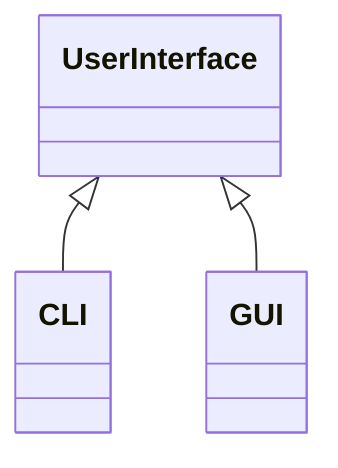
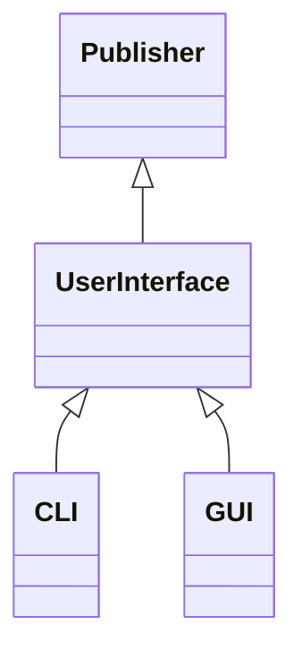

# The Command Line Interface

这是非常激动人心的一章。 尽管命令行界面（CLI）可能没有现代图形用户界面（GUI）的名声，尤其是电话或平板电脑的用户界面，但CLI仍然是非常有用和有效的用户界面。 本章详细介绍pdCalc的命令行界面的设计和实现。 到本章末，我们将首次拥有一个功能正常的计算器（尽管功能不完整），这是我们开发中的重要里程碑。

## 5.1 用户界面抽象

尽管我们可以单独设计功能全面的CLI，但从我们的需求中我们知道，功能完整的计算器必须同时具有CLI和GUI。 因此，首先考虑这两个接口之间的通用性并将此功能分解为通用抽象，将更好地为我们的总体设计服务。 让我们考虑构造用户界面抽象的两种设计替代方法，即自顶向下方法和自底向上方法。

在考虑具体类型之前设计抽象接口类似于自上而下的设计。 在用户界面方面，您首先要考虑任何UI必须遵循的最基本的要求，并基于此简约概念创建抽象的界面。 当抽象概念错过实现具体类型所需的内容时，有必要对接口进行优化。

考虑具体类型后设计抽象接口类似于自下而上的设计。 同样，就用户界面而言，您首先要考虑所有具体类型（在这种情况下为CLI和GUI）的需求，寻找所有类型之间的共通性，然后将这些共通特性提炼成抽象。 当添加新的具体类型时，需要对接口进行优化，而新的具体类型需要在最初提取抽象概念时未考虑的其他功能。

通常，哪种方法更好地用于创建抽象接口：自上而下还是自下而上？ 通常，答案取决于特定的情况，个人舒适度和风格。 在这种特定情况下，最好从抽象开始，再向下发展到具体类型（自顶向下方法）。 为什么？ 在这种情况下，自上而下的方法基本上是免费的。 用户界面是pdCalc的高级模块之一，在执行初始分解时，我们已经在第2章中为UI定义了抽象界面。 现在，让我们将抽象模块接口转变为实用的面向对象设计。

### 5.1.1 抽象接口

为UI拥有抽象界面的目的是使程序的其余部分能够与用户界面交互，而无需考虑当前界面是图形界面，命令行界面还是其他界面。 理想情况下，我们将能够将抽象接口分解为使用每个具体接口所需的最少功能。 任何共享实现的函数都可以在基类中定义，而任何需要基于具体类型的唯一实现的函数都可以在抽象基类中声明为虚函数，并在派生类中定义。 这个概念很简单，但是，像往常一样，魔鬼在细节上。

考虑图5-1中描述的层次结构。 我们的目标是为pdCalc的UserInterface类设计一个最小但完整的界面，并与Liskov可替换性原则保持一致，该界面将同时适用于CLI和GUI。 如前所述，我们已经在第2章中为此UI定义了一个高级界面。让我们从该预定义界面开始，并根据需要进行重构。



参考第2章中的表2-2，您可以看到UserInterface类的完整接口包含两个事件处理函数postMessage（）和stackChanged（），以及一个UserInterface引发事件commandEntered（）。 有趣的是，UserInterface类是发布者，观察者和抽象用户界面。

在接口级别，两个事件处理函数postMessage（）和stackChanged（）很简单。 正如我们与以前的观察者所做的一样，我们将简单地将这两个函数添加到UserInterface类的公共接口，并创建代理观察者类以代理发布者和实际观察者的通信。 这些代理将在下面的第5.1.2.2节中详细讨论。 具体的用户界面必须根据各个UI与用户的交互方式来唯一地处理事件处理的实现。 因此，postMessage（）和stackChanged（）都必须是纯虚拟的。 由于不需要在事件处理期间插入UserInterface类，因此，为简单起见，我选择放弃NVI模式。 但是，如第4章所述，可以将NVI模式与微不足道的转发非虚拟接口功能一起使用。

UserInterface类作为发布者的角色比其作为观察者的角色稍微复杂一些。 如您在第3章中设计Stack类时所见，Stack实现了发布者接口，而不是替代发布者。 因此，我们得出结论，从Publisher类的继承应该是私有的。 对于UserInterface类，除了UserInterface类本身不是发布者之外，与Publisher类的关系相似。 UserInterface类是系统中用户界面的抽象接口，并且它是从Publisher类继承的，仅用于增强用户界面必须自己实现发布者接口的概念。 CLI和GUI类都将需要从Publisher访问公共功能（例如，引发事件）。 因此，在这种情况下，保护的继承模式是合适的。

从第3章进一步回顾，为了使Stack类实现发布者接口，一旦我们使用私有继承，就需要将Publisher类的attach（）和detach（）函数提升到Stack的公共接口中。使用受保护的继承也是如此。但是，问题是，吊装应该发生在UserInterface类还是其派生类中？要回答这个问题，我们需要询问pdCalc如何使用特定的用户界面。显然，CLI或GUI“是” UserInterface。因此，具体的用户界面将公开继承自UserInterface，并应遵守LSP。因此，必须能够在不知道底层UI类型的情况下，将事件附加到特定用户界面或从特定用户界面分离事件。因此，attach（）和detach（）函数必须作为UserInterface公用接口的一部分可见。有趣的是，在观察者模式的一个非常独特的实现中，发布者接口的一部分在UserInterface级别上实现，而发布者接口的另一部分在派生类级别上实现。

结合以上所有要点，我们最终可以定义UserInterface类，如清单5-1所示。

```c++
class UserInterface : protected Publisher
{
public:
    UserInterface();
    virtual ~UserInterface();
    virtual void postMessage(const string& m) = 0;
    virtual void stackChanged() = 0;
    using Publisher::attach;
    using Publisher::detach;
    static const string CommandEntered;
};
```

CommandEntered字符串是输入命令事件的名称。 附加或分离此事件是必需的，并且可以为UserInterface类中的事件指定任何唯一的名称。

为了完整起见，我在图5-2中显示了最终的用户界面层次结构。 类图说明了CLI，GUI，抽象UserInterface类和发布者接口之间的关系。 请记住，UserInterface类和Publisher类之间的继承是受保护的，因此UserInterface（或后续派生类）不能用作Publisher。 但是，如前所述，在具体的CLI和GUI类与抽象的UserInterface类之间进行继承的意图是公共的，从而允许将任一具体类型的实例替换为UserInterface。



### 5.1.2 用户界面事件

定义UserInterface类不会完成UI的界面。 因为UserInterface类是事件发布者，所以我们还必须定义与CommandEntered（）事件相对应的事件数据类。 另外，定义UserInterface类最终完成了一个发布者/观察者对，因此我们终于可以设计并实现事件代理类，以代理用户界面与命令分派器和堆栈之间的事件。

在第4章中，您已经看到所有命令都是通过事件传递给命令调度程序的。 具体来说，UI引发一个事件，该事件包含编码为字符串参数的特定命令，CommandDispatcher接收此事件，并将字符串参数传递给CommandRepository，在其中检索具体命令进行处理。 就命令分派器而言，处理commandEntered（）事件是相同的，而不管编码的命令字符串是从CLI还是从GUI派生。

同样，当Stack类引发stackChanged（）事件时，堆栈对处理该事件的特定UserInterface无关。 因此，我们有动力在用户界面层次结构中的UserInterface类级别上统一处理commandEntered（）事件的发出和stackChanged（）事件的处理。

我们从检查引发commandEntered（）事件的通用基础结构开始。 在UserInterface类的构造函数中，将为所有用户界面注册commandEntered（）事件。 因此，任何派生的用户界面类可以通过调用发布者接口定义的raise（）函数来引发此事件，该函数通过受保护的继承关系是任何具体用户界面实现的一部分。 raise（）函数的签名需要事件的名称和事件的数据。 由于事件的名称是在UserInterface的构造函数中预定义的，因此引发命令输入的事件所需的唯一其他功能是常见的CommandData类。 现在来看一下它的设计。

#### 5.1.2.1 命令数据

在第3章中，我们将事件系统设计为使用推式语义传递事件数据。 回想一下推式语义仅意味着发布者创建一个对象，该对象包含处理事件所需的信息，并在引发事件时将其推给观察者。 事件数据对象必须从抽象EventData类公开继承。 引发事件时，观察者通过抽象接口接收事件数据，并通过将事件数据向下转换为适当的派生类来检索数据。

对于命令输入的事件，事件数据通常是一个字符串，其中包含要在堆栈上输入的数字或要发出的命令的名称。 CommandData类仅需要在构造时接受一个字符串命令，存储此命令，并为观察者提供检索该命令的功能。 清单5-2给出了整个实现。

```c++
class CommandData : public EventData
{
public:
    CommandData(const string& s) : command_(s) { }
    const string& command() const { return command_; }
private:
    string command_;
};
```

虽然在CLI和GUI之间确定如何以及何时引发CommandEntered事件的机制有所不同，但是两种都通过最终使用带有已发出的特定命令编码的CommandData参数调用Publisher的raise（）函数来引发事件。 也就是说，对于某些命令字符串cmd，以下代码在CLI，GUI或可能从UserInterface继承的任何其他用户界面中引发commandEntered（）事件：

```c++
raise( UserInterface::CommandEntered, make_shared<CommandData>(cmd) );
```


#### 5.1.2.2 用户界面观察者

本小节的目标是构建使类能够侦听事件的机制。 因为抽象用户界面既是事件的源，又是事件的宿，所以UI可以用作演示发布者和观察者如何交互的理想选择。

在第3章中，我们看到观察者是注册和侦听发布者引发的事件的类。 到目前为止，我们已经遇到了都需要观察事件的CommandDispatcher和UserInterface类。 尽管可以直接使CommandDispatcher或UserInterface成为观察者，但我更喜欢在发布者和需要观察事件的类之间构造一个专门的观察者中介。 我经常模糊地将这种中介称为代理。 我现在准备给这个名词一个更具体的含义。

代理模式[6]是一种设计模式，它使用一个类（代理）作为其他内容的接口。 没有严格定义其他东西，我们称之为目标。 它可能是网络连接，文件，内存中的对象，或者像我们这样的情况下，仅仅是另一个类。 通常，当基础目标不可能，不方便或复制昂贵时，将使用代理模式。 代理模式使用类缓冲区来允许系统将目标视为独立于其基础组成的对象。 在我们的上下文中，我们仅使用代理模式来缓冲发布者和观察者之间的通信。

为什么我们在这里麻烦使用代理模式？该策略具有几个明显的优势。首先，它通过用描述性命名的事件处理函数替换通用名称的notify（）函数，提高了目标类的公共接口的清晰度。其次，删除了Observer类的其他不必要的继承。消除这种依赖性减少了耦合，增加了凝聚力，并在目标不是观察者的环境中促进了目标的重用。第三，使用代理类消除了对需要侦听多个事件的目标类产生的歧义。如果不使用代理类，则将需要观察者在其单个notify（）函数中消除事件的歧义。对每个事件使用单独的代理，可使每个事件在目标对象中调用唯一的处理函数。使用代理实现观察者模式的主要缺点是额外花费了一点费用间接处理每个事件。但是，在适当使用观察者模式的情况下，额外间接调用的成本可以忽略不计。

使用代理模式来实现观察者模式会导致以下两个类用于处理commandEntered（）和stackChanged（）事件：分别为CommandIssuedObserver和StackUpdatedObserver。 CommandIssuedObserver在UI引发的commandEntered（）事件与命令分派器中的观察之间进行中介。 StackUpdatedObserver在堆栈引发的stackChanged（）事件与UI中的观察之间进行中介。 这两个类的实现都是相对简单和非常相似的。 作为示例，让我们检查CommandIssuedObserver的实现。 参见清单5-3。

```c++
class CommandIssuedObserver : public Observer
{
public:
    CommandIssuedObserver(CommandDispatcher& ce);
    void notifyImpl(shared_ptr<EventData>) override;
private:
    CommandDispatcher& ce_;
};
```

因为它在作为发布者的UI与作为观察者目标的CommandDispatcher之间调解事件，所以CommandIssuedObserver的构造函数引用了CommandDispatcher实例，当UI引发commandEntered（）事件时，它保留以回调命令调度程序 。 回想一下，当观察者附加到事件时，UI会将CommandIssuedObserver存储在发布者的事件符号表中。 notifyImpl（）的实现只是将EventData参数动态转换为特定的CommandData实例，然后调用CommandDispatcher的commandEntered（）函数。

当然，在触发事件之前，必须在UI中注册CommandIssuedObserver。 为了完整起见，以下代码说明了如何完成此任务：

```c++
ui.attach( UserInterface::CommandEntered, make_unique<CommandIssuedObserver>(ce) );
```

其中ui是UserInterface引用。 注意，由于将attach（）函数故意提升到抽象UserInterface范围中，因此通过引用进行附加允许我们为CLI和GUI重用相同的调用。 也就是说，事件的注册是通过抽象的UI界面完成的，该界面大大简化了pdCalc的main（）例程中的用户界面设置。 StackUpdatedObserver的声明和注册类似。

观察者代理类的完整实现可以在AppObservers.cpp中找到。 尽管观察者代理的使用与事件观察类交织在一起，但是代理不是目标类的接口的一部分。 因此，它们包含在自己的文件中。 代理对事件的附加操作在main.cpp中执行。 此代码结构保留了发布者和观察者之间的松散绑定。 具体而言，发布者知道他们可以引发哪些事件，但谁知道谁将观看，而观察者则知道他们将观看哪些事件，而不是谁引发。 发行者及其观察者外部的代码将两者绑定在一起。

## 5.2 实际CLI类

本章的其余部分专门介绍CLI具体类。 首先，重新检查CLI的要求。

### 5.2.1 需求

对pdCalc的要求表明计算器必须具有命令行界面，但是CLI到底是什么？ 我对命令行界面的定义是程序的任何用户界面，该程序通过文本交互地响应用户命令。 即使您对命令行界面的定义有所不同，我相信我们可以肯定地同意，仅表明程序应具有CLI的广泛要求是远远不够的。

在生产开发环境中，如果遇到的需求过于模糊而无法设计组件，则应立即寻求客户的澄清。注意，我说的是何时而不是如果。不管您为优化需求付出了多大的努力，始终会有不完整，不一致或变化的需求。这通常是由于一些原因而引起的。有时，这是由于有意识的努力而没有花费前期的时间来完善需求。有时，这是由于缺乏经验的团队成员不了解如何正确收集需求而引起的。但是，它常常是由于最终用户直到产品开始成型才知道他或她真正想要或需要的东西而引起的。即使对于我自己的客户的小型开发项目，我也是如此！虽然作为实施者，您始终保留权宜之计，无需用户参与即可完善需求，但我的经验表明，此路径总是会导致反复重写代码：一次是出于您认为用户想要的，一次是出于用户认为自己想要的，然后输入用户实际想要的内容。

显然，对于我们的案例研究，我们只有一个假设的最终用户，因此我们将自己进行优化。 我们指定以下内容：

* CLI应该接受针对计算器定义的任何命令的文本命令（存在于命令库中的命令，以及撤消，重做，帮助和退出）。
* help命令应显示所有可用命令的列表和简短说明性消息。
* CLI应该按照处理命令的顺序接受空格分隔的命令。 回想一下，该顺序对应于反向波兰符号。 按下回车键后，将处理一行中的所有命令。
* 处理完命令后，界面最多应显示堆栈的顶部四个元素以及堆栈的当前大小。

令人惊讶的是，上面列出的最低要求足以构建简单的CLI。 尽管这些要求有些武断，但为了描述设计和实现，还需要选择一些特定的东西。 如果您不喜欢最终的CLI，我强烈建议您指定自己的要求并相应地修改设计和实现。

### 5.2.2 CLI设计

CLI的设计非常简单。 因为我们的总体体系结构设计将计算器的整个“业务逻辑”放在后端，所以前端只是一个薄层，除了接受和标记来自用户的输入，将这些输入顺序传递给控制器外，无非 显示结果。 让我们从描述界面开始。

#### 5.2.2.1 接口

通过本章前面的分析，我们知道具体的CLI类将从抽象的UserInterface类继承。 该继承是公共的，因为CLI“是一个” UserInterface，并且必须替换为一个。 因此，CLI必须实现UserInterface的两个抽象的纯虚拟函数postMessage（）和stackChanged（）。 这两种方法只能通过UserInterface引用进行多态调用。 因此，这两种方法都成为CLI专用接口的一部分。 除了构造和销毁之外，CLI需要公开的唯一功能是启动其执行的命令。 此函数将驱动整个CLI，并且仅在用户请求退出程序时才返回（通常）。 结合以上内容，CLI的整个接口可以通过清单5-4中的代码给出。

```c++
class Cli : public UserInterface
{
    class CliImpl;
public:
    Cli(istream& in, ostream& out);
    ~Cli();
    void execute(bool suppressStartupMessage = false, bool echo = false);
private:
    void postMessage(const string& m) override;
    void stackChanged() override;
    unique_ptr<CliImpl> pimpl_;
};
```

尽管接口大部分都是不言自明的，但构造函数和execute（）函数的参数都值得解释。 为了满足上述要求，execute（）函数可以不带任何参数编写。 接口中包含的两个参数只是可以打开的可选功能。 首先
参数指定在CLI启动时是否显示横幅。 第二个参数控制命令回显。 如果echo设置为true，则在显示结果之前，将重复每个命令。 这两个功能都可以在CLI中进行硬编码，但是我选择将它们作为参数添加到execute（）方法中，以增加灵活性。

构造函数的参数不如execute（）命令的参数明显。 根据定义，CLI几乎从cin接收输入，然后将结果输出到cout或cerr。 但是，对这些标准I / O流进行硬编码可任意将此类的使用限制为传统的CLI。 通常，我主张将功能严格地限制在您所需要的范围之内，而不是期待更多的常规用法。 但是，使用C ++流I / O是我的经验法则的少数例外之一。

让我们讨论一下为什么使用对基类C ++ I / O流的引用通常是一种好的设计实践。首先，使用不同的I / O模式的需求很普遍。具体来说，重定向到文件或从文件重定向是对CLI的经常请求的修改。实际上，您将在第8章中看到此请求！其次，实现通用接口与特定接口的实现几乎不增加复杂性。例如，不是直接写入cout，而是简单地保留对输出流的引用并写入该输出流。在基本情况下，此引用仅指向cout。最后，使用任意流输入和输出可大大简化测试。尽管程序可以使用cin和cout实例化Cli类，但是测试可以使用文件流或字符串流实例化Cli类。以这种方式，可以使用字符串或文件来模拟交互式流的输入和输出。这种策略简化了Cli类的测试，因为输入可以轻松传递，输出可以轻松捕获为字符串，而不是通过标准输入和输出。

#### 5.2.2.2 实现

值得研究Cli类的实现，以观察pdCalc设计模块化带来的简单性。 Cli类的整个实现有效地包含在execute（）和postMessage（）成员函数中。 execute（）函数驱动CLI。 它向最终用户显示启动消息，等待输入命令，将这些命令标记化，并引发事件以向命令调度程序发出已输入新命令的信号。 stackChanged（）函数是一个观察者代理回调目标，它在引发stackChanged（）事件后将栈顶写入命令行。 本质上，CLI简化为两个I / O例程，其中execute（）处理输入，stackChanged（）处理输出。 让我们从清单5-5中所示的execute（）函数开始，看看这两个函数的实现。

```c++
void Cli::CliImpl::execute(bool suppressStartupMessage, bool echo)
{
    if (!suppressStartupMessage) startupMessage();
    for(string line; getline(in_, line, '\n');)
    {
        Tokenizer tokenizer{line};
        for(const auto& i : tokenizer)
        {
            if(echo) out_ << i << endl;
            if(i == "exit" || i == "quit")
                return;
            else
                parent_.raise( CommandEntered, make_shared<CommandData>(i) );
        }
    }
    return;
}
```

CLI的主要算法非常简单。 首先，CLI等待用户输入行。 其次，此输入行由Tokenizer类标记。 然后，CLI会在输入行中循环遍历每个令牌，并以令牌字符串作为事件的数据引发一个事件。 当遇到退出令牌或退出令牌时，CLI终止。

之前没有解释的execute（）函数的唯一部分是Tokenizer类。 简而言之，Tokenizer类负责获取文本字符串并将该字符串拆分为单独的以空格分隔的令牌。 CLI和令牌生成器均不能确定令牌的有效性。 令牌只是作为事件分发给命令调度程序处理。 注意，作为编写自己的替代方法，许多库（例如，boost）都提供了简单的标记器。

考虑到令牌化算法的简单性（请参阅Tokenizer.cpp中的实现），为什么我将令牌化器设计为类而不是返回字符串向量的函数？ 实际上，两个设计都可以正常工作，并且两个设计都同样易于测试和维护。 但是，我更喜欢类设计，因为它为Tokenizer提供了不同的类型。 让我们研究一下为令牌化创建独特类型的好处。

假设我们想对函数foo（）中的输入进行标记化，但在单独的函数bar（）中处理标记。 考虑以下两个可能的功能对，以实现此目标：

```c++
// use a Tokenizer class
Tokenizer foo(const string&);
void bar(const Tokenizer&);
// use a vector of strings
vector<string> foo(const string&);
void bar(const vector<string>&);
```

首先，使用Tokenizer类，foo（）和bar（）的签名立即将功能的意图通知程序员。我们知道这些功能涉及令牌化。使用字符串向量可以消除歧义，而无需进一步的文档说明（我故意不提供参数名称）。但是，更重要的是，键入令牌生成器使编译器可以确保只能使用Tokenizer类作为参数来调用bar（），从而防止程序员意外地使用不相关的字符串集合调bar（）。类设计的另一个好处是Tokenizer类封装了表示令牌集合的数据结构。这种封装可保护bar（）的接口避免将底层数据结构从例如字符串向量更改为字符串列表的决定。最后，如果需要，Tokenizer类可以封装有关令牌化的其他状态信息（例如，原始的，预先令牌化的输入）。字符串的集合显然仅限于仅携带令牌本身。

现在，让我们研究一下stackChanged（）函数的简化实现，如清单5-6所示。

```c++
void Cli::CliImpl::stackChanged()
{
    unsigned int nElements{4};
    auto v = Stack::Instance().getElements(nElements);
    ostringstream oss;
    size_t size = Stack::Instance().size();
    oss << "stack\n";
    size_t j{ v. size() };
    for(auto i = v.rbegin(); i != v.rend(); ++i)
    {
        oss << j << ":\t" << *i << "\n";
        --j;
    }
    postMessage( oss. str() );
}
```

Cli.cpp中的实现仅在打印的新颖性上有所不同。 请注意，只要堆栈发生更改，CLI就会简单地选择堆栈的前四项（按照我们的要求指定）（getElements（）返回nElement的最小值和堆栈的大小），将它们格式化为ostringstream并传递 到postMessage（）函数的字符串消息。 对于CLI，postMessage（）只是将字符串写入输出流。

在继续之前，让我们暂停一下，回顾一下CLI的实施情况如何简洁明了。这种简单性是pdCalc整体设计的直接结果。尽管许多用户界面将业务逻辑与显示代码混合在一起，但我们精心设计了这两层以使其相互独立。命令的解释和处理（业务逻辑）完全位于命令分派器中。因此，CLI仅负责接受命令，标记命令和报告结果。此外，基于事件系统的设计，CLI没有直接耦合到命令调度程序，这与我们的MVC架构一致。命令调度程序确实具有到用户界面的直接链接，但是由于我们的抽象性，命令调度程序绑定到抽象的UserInterface而不是特定的用户界面实现。这样，Cli可以完美地替代为UserInterface（LSP的应用程序），并且可以轻松地作为计算器的许多唯一视图中的任意一个来切入或切出。尽管这种灵活性似乎对于计算器的设计来说是过大的，但从测试和关注点分离的角度来看，所有组件的模块化都是有益的，即使该计算器没有计划具有另一个用户界面。

## 5.3 一个可运行的程序

在结束本章有关CLI的介绍之前，值得编写一个简单的主程序，该主程序将所有组件联系在一起，以演示一个有效的计算器。 pdCalc在main.cpp中的实际实现要复杂得多，因为它可以处理多个用户界面和插件。 最终，我们将逐步了解main.cpp中的完整实现，但是就目前而言，清单5-7中的代码将使我们能够使用命令行界面（当然，包括适当的头文件）来执行可运行的计算器。 

```c++
int main()
{
    Cli cli{cin, cout};
    CommandDispatcher ce{cli};
    RegisterCoreCommands(cli);
    cli.attach( UserInterface::CommandEntered,
    make_unique<CommandIssuedObserver>(ce) );
    Stack::Instance().attach( Stack::StackChanged,
    make_unique<StackUpdatedObserver>(cli) );
    cli.execute();
    return 0;
}
```

由于设计的模块化，整个计算器仅需六个可执行语句就可以设置，组装和执行！ main（）函数中的逻辑很容易理解。 从维护的角度来看，该项目的任何新程序员都可以轻松地跟踪计算器的逻辑，并且可以清楚地看到每个模块的功能都可以分为不同的抽象。 如在以后的章节中将看到的，随着添加了更多的模块，抽象的功能更加强大。

为了让您快速入门，存储库源代码中包含一个项目，该项目使用上述main（）函数作为应用程序的驱动程序来构建可执行文件pdCalc-simple-cli。 可执行文件是一个独立的CLI，其中包括本书中到目前为止所讨论的所有功能。

在下一章中，我们将考虑计算器的图形用户界面的设计。 一旦GUI完成，许多用户将迅速将CLI视为以前的练习或遗物。 在此之前，我想鼓励读者不要这么快地判断谦虚的CLI。 CLI是非常有效的界面，而且对于需要大规模部署或自动化的任务，通常它们更容易编写脚本。 至于pdCalc，就其个人而言，由于其易用性，我更喜欢CLI而不是GUI。 当然，也许这只是表明我也是前一个时代的遗物。