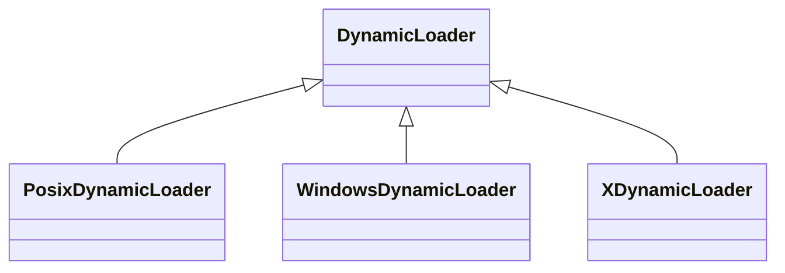
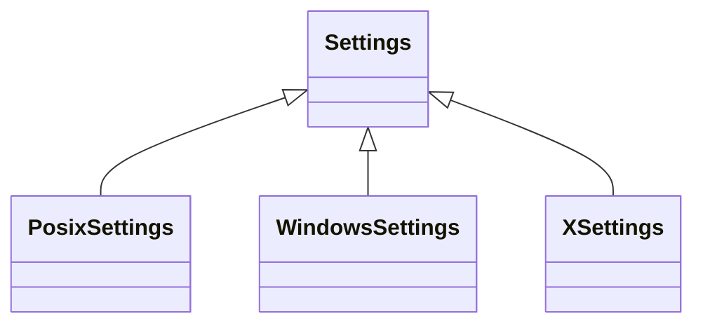
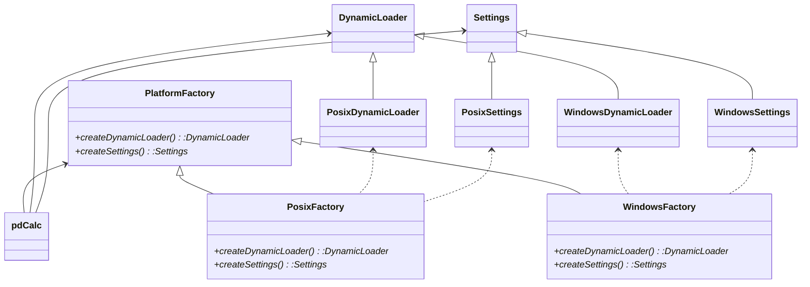

# Plugins

您可能已经阅读了本章的标题，因此您已经知道本章与插件有关，尤其是插件的设计和实现。 此外，插件将使我们有机会探索设计技术以隔离特定于平台的功能。 不过，在深入探讨细节之前，让我们先定义什么是插件。

## 7.1 什么是插件

插件是一个软件组件，可以在程序初次编译后将新功能添加到程序中。 在本章中，我们将仅专注于运行时插件，即作为共享库（例如POSIX .so或Windows .dll文件）构建的插件，这些插件可以在运行时发现并加载。

由于多种原因，插件在应用程序中很有用。这里只是几个例子。首先，插件对于允许最终用户无需重新编译即可向现有程序添加功能很有用。通常，这些是原始应用程序开发人员完全无法预料的新功能。其次，在架构上，插件可将程序分为多个可选部分，这些可选部分可随程序单独提供。例如，考虑具有某些基本功能但允许用户添加特殊功能（例如广告拦截器）的程序（例如网络浏览器）。第三，插件可用于设计可针对特定客户端定制的应用程序。例如，考虑一个电子健康记录系统，它需要根据软件是部署在医院还是医生的个人诊所而需要不同的功能。可以通过插入核心系统的不同模块来捕获必要的定制。当然，可以想到许多其他插件应用程序。

在pdCalc上下文中，插件是共享库，它们提供新的计算器命令以及（可选）新的GUI按钮。 那任务有多困难？ 在第4章中，我们创建了许多命令，并发现添加新命令相当简单。我们仅从Command类（或其派生类之一，如UnaryCommand或BinaryCommand）继承，实例化该命令，并将其注册到CommandRepository。 例如，使用在CoreCommands.h中声明的sine命令，如下所示：

```c++
class Sine : public UnaryCommand
{
// implement Command virtual members
};
```

并通过以下行在CoreCommands.cpp中注册

```c++
registerCommand( ui, "sin", MakeCommandPtr<Sine>() );
```

事实证明，除了一个关键步骤外，该命令几乎可以完全由插件命令执行。 由于pdCalc在编译时不知道插件命令的类名，因此我们无法使用插件类的名称进行分配。

看似不知道插件命令的类名的看似简单的难题导致了我们需要解决插件的第一个问题。 具体来说，我们需要建立一个抽象接口，通过该接口，pdCalc可以发现并在其中注册插件命令。 在确定了插件接口之后，我们将很快遇到第二个基本的插件问题，即如何动态加载插件，甚至使共享库中的名称可用于pdCalc。 为了使我们的生活更加复杂，第二个问题的解决方案取决于平台，因此，我们将寻求一种设计策略，以最大程度地减少平台依赖的痛苦。 我们将遇到的最后一个问题是更新现有代码，以动态添加新的命令和按钮。 也许令人惊讶的是，最后一个问题最容易解决。 但是，在开始解决我们的三个问题之前，我们需要考虑一些C ++插件规则。

### 7.1.1 C++插件规则

从概念上讲，插件不是C ++语言的一部分。 相反，插件是操作系统如何动态加载和链接共享库的体现（因此，插件具有特定于平台的性质）。 对于任何规模不大的项目，应用程序通常分为可执行文件和几个共享库（传统上，Unix中的.so文件，Mac OS X中的.dylib文件和MS Windows中的.dll文件）。

通常，作为C ++程序员，我们非常高兴地没有意识到这种结构所带来的微妙之处，因为可执行文件和库是在同类构建环境中构建的（即，相同的编译器和标准库）。但是，对于实用的插件界面，我们没有这样的保证。相反，我们必须进行防御性编程并假设最坏的情况，即插件是在与主应用程序不同但兼容的环境中构建的。在这里，我们将相对较弱的假设是，两个环境至少共享同一对象模型。具体来说，我们要求两个环境使用相同的布局来处理虚拟函数指针（vptr）。如果您不熟悉虚拟函数指针的概念，则可以在Lippman [13]中找到所有棘手的细节。虽然原则上C ++编译器作者可以选择不同的vptr布局，但实际上，编译器通常使用兼容的布局，尤其是同一编译器的不同版本。如果没有这种共享对象模型的假设，我们将不得不开发仅C语言的插件结构。请注意，我们还必须假设在主应用程序和插件中，对于所有类型T，sizeof（T）的大小均相同。例如，这消除了具有32位应用程序和64位插件的情况，因为这两个平台的指针大小不同。

异构环境中的编程如何影响我们可以使用的可用编程技术？在最坏的情况下，可能会使用不同的编译器和不同的标准库来构建主应用程序。这个事实有几个严重的含义。首先，我们不能假设插件和应用程序之间的内存分配和释放是兼容的。这意味着必须在同一插件中删除插件中新存储的所有内存。其次，我们不能假定标准库中的代码在任何插件和主应用程序之间都是兼容的。因此，我们的插件界面不能包含任何标准容器。虽然库不兼容可能看起来很奇怪（这是标准库，对吗？），但请记住，该标准指定接口而不是实现（受某些限制，例如向量占用连续内存）。例如，不同的标准库实现经常具有不同的字符串实现。一些人更喜欢小字符串优化，而另一些人更喜欢使用写时复制。第三，虽然我们假定对象中vptr的布局兼容，但是我们不能假定相同的对齐方式。因此，如果在主应用程序中使用了这些成员变量，则插件类不应从在基类中定义了成员变量的主应用程序类继承。这是因为，如果每个编译器使用不同的对齐方式，则主应用程序的编译器使用的成员变量内存偏移量可能不同于插件编译器定义的成员偏移量。第四，由于不同编译器之间的名称处理差异，导出的接口必须指定外部“ C”链接。链接要求是双向的。没有外部“ C”链接的插件不应调用应用程序函数，没有外部“ C”链接的应用程序也不应该调用插件函数。请注意，由于非内联非虚拟成员函数需要跨编译单元链接（与虚拟函数相反，虚拟函数通过vptr通过虚拟函数表中的偏移量进行调用），因此应用程序应仅通过virtual调用插件代码函数和插件代码不应调用在主应用程序中编译的基类非内联非虚拟函数。最后，异常很少能在主程序和插件之间的二进制接口之间移植，因此我们不能在插件中抛出异常并尝试在主应用程序中捕获它们。

那是一口。 让我们回顾一下C ++插件的规则：
1.在插件中分配的内存必须在同一插件中释放。
2.标准库组件不能在插件接口中使用。
3.假定不兼容的对齐方式。 如果变量在主应用程序中使用，请避免插件从具有成员变量的主应用程序类继承。
4.从插件（由主应用程序调用）导出的函数必须指定外部“ C”链接。 从主应用程序导出的功能（由插件调用）必须指定外部“ C”链接。
5.主应用程序应专门通过虚拟函数与插件派生的类进行通信。 插件派生的类不应调用非内联，非虚拟的主应用程序基类函数。
6.不要让插件中抛出的异常传播到主应用程序。

牢记这些规则，让我们回到为设计插件而必须解决的三个基本问题。

## 7.2 问题1：插件接口

插件接口负责多个事务。 首先，它必须能够发现新的命令和新的GUI按钮。 我们将看到，通过类接口有效地实现了此功能。 其次，插件必须支持C链接接口，用于分配和取消分配上述插件类。 第三，pdCalc应该提供一个从Command派生的PluginCommand类，以帮助正确编写插件命令。 从技术上讲，PluginCommand类是可选的，但是提供这样的接口可以帮助用户遵守插件规则3和6。第四，对于插件接口来说，提供一个查询插件支持的API版本的功能是值得的。 最后，pdCalc必须为插件调用的任何函数提供C链接。 具体来说，插件命令必须能够访问堆栈。 我们将从发现命令的接口开始依次解决这些问题。

### 7.2.1 发现命令的接口

我们面临的第一个问题是，当我们既不知道插件提供的命令也不知道实例化的类的名称时，如何从插件分配命令。 我们将通过创建一个抽象接口来解决此问题，所有插件都必须遵循该抽象接口，以导出命令及其名称。 首先，让我们解决我们需要的功能。

回顾第4章，为了将新命令加载到计算器中，我们必须在CommandRepository中注册它。根据设计，CommandRepository是专门为允许动态分配命令而构造的，而正是这种动态分配正是我们插件命令所需的功能。现在，我们假设插件管理系统可以访问register命令（我们将在7.4节中解决此缺陷）。 CommandRepository的注册功能需要命令的字符串名称和作为命令原型的unique_ptr。由于pdCalc对插件中的命令名称没有先验知识，因此插件接口必须首先使名称可发现。其次，由于C ++缺乏作为语言功能的反映，因此插件接口必须提供一种方法来创建与每个发现的名称相关联的原型命令。同样，通过设计，抽象的Command接口通过clone（）虚拟成员函数支持原型模式。让我们看看这两个先前的设计决策如何有效地启用插件。

根据上述C ++插件规则，我们必须执行命令发现的唯一方法是将其封装为所有插件必须遵守的纯虚拟接口。 理想情况下，我们的虚函数将返回一个由字符串作为键的unique_ptr <CommandPtr>值的关联容器。 但是，我们的C ++插件规则还规定我们不能使用标准容器，因此不包括字符串，映射，unordered_map和unique_ptr。 与其（不良地）重新实现这些容器中的任何一个的自定义版本，我们将使用一种通常可避免使用的低级工具：指针数组。

通过创建所有插件都必须遵循的Plugin类来强制执行以上设计。 该抽象类的目的是标准化插件命令发现。 类声明由以下给出：

```c++
class Plugin
{
public:
    Plugin();
    virtual ~Plugin();
    struct PluginDescriptor
    {
        int nCommands;
        char** commandNames;
        Command** commands;
    };
    virtual const PluginDescriptor& getPluginDescriptor() const = 0;
};
```

现在，我们有了一个抽象的插件接口，当专门化时，它需要派生类返回一个描述符，该描述符提供可用命令的数量，这些命令的名称以及命令本身的原型。 显然，命令名称的顺序必须与命令原型的顺序匹配。 不幸的是，在使用原始指针和原始数组的情况下，谁拥有命令名称和命令原型的内存谁就产生了歧义。 由于无法使用标准容器，我们不得不进行不幸的设计：通过评论签约。 由于我们的规则规定必须由同一插件释放在插件中分配的内存，因此最好的策略是决定由插件负责PluginDescriptor及其组成部分的重新分配。 如前所述，内存合同通过评论“强制执行”。

太好了，我们的问题解决了。我们创建了一个名为MyPlugin的插件，该插件继承自Plugin。我们将在下面的第7.3节中了解如何分配和取消分配插件。在MyPlugin内部，我们照常从Command继承来创建新命令。由于插件知道自己的命令名称，因此与主程序不同，该插件可以使用new运算符分配其命令原型。然后，为了注册所有插件的命令，我们只需为插件描述符分配命令名称和命令原型，然后通过覆盖getPluginDescriptor（）函数来返回描述符，然后让pdCalc注册命令即可。由于Commands必须各自实现clone（）函数，因此pdCalc可以通过此虚拟函数复制插件命令原型，以将其注册到CommandRepository。通常，可以从commandNames数组创建用于注册的字符串名称。对于已经分配的Plugin * p，pdCalc中的以下代码可以实现注册：

```c++
const Plugin::PluginDescriptor& d = p->getPluginDesciptor();
for(int i = 0; i < d.nCommands; ++i)
    CommandRepository::Instance().registerCommand( d.commandNames[i],
        MakeCommandPtr( d.commands[i]->clone() ) );
```

在这一点上，您可能会认识到我们的插件的困境。命令是在插件中分配的，在通过clone（）调用向主程序中的CommandRepository注册后将其复制，然后在CommandRepository的析构函数执行时最终被主程序删除。更糟糕的是，每次执行命令时，CommandRepository都会克隆其原型，并通过Command的clone（）函数在插件中触发一条新语句。 CommandManager通过其撤消和重做堆栈来管理此命令的生命周期。具体来说，当从这些堆栈之一中清除命令时，当删除保存该命令的unique_ptr时，将在主程序中调用delete。至少，这就是它的工作方式，无需进行任何调整。正如在第4章中提到的那样，CommandPtr不仅仅是unique_ptr <Command>的简单别名。现在，我将最后描述CommandPtr别名和MakeCommandPtr（）函数背后的机制，这些机制允许正确的插件命令内存管理。

从根本上讲，我们首先需要一个函数在相应的编译单元中调用delete。 解决此问题的最简单方法是向Command类添加一个deallocate（）虚拟函数。 该功能的职责是在销毁命令时在正确的编译单元中调用delete。 对于所有核心命令，正确的行为只是在主程序中删除该类。 因此，我们不会使deallocate（）函数成为纯虚拟的，而是为其提供以下默认实现：

```c++
void Command::deallocate()
{
    delete this;
}
```

对于插件命令，对deallocate（）的覆盖具有相同的定义，只有定义出现在插件的已编译代码中（例如，在特定插件中的命令使用的基类中）。 因此，在主应用程序中的Command指针上调用deallocate（）时，虚拟函数分派可确保从正确的编译单元调用delete。 现在我们只需要一种机制来确保我们调用deallocate（），而不是在收回Commands时直接调用delete。 幸运的是，好像标准委员会在设计unique_ptr时就完美地预期了我们的需求。 让我们返回CommandPtr别名，看看如何使用unique_ptr解决我们的问题。

定义CommandPtr别名并实现能够调用deallocate（）而不是delete的MakeCommandPtr（）函数所需的代码行非常少。 该代码利用了unique_ptr的删除器对象（请参见边栏），当调用unique_ptr的析构函数时，该对象可以调用自定义例程来回收unique_ptr所拥有的资源。 让我们看一下代码：

```c++
inline void CommandDeleter(Command* p)
{
    p->deallocate();
    return;
}
using CommandPtr = unique_ptr<Command, decltype(&CommandDeleter)>;
inline auto MakeCommandPtr(Command* p)
{
    return CommandPtr{p, &CommandDeleter};
}
```

必须对上面的密集代码进行简要说明。 CommandPtr只是unique_ptr的别名，其中包含一个Command指针，可以通过销毁CommandDeleter（）函数来回收Command指针。 unique_ptr调用的CommandDeleter（）函数是一个简单的内联函数，该函数调用先前定义的虚拟deallocate（）函数。 为了减轻创建CommandPtr的语法负担，我们引入了一个内联的MakeCommandPtr（）帮助函数，该函数从Command指针构造一个CommandPtr。 而已。 现在，和以前一样，unique_ptrs自动管理命令的内存。 但是，unique_ptr的析构函数不是直接在基础Command上调用delete，而是调用CommandDeleter函数，该函数调用deallocate（），该函数在正确的编译单元中对基础Command进行删除。

如果查看MakeCommandPtr（）的源代码，除了上面看到的带有Command指针参数的函数版本外，您还将看到一个非常不同的重载，它使用可变参数模板和完美的转发。 由于在存储过程的构造中MakeCommandPtr（）的语义用法不同，因此必须存在此重载函数。 我们将在第8章中再次介绍该函数的两种形式的原理。如果悬而未决，请随时跳至第8.1.2节。

> **现代C++设计说明：unique_ptr销毁机制**
>
> unique_ptr <T，D>类模板是一个智能指针，用于对资源的唯一所有权进行建模。 最常用的用法仅指定第一个模板参数T，该参数声明要拥有的指针的类型。 第二个参数D指定在销毁unique_ptr期间调用的自定义delete可调用对象。 让我们看一下用于unique_ptr的析构函数的概念模型：
>
> ```c++
> template<typename T, typename D = default_delete<T>>
> class unique_ptr
> {
>     T* p_;
>     D d_;
> public:
>     ~unique_ptr()
>     {
>         d_(p_);
>     }
> };
> ```
>
> unique_ptr的析构函数使用函数调用语义将拥有的指针传递给Deleter, 而不是直接调用delete。 从概念上讲，default_delete实现如下：
>
> ```c++
> template<typename T>
> struct default_delete
> {
>     void operator()(T* p)
>     {
>         delete p;
>     }
> };
> ```
>
> 也就是说，default_delete只是删除unique_ptr包含的基础指针。 但是，通过在构造过程中指定一个自定义的deleter可调用对象（D模板参数），unique_ptr可用于释放需要自定义释放语义的资源。 作为一个简单的示例，结合了lambda表达式，unique_ptr的delete语义使我们可以创建一个简单的raii（资源获取是初始化）容器类MyObj，由malloc（）分配：
>
> ```c++
> MyObj* m = static_cast<MyObj*>( malloc(sizeof(MyObj) ) );
> auto d = [](MyObj* p){ free(p); };
> auto p = unique_ptr<MyObj, decltype(d)>{m, d};
> ```
>
> 当然，我们对pdCalc的设计显示了unique_ptr的自定义删除语义的有用性的另一个实例。 应当注意，shared_ptr也以类似的方式接受自定义删除器。

### 7.2.2 增加新GUI按钮的接口

从概念上讲，动态添加按钮与动态添加命令没有太大区别。 主应用程序不知道需要从插件中导入哪些按钮，因此Plugin接口必须提供一个提供按钮描述符的虚函数。 但是，与命令不同，该插件实际上不需要分配按钮本身。 回顾第六章，GUI CommandButton小部件仅需要文本即可进行构造。 特别是，它需要按钮的显示文本（可选的是转移的状态文本）和带有clicked（）信号的命令文本。 因此，即使对于插件命令，相应的GUI按钮本身也完全位于主应用程序中。 插件只能提供文字。 这会在Plugin类中导致以下简单接口：

```c++
class Plugin
{
public:
    struct PluginButtonDescriptor
    {
        int nButtons;
        char** dispPrimaryCmd; // primary command label
        char** primaryCmd; // primary command
        char** dispShftCmd; // shifted command label
        char** shftCmd; // shifted command
    };
    virtual const PluginButtonDescriptor* getPluginButtonDescriptor() const = 0;
};
```

同样，由于我们必须遵循插件规则，因此该接口必须由低级字符数组组成，而不是由更高级别的STL构造组成。

相对于getPluginDescriptor（）来说，getPluginButtonDescriptor（）函数的一个有趣方面是决定返回指针而不是引用。此选择的基本原理是，插件编写者可能希望编写一个插件，以导出没有相应GUI按钮的命令（即，仅CLI的命令）。相反，这当然是荒谬的。也就是说，我无法想象为什么有人会编写一个插件，为不存在的命令导出按钮。在两个描述符函数的返回类型中捕获了这种实用性。由于这两个功能都是纯虚拟的，因此插件专业化必须实现它们。因为getPluginDescriptor（）返回一个引用，所以它必须导出一个非null的描述符。但是，通过返回指向描述符的指针，允许getPluginButtonDescriptor（）返回一个nullptr，指示该插件不导出任何按钮。有人可能会争辩说，getPluginButtonDescriptor（）函数不应是纯虚拟的，而应提供返回nullptr的默认实现。该决定在技术上是可行的。但是，通过坚持要求插件作者手动实现getPluginButtonDescriptor（），接口可以强制明确做出决定。

### 7.2.3 插件的分配和取消分配

我们最初的问题是主程序不知道插件命令的类名，因此无法通过调用new来分配它们。 我们通过创建一个抽象的Plugin接口解决了这个问题，该接口负责导出命令原型，命令名称以及足够的信息，以供GUI创建按钮。 当然，要实现此接口，插件必须从Plugin类派生，从而创建一个专业化名称，主应用程序事先无法知道其名称。 看来，我们没有取得任何进展，回到了原来的问题。

实际上，与原始问题类似，我们的新问题很容易解决。 通过在每个具有预先指定名称的插件中创建一个单独的“ C”分配/取消分配函数对来解决该问题，这些名称通过基类指针分配/取消分配插件专业化类。 为了满足这些要求，我们在插件界面中添加了以下两个功能：

```c++
extern "C" void* AllocPlugin();
extern "C" void DeallocPlugin(void*);
```

显然，AllocPlugin（）函数分配插件专用化并将其返回给主应用程序，而DeallocPlugin（）函数在主应用程序使用完后将其解除分配。 奇怪的是，AllocPlugin（）和DeallocPlugin（）函数使用void指针而不是Plugin指针。 由于外部“ C”接口必须符合C类型，因此该接口对于保留C链接是必需的。 保持C连接的不幸结果是必须进行强制转换。 主应用程序在使用前必须将void *强制转换为Plugin *，共享库必须在调用delete之前将void *强制转换回Plugin *。 不过请注意，我们不需要具体的插件类名。 因此，AllocPlugin（）/ DeallocPlugin（）函数对解决了我们的问题。

### 7.2.4 插件命令接口

从技术上讲，不需要特殊的插件命令界面。 但是，提供这样的接口有助于编写遵循C ++插件规则的插件命令。 具体来说，通过创建PluginCommand接口，我们可以确保插件开发人员具有两个关键功能。 首先，我们提供一个接口，以确保插件命令不会从具有任何状态的命令类继承（以避免对齐问题）。 通过构造该属性是显而易见的。 其次，我们使用checkPreconditionsImpl（）函数来创建跨插件边界的无异常接口。 牢记此指导，这是PluginCommand接口：

```c++
class PluginCommand : public Command
{
public:
    virtual ~PluginCommand();
private:
    virtual const char* checkPluginPreconditions() const noexcept = 0;
    virtual PluginCommand* clonePluginImpl() const noexcept = 0;
    void checkPreconditionsImpl() const override final;
    PluginCommand* cloneImpl() const override final;
};
```

尽管在第4章中仅作了简要介绍，但Command类中的所有纯虚函数都标记为noexcept，除了checkPreconditionsImpl（）和cloneImpl（）之外（请参见关键字noexcept的侧栏）。 因此，为了确保插件命令不会引发异常，我们只需在层次结构的PluginCommand级别上实现checkPreconditionsImpl（）和cloneImpl（）函数，并为其派生类创建新的，无异常的纯虚函数。 在PluginCommand类中，checkPreconditionsImpl（）和cloneImpl（）都标记为final，以防止专业化无意中覆盖这两个函数。 checkPreconditionsImpl（）的实现可以简单地编写如下：

```c++
void PluginCommand::checkPreconditionsImpl() const
{
    const char* p = checkPluginPreconditions();
    if(p) throw Exception(p);
    return;
}
```

请注意，上述实现背后的关键思想是PluginCommand类的实现位于主应用程序的编译单元中，而此类的任何特殊化都位于插件的编译单元中。 因此，通过虚拟调度，将在主应用程序的编译单元中执行对checkPreconditionsImpl（）的调用，然后该函数依次调用位于插件的编译单元中的无异常checkPluginPreconditions（）函数。 如果发生错误，则checkPreconditionsImpl（）函数会通过nullptr返回值接收到错误，并随后从主应用程序的编译单元而不是插件的编译单元引发异常。

在Command.cpp中可以找到cloneImpl（）的类似的简单实现。 继承自PluginCommand而不是Command，UnaryCommand，或BinaryCommand更有可能避免违反任何C ++插件规则，因此不太可能产生难以诊断的，特定于插件的运行时错误。

> **现代C++设计说明：noexcept**
>
> the C++98 standard admits using exception specifications. For example, the following
> specification indicates that the function foo() does not throw any exceptions (the throw
> specification is empty):
>
> ```c++
> void foo() throw();
> ```
>
> 不幸的是，C ++ 98异常规范存在许多问题。 尽管它们是指定函数可以抛出的异常的极好的尝试，但它们的行为常常不符合预期。 例如，编译器从不保证在编译时指定异常规范，而是通过运行时检查强制实施此约束。 更糟糕的是，声明不抛出异常规范可能会影响代码性能。 由于这些原因以及更多原因，许多编码标准被声明为应避免使用异常规范（例如，参见[27]中的标准75）。
>
> 尽管指定函数可以抛出哪些规范并不是非常有用，但是指定函数不能抛出任何异常可能是重要的接口考虑因素。 幸运的是，C ++ 11标准通过引入noexcept关键字纠正了异常规范混乱。 有关noexcept指定符的用法的深入讨论，请参见[19]中的第14项。 在我们的讨论中，我们将重点介绍关键字在设计中的实用性。
>
> 除了性能优化之外，在函数的规范中选择使用noexcept很大程度上取决于偏好。 对于大多数功能，没有异常规范是规范。 即使函数的代码本身不会发出异常，也很难静态地确保函数内的嵌套函数调用不会发出任何异常。 因此，noexcept在运行时强制执行，而不是在编译时保证。 因此，我个人的建议是在需要对功能的意图做出明确声明的特定情况下，保留noexcept指定符的用法。 pdCalc的Command层次结构说明了几种情况，其中不抛出异常对于正确操作很重要。 该要求已在接口中进行了整理，以告知开发人员抛出异常将导致运行时错误。

### 7.2.5 API版本

在长期使用的应用程序的生命周期中，插件规范始终会发生变化。这意味着在某个时间点编写的插件可能不再具有更新的API版本。对于以单个单元形式交付的应用程序，组成整个组件（即多个共享库）的组件将通过开发进度表进行同步。对于完整的应用程序，版本控制用于向外部世界表示整个应用程序已更改。但是，由于插件的设计独立于主应用程序的开发，因此可能无法使插件版本与应用程序版本同步。此外，插件API可能会或可能不会随每个应用程序版本而更改。因此，为确保兼容性，我们必须与主应用程序分开对插件API进行版本控制。虽然您可能不会期望将来更改插件API，但是如果您不作为API本身的一部分而添加查询插件的支持的API版本的功能，则以后必须进行重大更改才能添加此功能。根据您的要求，这种重大更改可能不可行，并且您永远无法添加API版本控制。因此，即使最初不使用它，在插件界面中添加用于查询插件支持的API版本的功能也应视为隐含要求。显而易见，API版本与应用程序版本不同。

实际的API版本编号方案可以适当地简单或复杂。 简单来说，它可以是一个整数。 在更复杂的方面，它可以是包含几个用于主版本，次版本等的整数的结构。对于pdCalc，我选择了一个仅使用主版本和次版本号的简单结构。 接口代码如下：

```c++
class Plugin
{
public:
    struct ApiVersion
    {
        int major;
        int minor;
    };
    virtual ApiVersion apiVersion() const = 0;
};
```

因为pdCalc是第一版，所以主应用程序只需要检查插件是否使用1.0版本的API。 如果违反了此约束，则不会加载有问题的插件。

### 7.2.6  使堆栈可用

插件接口的一部分包括使插件及其命令可被pdCalc发现。 pdCalc插件接口的另一部分包括使插件可以使用pdCalc功能的必要部分。 具体来说，要实现新命令，需要访问pdCalc的堆栈。

正如我们在开发核心命令时所看到的，命令仅需要对堆栈的非常基本的访问。 具体来说，他们需要能够将元素推入堆栈，将元素弹出堆栈，并可能检查堆栈中的元素（以实现前提条件）。 我们使此功能可用于核心命令的策略是将Stack类作为具有公共接口（包括推入，弹出和检查成员函数）的单例实现。 但是，此设计无法扩展到插件命令，因为它违反了两个C ++插件规则。 也就是说，我们的当前接口不符合C链接（堆栈提供了C ++类接口），并且当前检查函数通过STL向量返回堆栈元素。

解决这个问题的方法很简单。 我们只需向堆栈中添加一个新接口（最好在一个专门指定的头文件中），就可以由一个全局（在pdCalc命名空间之外）外部“ C”函数组成的集合，这些函数在C链接和C ++类链接（再次为适配器模式）之间转换 。 回想一下，由于Stack类是作为单例实现的，因此插件和全局帮助程序函数都不需要拥有Stack引用或指针。 辅助函数通过其Instance（）函数直接访问堆栈。 我选择在单独的StackPluginInterface.h头文件中实现以下五个功能：

```c++
extern "C" void StackPush(double d, bool suppressChangeEvent);
extern "C" double StackPop(bool suppressChangeEvent);
extern "C" size_t StackSize();
extern "C" double StackFirstElement();
extern "C" double StackSecondElement();
```

为简单起见，由于示例插件不需要比顶部的两个元素更深入地访问堆栈，因此我仅创建了两个检查函数StackFirstElement（）和StackSecondElement（），以获取堆栈的顶部两个元素。 如果需要，可以实现将堆栈中的元素返回到任何深度的函数。 为了维持外部“ C”链接，此类函数的实现者需要记住使用双精度数组而不是STL向量。

以上五个功能的完整，直接的实现出现在StackPluginInterface.cpp文件中。 例如，以下给出了StackSize（）函数的实现：

```c++
size_t StackSize()
{
    return pdCalc::Stack::Instance().size();
}
```

## 7.3 问题2： 加载插件

如前所述，插件是特定于平台的，并且固有地，插件的加载需要特定于平台的代码。 在本节中，我们将考虑两个主题。 首先，我们将介绍加载库及其相应符号所必需的特定于平台的代码。 在这里，我们将研究两个平台界面：POSIX（Linux，UNIX，Mac OS X）和win32（MS Windows）。 其次，我们将探讨一种设计策略，以减轻通常因使用平台特定的代码而引起的源代码混乱。

### 7.3.1 平台特定插件加载

为了使用插件，我们只需要三个特定于平台的功能：打开共享库的功能，关闭共享库的功能以及从打开的共享库中提取符号的功能。 表7-1按平台列出了这些功能及其关联的头文件。 让我们看看如何使用这些功能。

Table7-1. 不同平台的插件功能
|                    | POSIX | win32            |
| ------------------ | --------- | ---------------- |
| header             | dlfcn.h   | windows.h        |
| load library       | dlopen()  | LoadLibrary()    |
| close library      | dlclose() | FreeLibrary()    |
| get library symbol | dlsym()   | GetProcAddress() |

### 7.3.2 加载，使用和关闭一个共享库

使用插件的第一步是要求运行时系统打开库并将其可导出符号提供给当前工作程序。 每个平台上的open命令都需要打开共享库的名称（POSIX还需要一个标志，用于指定所需的符号绑定（延迟的或立即的），并且它向该库返回一个不透明的句柄，该句柄用于引用 后续函数调用中的库。 在POSIX系统上，句柄类型为void *，而在Win32系统上，句柄类型为HINSTANCE（在经过一些整理之后，它是void *的typedef）。 例如，以下代码在POSIX系统上打开一个插件库libPlugin.so：

```c++
void* handle = dlopen("libPlugin.so", RTLD_LAZY);
```

RTLD_LAZY选项仅告诉运行时系统执行延迟绑定，该延迟绑定会在执行引用符号的代码时解析它们。 替代选项是RTLD_NOW，它在dlopen（）返回之前解析库中所有未定义的符号。 如果打开失败，则返回空指针。 一个简单的错误处理方案会跳过从空插件加载任何功能的过程，并警告用户打开插件失败。

除了不同的函数名称外，打开插件的特定于平台的主要区别是不同平台采用的规范命名约定。 例如，在Linux上，共享库以lib开头，扩展名为.so。 在Windows上，共享库（通常称为动态链接库，或简称为DLL）没有特定的前缀和.dll文件扩展名。 在Mac OS X上，共享库通常以lib开头，并具有.dylib扩展名。 本质上，此命名约定仅在两个地方起作用。 首先，构建系统应为各个平台创建具有适当名称的插件。 其次，打开插件的调用应使用正确的格式指定名称。 由于插件名称是在运行时指定的，因此我们需要确保提供插件的用户正确指定了插件名称。

插件打开后，我们需要从共享库中导出符号，以调用插件中包含的函数。 可以通过调用dlopen（）或LoadLibrary（）（取决于平台）来完成此导出，这两种方法均使用插件函数的字符串名称将插件函数绑定到函数指针。 然后，通过此获得的函数指针在主应用程序中间接调用绑定的插件函数。

为了绑定到共享库中的符号，我们需要有一个插件句柄（打开插件的返回值），要知道我们要调用的插件中函数的名称，以及要知道的签名。 我们要调用的功能。 对于pdCalc，我们需要调用的第一个插件函数是AllocPlugin（）来分配嵌入式Plugin类（请参见上面的7.2.3节）。 由于此函数被声明为插件接口的一部分，因此我们知道它的名称和签名。 例如，在Windows上，对于由HINSTANCE句柄指向的已加载插件，我们使用以下代码将插件的AllocPlugin（）函数绑定到函数指针：

```c++
// function pointer of AllocPlugin 's type:
extern "C" { typedef void* (*PluginAllocator)(void); }
// bind the symbol from the plugin
auto alloc = GetProcAddress(handle, "AllocPlugin");
// cast the symbol from void* (return of GetProcAddress)
// to the function pointer type of AllocPlugin
PluginAllocator allocator{ reinterpret_cast<PluginAllocator>(alloc) };
```

随后，按以下方式从分配器中取出特定的插件:

```c++
// only dereference if the function was bound properly
if(allocator)
{
    // dereference the allocator, call the function,
    // cast the void* return to a Plugin*
    auto p = static_cast<Plugin*>((*allocator)());
}
```

现在可以通过抽象的插件接口使用具体的插件（例如，加载插件命令，查询支持的插件API）。

插件释放后，需要类似的代码序列来绑定并执行插件的DeallocPlugin（）函数。 有兴趣的读者可以参考GitHub存储库中特定于平台的代码以获取详细信息。 请记住，在取消分配插件之前，由于插件分配的命令驻留在主应用程序的内存中（但必须在插件中回收），因此在释放所有命令之前，不得关闭插件。 驻留在主应用程序内存空间中的插件命令的示例包括CommandRepository中的命令原型和CommandManager中的撤消/重做堆栈上的命令。

由于插件是一种获取的资源，因此我们应该在使用完后释放它。 在POSIX平台上通过调用dlclose（）执行此操作，而在win32平台上通过调用FreeLibrary（）执行此操作。 例如，以下用于POSIX系统的代码将关闭使用dlopen（）打开的共享库（句柄）：

```c++
// only try to close a non-null library
if(handle) dlclose(handle);
```

现在，我们已经讨论了打开，使用和关闭插件的特定于平台的机制，下面我们将注意力转向一种设计策略，该策略可以减轻使用多平台源代码所固有的复杂性。

### 7.3.3 多平台代码的设计

跨平台的可移植性是任何软件项目都值得称赞的目标。 但是，在保持可读代码库的同时实现此目标需要大量的前瞻性工作。 在本节中，我们将研究一些设计技术，这些技术可在保持可读性的同时实现平台的可移植性。

#### 7.3.3.1 显而易见的解决方案：库

解决可移植性问题的一个显而易见的（也是首选的）解决方案是使用一个为您抽象平台依赖关系的库。在任何开发方案中使用高质量的库总是可以节省您设计，实施，测试和维护项目所需功能的工作量。使用库进行跨平台开发还具有将平台特定的代码隐藏在独立于平台的API之后的额外好处。当然，这样的API允许您维护可以在多个平台上无缝运行的单个代码库，而不会在源代码中堆满预处理程序指令。尽管我没有在第6章中明确讨论这些优点，但是Qt的工具箱抽象提供了用于构建GUI的与平台无关的API，这是一个与平台无关的任务。在pdCalc中，我们使用Qt构建了一个可在Windows和Linux（以及大概是OS X，尽管我尚未验证这一事实）上编译和执行的GUI，而无需在平台之间更改源代码。

然而，显而易见的解决方案并不总是可用。没有将库合并到项目中的原因很多。首先，许多库不是免费的，而且库的费用可能高得令人望而却步，尤其是如果许可证除开发费外还包含使用费。其次，库的许可证可能与项目的许可证不兼容。例如，也许您正在构建一个封闭的源代码，但是唯一可用的库具有不兼容的开放源代码许可证（反之亦然）。第三，库经常不提供源代码。由于缺乏源代码，因此无法扩展库的功能。第四，您可能需要库的支持，但供应商可能不提供任何支持。第五，库可能附带与您自己的库不兼容的升级周期。第六，库可能与您的工具链不兼容。最后，对于您要寻找的功能，库可能根本不存在。尽管通常使用库是实现可移植性的第一选择，但存在使用该库的足够的反例，因此，值得讨论如何在没有库的情况下实现可移植性。

#### 7.3.3.2 原始预处理程序指令

无疑，使用原始预处理程序指令是尝试获得跨平台代码时尝试的第一种方法。 几乎每个编写可移植代码的人都可能以这种方式开始。 简而言之，随处可见与平台相关的代码，特定于平台的部分被预处理器#ifdef指令包围。 以Linux和Windows中的共享库的运行时加载为例：

```c++
#ifdef POSIX
    void* handle = dlopen("libPlugin.so", RTLD_LAZY);
#elif WIN32
    HINSTANCE handle = LoadLibrary("Plugin.dll");
#endif
```

不要忘记头文件周围的预处理器指令：

```c++
#ifdef POSIX
#include <dlfcn.h>
#elif WIN32
#include <windows.h>
#endif
```

对于少数平台或很少实例，可以允许使用原始预处理程序指令。 但是，此技术的伸缩性很差。 一旦平台数量或需要平台相关代码的代码位置数量增加，使用原始预处理程序指令就会很快变得一团糟。 代码变得难以阅读，并且在添加新平台时查找所有与平台相关的位置成为噩梦。 即使在中等规模的项目中，在代码中快速添加#ifdefs也变得站不住脚。

#### 7.3.3.3 更聪明的预处理器指令

在平台API的名称不同但函数调用参数相同的情况下（比您预期的要普遍得多，因为相似的功能不足为奇，需要相似的自定义），我们在使用预处理器方面可能会更聪明。 与其将预处理器指令放在每个与平台相关的函数调用和类型声明的位置，不如我们创建与平台相关的宏名称，并在集中位置定义它们。 用一个例子可以更好地解释这个想法。 让我们看一下在Linux和Windows上关闭共享库的方法：

```c++
// some common header defining all platform dependent analogous symbols
#ifdef POSIX
    #define HANDLE void*
    #define CLOSE_LIBRARY dlclose
#elif WIN32
    #define CLOSE_LIBRARY FreeLibrary
    #define HANDLE HINSTANCE
#endif

// in the code, for some shared library HANDLE handle
CLOSE_LIBRARY(handle);
```

这种技术比在每次函数调用调用时都使用#ifdef的天真方法要干净得多。 但是，它仅通过使用具有相同参数的函数调用而受到严格限制。 显然，我们仍然需要在调用站点上使用#ifdef来打开共享库，因为POSIX调用需要两个参数，而Windows调用仅需要一个参数。 当然，有了C ++的抽象功能，我们可以做得更好。

#### 7.3.3.4 构建系统解决方案

一开始似乎很有吸引力的有趣想法是将特定于平台的代码分离为特定于平台的源文件，然后使用构建系统根据平台选择正确的文件。 让我们考虑这样的例子。 将所有特定于Unix的代码放置在名为UnixImpl.cpp的文件中，并将所有特定于Windows的代码放置在名为WindowsImpl.cpp的文件中。 在每个相应的平台上，对您的构建脚本进行编码，以仅编译适当的平台特定文件。 使用此技术，不需要平台预处理程序指令，因为任何给定的源文件仅包含一个平台的源。

上述方案具有两个明显的缺点。首先，仅当您在所有平台上的代码与自己的维护的源代码具有相同的接口（例如，函数名称，类名称，参数列表）时，该方法才有效。这壮举说起来容易做起来难，尤其是在每个平台上都有独立的团队工作和测试的情况下。使问题更加复杂的是，由于编译器在任何给定时间只能看到单个平台的代码，因此没有语言机制（例如，类型系统）来实施这些跨平台接口约束。其次，对于任何在单个平台上检查源代码的开发人员来说，实现跨平台兼容性的机制都是完全不透明的。在任何一个平台上，许多依赖于平台的源文件中只有一个有效地存在，并且该源文件无法暗示其他源文件的存在。当然，后一个问题加剧了前一个问题，因为缺乏跨平台的源代码透明性以及缺乏对该技术的语言支持，使得几乎不可能保持接口一致性。由于这些原因，单纯的构建系统解决方案很难解决跨平台问题。

注意到该技术的缺点，我们必须小心，不要将婴儿扔掉洗澡水，因为我们最终解决方案的核心在于与预处理器和构建系统解决方案并列的语言支持机制。 下一节将研究此设计技术。

#### 7.3.3.5 平台工厂函数

在需要平台特定功能的任何地方，在整个代码中分散预处理器宏类似于使用整数标志和switch语句执行类型特定的代码。 巧合的是，两个问题有相同的解决方案，即建立抽象类层次结构并通过多态性执行特定功能。

我们将分两步构建用于设计通用跨平台架构的解决方案。 首先，我们将设计一个平台层次结构来处理动态加载。 其次，我们将这个特定的解决方案扩展到一个框架中，以将平台依赖性抽象为平台无关的接口。 在这两个步骤中，我们将采用一种混合解决方案，该方法通过最少使用特定于平台的预处理器指令，以类型安全的方式利用构建系统。 在此过程中，我们将遇到另外两种重要的设计模式：工厂方法和抽象工厂。 让我们开始研究与平台无关的插件动态加载。

为了解决我们的特定问题，我们首先为DynamicLoader基类定义与平台无关的抽象接口。 我们的DynamicLoader只需要做两件事：分配和取消分配插件。 因此，基类的定义很简单，如下所示：

```c++
class DynamicLoader
{
public:
    virtual ~DynamicLoader();
    virtual Plugin* allocatePlugin(const string& pluginName) = 0;
    virtual void deallocatePlugin(Plugin*) = 0;
};
```

上面的基类的设计意图是层次结构将由平台进行专门化。

注意，接口本身是平台无关的。平台相关的分配和释放是通过虚拟功能由该接口的平台特定派生类处理的实现细节。此外，由于每个特定于平台的实现都完全包含在派生类中，因此通过将每个派生类放置在单独的文件中，我们可以使用构建系统选择性地仅编译与每个平台相关的文件，从而无需使用平台预处理程序指令层次结构中的任何地方。更好的是，一旦DynamicLoader
分配后，该接口将抽象出特定于平台的插件加载详细信息，并且插件的使用者无需关心插件加载详细信息。加载就可以了。对于DynamicLoader派生类的实现者，编译器可以使用类型信息在各个平台之间实现接口一致性，因为每个派生类必须符合所有平台通用的抽象基类指定的接口。该设计如图7-1所示。随附的pdCalc源代码为POSIX兼容系统和Windows实现了平台特定的加载程序。

注意，接口本身是平台无关的。平台相关的分配和释放是通过虚拟功能由该接口的平台特定派生类处理的实现细节。此外，由于每个特定于平台的实现都完全包含在派生类中，因此通过将每个派生类放置在单独的文件中，我们可以使用构建系统选择性地仅编译与每个平台相关的文件，从而无需使用平台预处理程序指令层次结构中的任何地方。更好的是，一旦分配了DynamicLoader，该接口就会抽象出特定于平台的插件加载详细信息，并且插件的使用者不必担心插件加载详细信息。加载就可以了。对于DynamicLoader派生类的实现者，编译器可以使用类型信息在各个平台之间实现接口一致性，因为每个派生类必须符合所有平台通用的抽象基类指定的接口。该设计如图7-1所示。随附的pdCalc源代码为POSIX兼容系统和Windows实现了平台特定的加载程序。


图7-1. 动态加载平台独立层次结构

上面的设计将平台特定的细节隐藏在抽象接口的后面，从而减轻了插件使用者了解如何加载插件的需求。 也就是说，当然，假设插件使用者实例化了特定于平台的正确派生类，则DynamicLoader层次结构无法自动处理某些事情。 在这里，我们引入了一种新的设计模式，即工厂函数，以解决实例化正确的派生类的问题。 简而言之，工厂函数是一种将类型创建与实例化逻辑点分开的模式。

在继续之前，我应该指出工厂功能和工厂方法模式之间的语义差异，这由“四人帮” [6]定义。 简单地说，工厂方法模式通过单独的类层次结构实现工厂。 更一般地说，工厂是从逻辑实例化角度分离对层次结构中特定派生类的选择的任何机制。 工厂功能是由单个功能而非单独的创建层次结构组成的工厂。

通常，工厂是通过调用带有标志（整数，枚举，字符串等）的函数来实现的，以界定层次结构的特殊性并返回基类指针。 我们来看一个人工的例子。 假设我们具有Shapes的层次结构，其派生类为Circle，Triangle和Rectangle。 此外，假设我们定义了以下枚举类：

```c++
enum class ShapeType {Circle, Triangle, Rectangle};
```

以下工厂函数可用于创建形状：

```c++
unique_ptr<Shape> shapeFactory(ShapeType t)
{
    switch(t)
    {
    case ShapeType::Circle:
        return make_unique<Circle>();
    case ShapeType::Triangle:
        return make_unique<Triangle>();
    case ShapeType::Rectangle:
        return make_unique<Rectangle>();
    }
}
```

可以通过以下函数调用创建一个Circle：

```c++
auto s = shapeFactory(ShapeType::Circle);
```

为什么上面的构造比下面这个更有用:

```c++
auto s = make_unique<Circle >();
```

说真的，不是。 但是，可以考虑使用一个工厂函数，该函数接受字符串参数而不是枚举类型（用一系列if语句替换switch语句）。 现在，我们可以使用以下语句构造一个Circle：

```c++
auto s = shapeFactory("circle");
```

上面的结构比使用类名的直接实例化更为有用，因为可以将shapeFactory（）的字符串参数值的发现推迟到运行时。 如上所述的简单工厂方法的典型用法是使定义实例化哪个专业化的条件能够出现在配置文件或输入文件中。

就我们而言，工厂甚至更简单。 因为我们的层次结构是由平台专用的，而不是传递标志来选择适当的派生类，所以我们只需使用预处理程序指令进行选择，如清单7-1所示。

```c++
unique_ptr<DynamicLoader> dynamicLoaderFactory()
{
#ifdef POSIX
    return make_unique<PosixDynamicLoader>();
#elif WIN32
    return make_unique<WindowsDynamicLoader>();
#else
    return nullptr;
}
```

通过将dynamicLoaderFactory（）函数编译到其自己的源文件中，我们可以通过在一个源文件中隔离一组预处理程序指令来实现与平台无关的插件创建。 然后，调用工厂函数以在需要插件分配或释放的站点上返回正确的DynamicLoader类型。 通过让工厂返回unique_ptr，我们不必担心内存泄漏。 以下代码段说明了DynamicLoader的平台无关用法：

```c++
// Question: What plaform?
auto loader = dynamicLoaderFactory();
// Answer: Who cares?
auto plugin = (loader ? loader->allocatePlugin(pluginName) : nullptr);
```

出于pdCalc的目的，我们可以停止使用DynamicLoader层次结构和简单的工厂函数。 我们只需要抽象一个与平台相关的功能（插件的分配和释放），上面的代码就足以实现此目的。 但是，我们已经走到了这一步，值得采取进一步的措施，以看到适用于需要许多不同的依赖于平台的功能的情况的通用平台独立实现，即使我们的案例研究并非特别需要。

#### 7.3.3.6 通用平台独立代码的抽象工厂

作为软件开发人员，我们始终面临平台依赖性带来的设计挑战。 以下是C ++开发人员常用平台特定的编程任务的不完整列表：插件加载，进程间通信，文件系统导航（在C ++ 17中标准化），图形，线程（在C ++ 11中标准化）， 持久性设置，二进制序列化，sizeof（）内置数据类型，计时器（在C ++ 11中标准化）和网络通信。 此列表中的大多数功能（如果不是全部的话）可以通过诸如boost或Qt之类的平台无关的API获得。 就我个人而言，引起最大麻烦的特定于平台的功能是不起眼的目录分隔符（在Posix系统上为/，在Windows系统上为\）。

假设我们的计算器需要具有读取，写入和保存持久性自定义设置的能力（出于某些原因，请参阅第8章，这对于计算器可能是必需的）。 通常，Linux系统将设置保存为文本文件（例如，在Ubuntu上，用户设置保存在home的.config目录中的文件中），而在Windows系统上，持久设置保存在系统注册表中。 实际上，最好的解决方案是使用已经实现了这种抽象的现有库（例如Qt的QSettings类）。 出于说明目的，我们假设没有可用的外部库，并且将研究一种设计，该设计在我们现有的动态加载程序的旁边添加了持久设置（或任何数量的依赖于平台的功能）。 我们的重点是抽象，而不是每个平台上设置实现的细节。

一种简单的解决方案是搭载我们的动态加载器，并直接将必需的设置接口直接添加到DynamicLoader类中。 当然，我们需要将类重命名为更通用的名称，例如OsSpecificFunctionality，带有派生类，例如LinuxFuntionality和WindowsFunctionality。 这种方法简单，快速但难以处理。 它与凝聚力相反。 对于任何相当大的代码，此技术最终都会导致无法控制的膨胀，从而完全缺乏接口的可维护性。 尽管有项目上的时间压力，但我还是建议您始终避免采用这种快速解决方案，因为它只会增加您的技术负担，并导致未来的延误要比采用适当解决方案的情况更长。

我们没有从现有的DynamicLoader类中肿，而是从其设计中汲取了灵感，并创建了一个单独的类似设置层次结构，如图7-2所示。 同样，我们有在每个唯一平台上实例化特定于平台的派生类的问题。 但是，我们没有添加一个额外的settingsLoaderFactory（）函数来镜像现有的dynamicLoaderFactory（）函数，而是寻求一种通用的解决方案，该解决方案可以实现不确定的功能扩展，同时保留用于平台选择的单个代码点。 不出所料，我们不是第一个遇到此特定问题的程序员，并且已经存在解决方案：抽象工厂模式。


图7-2. 设置层次结构

根据Gamma等[6]的说法，抽象工厂“提供了一个用于创建相关或相关对象族的接口，而无需指定其具体类。” 本质上，该模式可以分两个步骤构建：

1. 为每个相关对象创建独立的层次结构（系列）（例如，动态加载程序层次结构和设置层次结构，取决于它们的平台依赖性）。
2. 创建一个层次结构，专门研究依赖关系（例如平台），该层次结构为每个系列提供工厂功能。

如果没有具体示例，我很难理解上述抽象。 因此，让我们考虑一下我们要在pdCalc中解决的问题。 在遍历此示例时，请参考图7-3中的（过于复杂）类图。 回想一下，此抽象的总体目标是创建一个单一源位置，该位置能够提供独立于平台的机制，以创建任意数量的特定于平台的专业化知识。


图7-3. 抽象工厂模式在pdCalc的应用

正如我们已经看到的，可以将与平台相关的功能抽象为并行，独立的层次结构。 这些层次结构使得可以通过独立于平台的基类接口通过多态性访问依赖于平台的实现。 对于pdCalc，此模式转换为提供平台无关的Settings和DynamicLoader层次结构，以分别抽象持久性设置和动态加载。 例如，如果系统根据平台实例化了正确的基础派生类（PosixDynamicLoader或WindowsDynamicLoader），则可以通过抽象的DynamicLoader接口多态分配和解除分配插件。 抽象工厂的这一部分由图7-3中的DynamicLoader层次结构表示。

现在，问题减少到了基于当前平台实例化正确的派生类。我们没有提供单独的工厂函数来实例化DynamicLoader和Settings对象（一种分散式方法，在每个工厂中需要单独的平台#ifdefs），而是创建了一个层次结构，该层次结构提供了抽象接口，以提供创建DynamicLoader和Settings对象所需的工厂函数。然后，此抽象工厂层次结构（图7-3中的PlatformFactory层次结构）专门针对平台，以便我们拥有工厂层次结构的特定于平台的派生类，这些派生类创建功能层次结构的特定于平台的派生类。此方案将平台依赖性集中到单个工厂函数中，该函数实例化正确的PlatformFactory专业化。在pdCalc的实现中，我选择使PlatformFactory为单例，从而在Instance（）函数中“隐藏” PlatformFactory的工厂函数。

抽象工厂模式可能仍然没有多大意义，所以让我们看一些示例代码，以自上而下的方式查看抽象。 最终，抽象工厂模式使我们能够在pdCalc中编写以下与平台无关的高级代码：

```c++
// PlatformFactory Instance returns either a PosixFactory or a
// WindowsFactory instance (based on the platform), which in turn
// creates the correct derived DynamicLoader
auto loader = PlatformFactory::Intance().createDynamicLoader();
// The correctly instantiated loader provides platform specific
// dynamic loading functionality polymorphically through a platform
// independent interface
auto plugin = loader->allocatePlugin(pName);
// ...
loader->deallocatePlugin(plugin);
// Same principle for settings ...
auto settings = PlatformFactory::Instance().createSettings();
settings->readSettingsFromDisk();
// ...
settings->commitSettingsToDisk();
```

深入研究，我们将研究的第一个函数是PlatformFactory的Instance（）函数，该函数根据平台返回PosixFactory或WindowsFactory。

```c++
PlatformFactory& PlatformFactory::Instance()
{
#ifdef POSIX
    static PosixFactory instance;
#elif WIN32
    static WindowsFactory instance;
#endif
    return instance;
}
```

上面的功能在做些微妙而巧妙的事情，这是一个值得知道的技巧。从客户的角度来看，PlatformFactory看起来像一个普通的单例类。一个调用Instance（）函数，并返回PlatformFactory引用。然后，客户端将使用PlatformFactory的公共接口，就像使用其他任何单例类一样。但是，由于Instance（）成员函数返回引用，因此我们可以自由地多态使用该实例。自PosixFactory和
WindowsFactory均从PlatformFactory派生，实例化的实例变量是与实现中的#ifdef定义的平台相匹配的特殊化。我们从类的用户那里巧妙地掩饰了一个实现细节，即抽象工厂模式的机制。除非客户注意到PlatformFactory中的工厂功能是纯虚拟的，否则他可能不会意识到自己正在使用面向对象的层次结构。当然，我们的目标不是在阴险的情节中向用户隐藏任何东西以掩盖实现。而是，此信息隐藏用于减少PlatformFactory客户端的复杂性负担。

接下来，我们检查PosixFactory和WindowsFactory类中createDynamicLoader（）函数的简单实现（请注意函数的协变返回类型）：

```c++
unique_ptr<DynamicLoader> PosixFactory::createDynamicLoader()
{
    return make_unique<PosixDynamicLoader>();
}
unique_ptr<DynamicLoader> WindowsFactory::createDynamicLoader()
{
    return make_unique<WindowsDynamicLoader>();
}
```

上面，我们仅用类层次结构替换了动态加载程序工厂函数（参见清单7-1），将平台#ifdefs替换为多态。 由于只有一项功能依赖于平台，因此用抽象工厂替换工厂功能无疑是过大的。 但是，对于我们的示例，我们有独立的DynamicLoader和Settings系列，它们都依赖于相同的平台条件（原则上，我们可以具有任意数量的此类层次结构），并且抽象工厂模式允许我们将平台依赖关系集中在一个位置 （在这里，在PlatformFactory的Instance（）函数中），而不是通过多个独立的工厂函数分散它。 从维护的角度来看，价值主张类似于选择多态性来切换语句。

难题的最后一部分是DynamicLoader和Settings层次结构的实现。 幸运的是，这些实现与第7.3.3节中概述的思想相同，在此我无需重复其实现。 实际上，使用抽象工厂模式确实不会给平台相关功能的实现带来任何内在的复杂性。 该模式仅通过单个工厂层次结构而不是工厂函数序列在这些类的实例周围添加机制。

在pdCalc存储库中的源代码中，不存在“设置”层次结构（或其在PlatformFactory中关联的readSettingsFromDisk（）和commitSettingsToDisk（）函数）实现，因为按照书面形式，pdCalc不需要持久的设置抽象。 设置层次结构只是作为一个合理的示例而制造的，以具体说明抽象工厂模式的机制和相关性。 话虽如此，我确实选择了在单独的DynamicLoader的pdCalc代码中包括完整的抽象平台工厂实现，只是为了说明抽象工厂模式的实际实现，即使更简单的单个工厂功能已经足够并且被生产代码所青睐。

## 7.4 问题3：改造pdCalc

现在我们来看最后一个插件问题，它是对已经开发的类和接口进行改造，以适应动态添加计算器功能。 此问题与插件管理无关。 相反，我们在此要解决的问题是扩展pdCalc的模块接口以接受插件功能。 本质上，在7.2节定义了如何发现插件中的命令和按钮的地方，本节描述了如何将这些新发现的命令合并到pdCalc中。

首先，创建一个接口以启用新发现的插件命令的注入。 回顾第4章，在应用程序启动时如何将核心命令加载到CommandRepository中。 首先，主应用程序调用RegisterCoreCommands（）函数。 其次，在此函数中，为每个核心命令调用CommandRepository类的registerCommand（）函数，并在CommandRepository中注册命令名称和命令原型。 在7.2节中，我们开发了一个接口，用于从插件中导出命令名称和命令原型。 显然，要注册这些插件命令，我们只需要扩展命令调度程序模块的接口以包括registerCommand（）函数即可。 但是，此接口扩展引发了一个有趣的问题。 在没有正式模块定义的C++语言中扩展一个模块的接口意味着什么？

### 7.4.1 模块接口

到目前为止，我们还没有严格定义用于实现或描述模块的机制。我们只是松散地宣布某些类为某些模块的一部分（例如CommandRepository是命令调度程序模块的一部分）。但这到底是什么意思？就目前而言，C ++语言未实现模块概念。因此，模块本质上是一种元语言概念，并且语言本身在模块接口的实施方面几乎没有帮助。但是，我们确实有一些定义模块及其接口的基本选项。首先，将所有类（不是直接作为接口的一部分）封装在一个源文件中，而仅在单个头文件中公开有限的模块接口。其次，将每个模块构建到单独的DLL中，并使用DLL符号导出机制有选择地导出接口功能。第三，通过文档和注释中的声明隐式定义模块边界。让我们探索这些选项中的每一个。

#### 7.4.1.1 源代码隐藏

让我们从讨论C程序员一直可以使用的封装模型开始：在源文件中隐藏非公共接口类和函数，并在标头中不公开其接口。 这是C ++提供的用于真正隐藏符号的唯一机制（请记住，访问修饰符（例如private）不能用于类本身，就像Java或C＃中那样）。 您已经看到了将这种机制隐藏在pimpl模式背后的机制。

在模块级别，这种封装方案意味着模块的所有源都必须驻留在单个源文件中，并且只有模块接口的公共部分才会出现在单个模块头文件中。例如，对于pdCalc的命令分派器模块，仅CommandDispatcher和Command接口将出现在单个标头中，CommandDispatcher类的定义以及所有具体命令，CommandRepository和CommandManager的声明和定义将在驻留在单个源文件中。源代码隐藏的最大缺点是，对于复杂的模块，它可能导致非常大的单个文件。大文件造成了两个难题：由于规模庞大而难以阅读，并且编译时间长，即使模块中的任何更改都必须重新编译所有代码。该技术的优点是可以用C ++语言本机实现，并且不需要每个模块都驻留在单独的动态链接库中。

我个人已经看到至少在一个开源软件包中采用了这种策略。 从技术角度来看，它确实完成了模块接口的隐藏，但结果是整个库以单个头文件和单个源文件的形式分发。 头文件的长度超过3,000行，而源文件的长度则接近20,000行。 我无法想象此解决方案针对可读性或可维护性进行了优化设计。 就我所知，这个开源软件包只有一个作者。 因此，开发人员团队的可读性和可维护性并不是他的主要目标。

#### 7.4.1.2 DLL隐藏

如果您使用的是C ++，并且代码量很大，并且想要真正隐藏模块的接口，那么使用DLL隐藏是最合理的选择。 当然，采用此选项超出了C ++语言本身的范围。 DLL隐藏基于操作系统的库格式，并通过编译器指令实现。 本质上，程序员使用特殊的编译器指令修饰类或函数，以指示是从DLL导入还是导出函数。 然后，编译器创建一个DLL，该DLL仅公开导出适当标记的符号，并且链接到DLL的代码必须指定要导入的符号。 由于在编译DLL时必须将相同的标头标记为导出，而在使用DLL编译代码时必须将其标为导入，因此通常通过使用特定于编译器/ OS的预处理器指令来实现该实现。 例如，在Windows中，将采用以下代码（或类似变体）：

```c++
// Declspec .h
#ifdef BUILDING_DLL
    #define DECLSPEC __declspec(export)
#else
    #define DECLSPEC __declspec(import)
#endif
```

我们要从DLL中导出的函数foo（）的声明将写为

```c++
#include "Declspec.h"
DECLSPEC void foo();
```

构建DLL时，将定义预处理程序宏BUILDING_DLL； 因此，DECLSPEC宏扩展为__declspec（export）。 当使用DLL时，BUILDING_DLL宏将保持未定义状态，并且DECLSPEC宏将扩展为__declspec（import）。 没有用DECLSPEC宏修饰的任何函数或类均对DLL保留。 GCC使用略有不同的语法实现了类似的机制。

大多数Windows程序员都非常熟悉用于控制模块接口的DLL隐藏机制，因为在DLL中全局隐藏符号是Visual Studio的默认范例。如果未修饰符号，则不会从DLL导出符号。因此，要制作一个可以从外部调用的DLL（还有其他类型的DLL），Windows程序员必须使用__declspec指令手动导出符号。但是，许多UNIX程序员都不熟悉DLL隐藏，因为默认的共享库实现公开导出所有符号。也就是说，在典型的UNIX或Linux系统中，不需要将符号修饰为共享库代码中的导出或导入，因为当共享库为共享库时，链接程序可将共享库中的所有符号公开给调用程序。已加载。如果需要的话，编译器命令行选项可以将默认可见性从公共变为私有，并且可以手动标记符号以类似于Windows构建一样导入或导出。

我在本节开始时指出，如果您想为大型C ++代码库真正隐藏模块的接口，使用DLL隐藏是最合理的选择。如果您愿意为每个模块分配一个单独的DLL，它将为模块访问控制提供非常精细的粒度。该技术的主要缺点是可读性，可维护性和可移植性。使用该技术确实需要为每个可导出函数使用编译器和特定于操作系统的装饰器，这些装饰器不是C ++语言的一部分。尽管对于每个函数或类来说，额外的DECLSPEC宏并不是太难以忍受，但是当考虑到多个操作系统或多个编译器时，宏的定义很快就会变得笨拙。此外，在构建或使用DLL时，由于忘记定义正确的预处理器宏而导致的诊断问题会使新手程序员感到困惑。最后，在模板代码存在的情况下正确实现DLL导入和导出可能很简单。

#### 7.4.1.3 隐藏或隐藏文档

我称之为隐式隐藏的技术不过是通过不记录接口来隐藏接口。 实际上这是什么意思？ 由于C ++语言不直接支持模块，因此隐式隐藏只是围绕一组类和函数绘制逻辑构造，并声明这些类以组成模块。 该语言允许从模块外部的代码调用任何类的任何公共函数。 因此，仅通过记录应从外部调用的功能来“声明”模块的公共接口。 从纯粹的技术角度来看，隐式隐藏根本不是隐藏！

为什么有人会选择隐式隐藏而不是源代码隐藏或DLL隐藏？ 很简单，选择是为了方便。 使用隐式隐藏允许开发人员以逻辑，可读和可维护的样式组织类和源代码。 每个类（或一组密切相关的类）都可以分为自己的头文件和源文件对。 这使得仅包含必要代码的可能性降到最低，从而缩短了编译时间。 隐式隐藏也不会强制将边界定义包含在特定的共享库中，如果设计目标是最大程度地减少包装附带的单个共享库的数量，那么隐式隐藏就很重要。

当然，隐式隐藏的问题在于，不存在任何语言机制来防止滥用设计者不希望在逻辑模块外部使用的功能和类。 这是一个严重的问题吗？ 为什么我们要强制阻止用户调用部分接口（不公开）？ 主要的设计原因是我们不希望用户依赖未公开记录的功能，因为非公开界面可能会发生变化。 毫不奇怪，这个原因与我们在课堂设计中重视封装的原因相同。 也就是说，应该允许实现独立于接口进行更改。 那么，强制隐藏非公共接口有多重要？ 最终，这取决于您对代码用户不信任未记录接口或至少接受对未记录接口的更改所强加的计划外维护的所有权的信任程度。

#### 7.4.1.4 pdCalc模块设计

我选择在pdCalc设计中使用隐式隐藏。 对于这个项目，我觉得使用隐式隐藏的简单性胜过使用其他模块接口隐藏技术所带来的复杂性。 您为自己的项目选择哪种技术自然会影响到您的个人喜好。 给定的pdCalc的代码库相对较小，选择使用隐式隐藏可以使逻辑按类而不是按模块边界对类进行分组。 此外，隐式隐藏允许将多个模块（例如，命令分派器，堆栈和插件管理）集中到一个共享的后端库中。

我选择使用隐式隐藏对解决扩展命令调度程序模块的接口以包含CommandRepository类中的registerCommand（）函数的原始问题有直接的含义。 此扩展可以简单地通过法令或更确切地说通过文档更改来完成。 从本质上讲，可以通过更新第2章中的表2-2将此功能添加到接口中。

隐式隐藏没有特定语言支持的功能，因此您不能指向一个特定的类并说“此标头定义模块的接口”。 取而代之的是，文档用于在定义模块接口的公共类和函数的选定部分周围画一条隐含线。 因此，更改文档后，main（）函数可以在插件加载期间通过调用CommandRepository现有的registerCommand（）函数来注入插件命令。 无需更改代码即可为插件命令注入改造pdCalc。

### 7.4.2 在GUI上增加插件按钮

回想一下本节的开头，我们概述了在为插件改造pdCalc时要解决的两个问题。 我们刚刚解决的第一个问题是，在加载插件后如何将插件命令添加到CommandRepository。 事实证明，该解决方案非常简单，因为我们已经编写了必要的功能，并且只需要扩展模块定义的公共接口即可。 第二个问题涉及改造pdCalc以便能够将与插件命令相对应的按钮添加到GUI。

根据我们的命令调度程序的设计，命令一旦注册，便可以通过任何以命令名称作为事件参数的commandEntered（）事件在任何用户界面上执行。 因此，对于CLI，用户可以通过键入插件名称来执行插件命令。 也就是说，插件命令一经注册，便立即可被CLI访问。 当然，使插件命令在GUI中可访问会稍微复杂一些，因为必须为每个发现的插件命令创建一个可以引发commandEntered（）事件的按钮。

在7.2节中，我们定义了一个用于标记CommandButtons的接口。 每个插件都提供一个PluginButtonDescriptor，用于定义主要命令标签，次要命令标签以及与这些标签关联的基础命令。 因此，为了添加与插件命令相对应的新GUI按钮，我们必须简单地扩展GUI的MainWindow类的接口，以包括根据按钮的标签添加按钮的功能：

```c++
class MainWindow : public QMainWindow, public UserInterface
{
public:
    // Existing interface plus the following:
    void addCommandButton(const string& dispPrimaryCmd,
                          const string& primaryCmd, const string& dispShftCmd,
                          const string& shftCmd);
};
```

当然，此功能还需要根据一些合适的算法对按钮进行布局。 我微不足道的算法只是简单地将按钮从左到右放置四个行。

如第6章所述，MainWindow类还包括setupFinalButtons（）函数和fixSize（）函数。 setupFinalButtons（）函数将撤消，重做和处理（请参见第8章）按钮添加为GUI的第一行。 fixSize（）函数强制GUI的几何形状在其当前尺寸上保持固定。 只有在添加了所有插件按钮之后，才能从逻辑上调用这些操作。

与CommandRegistry的registerCommand（）函数不同，addCommandButton（）不是MainWindow类的预先存在的公共函数。 因此，我们必须添加并实现此新功能。 GUI的模块化实现极有可能在GUI模块中的某处已经具有类似的功能，因为创建核心命令的按钮已经需要此功能。 因此，addCommandButton（）函数的实现可能很简单，就像将此调用从MainWindow转发到适当的内部GUI类（该函数可能已经存在）一样。

## 7.5 整合插件

到目前为止，我们已经讨论了有关C ++插件，插件接口，插件命令内存管理，加载和卸载插件，用于在接口后面抽象平台相关代码的设计模式以及改装pdCalc以启用插件命令和GUI注入的准则。 但是，我们尚未讨论找到插件，从磁盘实际加载和卸载插件，管理插件的生命周期或将插件功能注入pdCalc的任何机制。 这些操作由PluginLoader类和应用程序的main（）函数执行，下面将对这两者进行描述。

### 7.5.1 加载插件

加载插件是通过PluginLoader类完成的。 PluginLoader负责查找插件动态库文件，将插件加载到内存中，并根据需要将具体的插件专长提供给pdCalc。 PluginLoader还负责在适当的时间释放插件资源。 如我们先前所见，一个好的设计将通过RAII实现自动重新分配。

加载插件的第一步是确定应加载哪些插件以及何时加载。 确实，只有两个实际选择可以回答这个问题。 程序启动时，pdCalc会自动加载插件（例如，配置文件中指定的文件或特定目录中的所有DLL），或者直接用户请求按需加载插件。 当然，这些选项不是互相排斥的，可以设计一个包含两个选项的PluginLoader类，并且可能让用户指示将来应该自动加载哪些手动加载的插件。 插件的加载方式没有正确或错误的答案。 该决定必须由程序要求解决。

为简单起见，我选择实现一个插件加载器，该插件加载器会在pdCalc启动时自动加载插件。 PluginLoader通过读取由文本行组成的ASCII配置文件来找到这些插件，每行文本分别列出插件的文件名。 该配置文件任意命名为plugins.pdp，并且该文件必须位于当前的可执行路径中。 可以使用相对路径或绝对路径来指定plugins.pdp中列出的插件文件。 更复杂的插件加载程序实现可能会将插件文件的位置存储在特定于操作系统的配置位置（例如Windows注册表）中，并使用更好的文件格式（例如XML）。 一个好的库，例如Qt，可以帮助您解析XML并使用与平台无关的抽象来查找特定于系统的配置文件。

考虑到上述插件加载程序的设计约束，PluginLoader接口非常简单：

```c++
class PluginLoader
{
public:
    void loadPlugins(UserInterface& ui, const string& pluginFileName);
    const vector<const Plugin*> getPlugins();
};
```

loadPlugins（）函数将配置文件的名称作为输入，将每个库加载到内存中，并分配每个库的Plugin类的实例。 UserInterface引用仅用于错误报告。 当main（）函数准备好注入插件的命令时，将调用getPlugins（）函数以返回已加载插件的集合。 当然，可以将loadPlugins（）和getPlugins（）函数组合在一起，但是我更喜欢这种设计，使程序员能决定何时加载插件和何时使用插件。 我对PluginLoader的实现利用了一些巧妙的技术来使用RAII来管理插件的自动释放。 由于此处的实现与设计正交，因此有兴趣的读者可以参考PluginLoader.cpp源文件以获取详细信息。

### 7.5.2 注入功能

决定应该从配置文件中自动加载插件之后，用于加载插件的最合理的方法是在main（）函数调用树中的某个位置。 本质上，此loadPlugins（）函数只是将我们之前讨论过的所有部分放在一起：加载插件库，加载插件，从插件描述符中提取命令和按钮，以及将这些命令和按钮注入pdCalc。 当然，适当的实现还将对插件执行错误检查。 例如，错误检查可能包括检查插件API版本，确保尚未注册命令以及确保GUI按钮对应于命令库中的命令。 清单7-2是用于加载插件的函数的框架。 它的输入是用于报告错误的UserInterface引用和PluginLoader引用。

```c++
void setupPlugins(UserInterface& ui, PluginLoader& loader)
{
    loader.loadPlugins(ui, "plugins.pdp");
    auto plugins = loader.getPlugins();
    for(auto p : plugins)
    {
        auto apiVersion = p->apiVersion();
        // verify plugin API at correct level
        // inject plugin commands into CommandRepository - recall
        // the cloned command will auto release in the plugin
        auto descriptor = p->getPluginDescriptor();
        for(int i = 0; i < descriptor.nCommands; ++i)
        {
            registerCommand( ui, descriptor.commandNames[i],
            MakeCommandPtr( descriptor.commands[i]->clone() ) );
        }
        // if gui, setup buttons
        auto mw = dynamic_cast<MainWindow*>(&ui);
        if(mw)
        {
            auto buttonDescriptor = p->getPluginButtonDescriptor();
            if(buttonDescriptor)
            {
                for(int i = 0; i <buttonDescriptor->nButtons; ++i)
                {
                    auto b = *buttonDescriptor;
                    // check validity of button commands
                    mw->addCommandButton(b.dispPrimaryCmd[i], b.primaryCmd[i], b.dispShftCmd [i], b.shftCmd[i]);
                }
            }
        }
    }
    return;
}
```

在漫长的章节描述了如何实现C ++插件之后，这种笨拙的做法有些古板，因为大多数机制都是在抽象的更深层进行的。 当然，正如您在本书中所学到的那样，这种“无聊”只能通过精心设计来实现。 始终比代码本身所指示的更难实现简单性。 如果在这种高级抽象中泄漏出任何复杂性，那肯定暗示了劣等设计。

## 7.6 一个具体的插件

经过长时间的讨论，解释了如何将本机C ++插件合并到pdCalc中，我们终于可以实现一个具体的插件了。 根据第一章的要求，我们需要编写一个插件，为自然对数，其反指数算法和双曲三角函数添加命令。 当然，您应该随意添加包含您可能喜欢的任何功能的插件。 例如，两个有趣的插件可能是概率插件和统计插件。 概率插件可以计算排列，组合，阶乘和随机数，而统计插件可以计算均值，中位数，众数和标准差。 不过，目前，我们仅考虑双曲线自然日志插件的设计和实现。

### 7.6.1 插件接口

HyperbolicLnPlugin的实现实际上非常简单。 我们将从类的接口开始，然后，检查一些实现细节。 选择用于进一步检查的代码突出显示了与本机C ++插件有关的特定细节。

HyperbolicLnPlugin的接口由专门定义Plugin类的类定义以及所需的插件分配和释放函数给出； 参见清单7-3。

```c++
class HyperbolicLnPlugin : public pdCalc::Plugin
{
    class HyperbolicLnPluginImpl;
public:
    HyperbolicLnPlugin();
    ~HyperbolicLnPlugin();
    const PluginDescriptor& getPluginDescriptor() const override;
    const PluginButtonDescriptor* getPluginButtonDescriptor() const override;
    pdCalc::Plugin::ApiVersion apiVersion() const;
private:
    unique_ptr<HyperbolicLnPluginImpl> pimpl_;
};
extern "C" void* AllocPlugin();
extern "C" void DeallocPlugin(void*);
```

如预期的那样，该类在Plugin类中实现三个纯虚函数，并将其实现的大部分时间推迟到私有实现类中。 AllocPlugin（）和DeallocPlugin（）函数具有明显的实现。 AllocPlugin（）仅返回一个新的HyperbolicLnPlugin实例，而DeallocPlugin（）函数将其void *参数强制转换为Plugin *，然后在此指针上调用delete。 请注意，根据定义，插件不是主程序的一部分，因此也不应该是pdCalc命名空间的一部分。 因此，在几个位置中都有显式的名称空间限定。

HyperbolicLnPluginImpl类的职责仅是按需提供插件描述符，并管理描述符所需的对象的生存期。 PluginDescriptor提供命令名称和由插件实现的相应命令。 这些命令在下面的第7.6.3节中描述。 插件的PluginButtonDescriptor仅列出由PluginDescriptor定义的命令名称以及出现在GUI按钮上的相应标签。 由于HyperbolicLnPlugin中的命令都具有自然的逆函数，因此我们只需用正向命令标记每个按钮，然后将辅助（移位）命令附加到逆函数。 我为插件提供的命令使用了明显的标签：sinh，asinh，cosh，acosh，tanh，atanh，ln和exp。 您是选择ln作为主要对象，还是选择exp作为次要对象，反之亦然，这只是一个偏好问题。

由于已经讨论的原因，插件描述符无需使用STL容器即可传输内容。通常，我们通常希望在接口中使用vectors和unique_ptrs来管理资源，而我们不得不使用原始数组。当然，由pimpl提供的封装可以实现我们所需的任何内存管理方案。对于HyperbolicLnPlugin，我选择了使用字符串，unique_ptrs和向量的自动内存管理的复杂方案。使用RAII内存管理方案的优点是，我们可以确保插件在出现异常（即在构造期间抛出的内存不足异常）时不会泄漏内存。实际上，我不希望计算器在内存不足的环境中执行，即使是这样，也不清楚在分配插件期间内存泄漏是否很重要，因为在这种情况下用户可能的下一步操作是重新启动计算机。因此，回想起来，一个更简单的内存管理方案在构造函数中带有原始new，而在析构函数中则具有delete功能可能更实用。

### 7.6.2 源代码依赖倒置

令人惊讶的是，上述HyperbolicLnPlugin的类声明确实是插件的完整接口。 我之所以说令人惊讶，是因为乍一看，可能会感到惊讶的是，该插件的界面与该插件提供的功能没有任何关系。 当然，这种情况应该是应该的。 插件提供的计算器功能确实仅是实现细节，并且可以完全包含在插件的实现文件中。

上面的微妙之处，即pdCalc仅知道插件的接口，而对功能本身一无所知，不应忽略。 实际上，这种源代码依赖性反转是插件设计的重点。 源代码依赖项反转到底是什么？为什么它很重要？ 要回答这个问题，我们必须首先上一段简短的历史课。

传统上（例如1970年代的Fortran），代码是通过简单地编写新函数和子例程来扩展的。这种方法的主要设计问题是，要求主程序调用新函数将主程序绑定到任何扩展的具体接口。因此，主程序变得依赖于扩展作者的异想天开所定义的接口更改。也就是说，每个新扩展都定义了主程序必须遵循的新接口。这种设置非常脆弱，因为主程序需要不断修改以跟上其扩展程序接口的更改。由于每个新扩展都需要对主程序的源代码进行独特的修改，因此，处理扩展的主程序代码的复杂度随扩展数量的增加而线性增加。如果还不够，添加新功能总是需要重新编译并重新链接主程序。具体来说，想象一下pdCalc的设计，该设计每次添加新的插件命令时都需要修改，重新编译和重新链接pdCalc的源代码。

上面的问题可以通过函数指针和回调而无需面向对象的编程来解决，尽管这种方式有些笨拙而且麻烦。但是，随着面向对象编程（尤其是继承和多态性）的兴起，在语言支持下以类型安全的方式解决了依赖性问题。这些技术使得源代码依赖反转的普及成为可能。具体来说，源代码依赖项反转规定主程序定义了所有扩展名都必须符合的接口（例如，本章中已研究的插件接口）。在这种策略下，扩展从属于主程序的界面，而不是相反的。因此，可以通过插件扩展主程序，而无需修改，重新编译或重新链接主程序的源代码。但是，更重要的是，可扩展性的接口由应用程序而不是其插件决定。具体来说，pdCalc提供了Plugin接口类来定义新功能的添加，但是pdCalc从不知道其扩展的实现细节。不符合pdCalc界面的插件将无法注入新的命令。

### 7.6.3 实现HyperbolicLnPlugin的功能

在游戏的这一阶段，我们知道HyperbolicLnPlugin将通过为每个操作实现一个命令类来提供其功能。 在实现了其中一些类之后，您会很快注意到插件中的所有命令都是一元命令。 不幸的是，基于C ++插件的第三条规则（假定不兼容的对齐方式），我们不能从UnaryCommand类继承，而必须从PluginCommand类继承。 请注意，我们的对齐假设甚至无法通过多重继承使用UnaryCommand类，并且我们必须在HyperbolicLnPluginCommand基类中重新实现一元命令功能，尽管这确实有点重复，但是C ++插件的规则让我们别无选择（尽管我们可以 提供UnaryPluginCommand和UnaryBinaryCommand的源代码，但是必须分别与每个插件一起编译）。

因此，我们最终到达接口类，HyperbolicLnPlugin中的所有命令都从该接口类派生。 参见清单7-4。

```c++
class HyperbolicLnPluginCommand : public pdCalc::PluginCommand
{
public:
    HyperbolicLnPluginCommand() {}
    explicit HyperbolicLnPluginCommand(const HyperbolicLnPluginCommand& rhs);
    virtual ~HyperbolicLnPluginCommand() {}
    void deallocate() override;
protected:
    const char* checkPluginPreconditions() const noexcept override;
private:
    void executeImpl() noexcept override;
    void undoImpl() noexcept override;
    HyperbolicLnPluginCommand* clonePluginImpl() const noexcept override;
    virtual HyperbolicLnPluginCommand* doClone() const = 0;
    virtual double unaryOperation(double top) const = 0;
    double top_;
};
```

与UnaryCommand类一样，HyperbolicLnPluginCommand类实现纯虚拟的executeImpl（）和undoImpl（）命令，从而将命令操作委托给纯虚拟的unaryOperation（）函数。 此外，HyperbolicLnPluginCommand类实现了checkPluginPreconditions（）函数，以确保在调用命令之前堆栈上至少有一个数字。 该函数受到保护，以便子类在必须实现任何其他前提条件但仍调用基类的checkPluginPreconditions（）进行一元命令前提条件检查时，可以直接覆盖前提条件函数。

deallocate（）和clonePluginImpl（）函数具有明显的实现，但在插件中起着关键作用。 deallocate（）函数简单地实现为

```c++
void HyperbolicLnPluginCommand::deallocate()
{
    delete this;
}
```

回想一下，deallocate（）函数的作用是强制在插件的编译单元中对插件命令的内存进行重新分配。 当保存命令的unique_ptr被销毁时，可以通过CommandDeleter（）函数调用它。

clonePluginImpl（）函数由

```c++
HyperbolicLnPluginCommand*
HyperbolicLnPluginCommand::clonePluginImpl() const noexcept
{
    HyperbolicLnPluginCommand* p;
    try
    {
        p = doClone();
    }
    catch(...)
    {
        return nullptr;
    }
    return p;
}
```

此功能的唯一目的是调整插件命令的克隆，以确保异常不会越过插件和主应用程序之间的内存边界。

完成HyperbolicLnPlugin所需要做的就是为插件中所需的每个数学运算创建HyperbolicLnPluginCommand的子类，并实现一些剩余的纯虚函数（unaryOperation（），doClone（）和helpMessageImpl（））。 此时，这些功能的实现与第4章一元函数的实现没有什么不同。有兴趣的读者可以参考HyperbolicLnPlugin.cpp中的源代码以获取详细信息。

## 7.7 下一步

在对C ++插件进行了相当长的讨论之后，通过实现双曲三角和自然对数插件，我们已经完成了第1章中对pdCalc的要求。最初描述的计算器已经完成！ 好吧，无论如何，1.0版已经完成。 但是，作为经验丰富的软件开发人员，我们知道任何“成品”产品只是客户请求新功能之前的一个临时里程碑。 下一章将介绍这种情况，我们将修改设计以合并计划外的扩展程序。