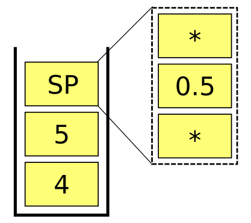
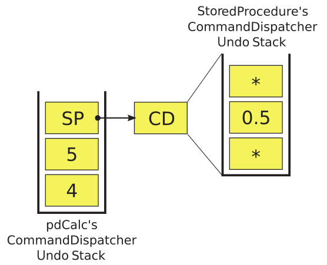

# 新需求

这是一个美丽的星期一早晨，而您在一个轻松的周末后才开始工作。 毕竟，您刚刚在星期五完成了pdCalc，现在可以开始发货了。 在您坐下来喝杯咖啡之前，您的项目经理会走进您的办公室，并说：“我们还没有完成。 客户要求一些新功能。”

上面的情况在软件开发中太普遍了。 虽然可能不会在上线日期要求新功能，但是在完成设计和实施的大部分工作后，几乎不可避免地会要求新功能。 因此，应该在可行的防御性开发中预期可扩展性。 我说的是防御性的，而不是防御性的，因为过度抽象的代码和过度具体的代码可能对开发造成很大的损害。 通常，如果需要，简单地重写不灵活的代码要比无缘无故地维护高度灵活的代码容易。 在实践中，我们力求在代码既简单又可维护又可扩展的方面取得平衡。

在本章中，我们将探索修改代码以实现超出原始要求设计范围的功能。 本章介绍的新功能的讨论范围从完整的设计和实现到仅设计到仅用于自我探索的建议。 让我们从两个扩展开始，我们将从需求一直贯穿到实施。

## 8.1 完全设计的新功能

在本节中，我们将研究两个新功能：计算器的批处理操作和存储过程的执行。 让我们从批处理操作开始。

### 8.1.1 批处理操作

对于那些不熟悉该术语的人来说，任何程序的批处理操作都只是从头到尾执行程序，而在程序启动后无需用户干预。 大多数桌面程序都不以批处理模式运行。 但是，批处理操作在编程的许多分支（例如科学计算）中仍然非常重要。 也许对您更大的兴趣，对于那些受雇于大公司的人来说，您的工资单可能是由以批处理模式运行的程序运行的。

说实话。 除了可能用于测试之外，pdCalc的批处理操作不是一个非常有用的扩展。 我之所以将它包含在内，主要是因为它演示了如何精心设计一个扩展的CLI以添加批处理模式。

回顾一下第5章，pdCalc的CLI具有以下公共接口：

```c++
class Cli : public UserInterface
{
    class CliImpl;
public:
    Cli(istream& in, ostream& out);
    ~Cli();
    void execute(bool suppressStartupMessage = false, bool echo = false);
};
```

要使用CLI，请使用cin和cout作为参数构造该类，并使用空参数调用execute（）：

```c++
Cli cli{cin, cout};
// setup other parts of the calculator
cli.execute();
```

我们如何修改Cli类以启用批处理操作？ 令人惊讶的是，我们根本不需要修改课程代码！ 通过设计，CLI本质上是一个解析器，它仅从输入流中获取以空格分隔的字符输入，通过计算器处理数据，并将字符输出生成到输出流。 因为我们有预见，不要将这些输入和输出流硬编码为cin和cout，所以可以通过将输入和输出流变为文件流，将CLI转换为批处理程序，如下所示：

```c++
ifstream f in{inputFile};
ofstream fout{outputFile};
Cli cli{f in, fout};
// setup other parts of the calculator
cli.execute(true, true);
```

其中inputFile和outputFile是可以通过pdCalc的命令行参数获取的文件名。 回想一下execute（）函数的参数只是抑制了启动标志，并将命令回显到输出。

是的，确实如此（但是请参阅main.cpp了解一些实现技巧）。 我们的CLI最初是构建的，因此只需更改其构造函数参数即可将其转换为批处理处理器。 您当然可以说，作为作者，我有意以此方式设计了Cli类，因为我知道计算器将以这种方式扩展。 但是现实是，我仅使用流输入而不是硬编码输入来构造所有CLI接口，因为这种设计使CLI更加灵活，几乎没有额外的认知负担。

在离开本节之前，我将迅速注意到，现实是pdCalc的CLI在操作系统的帮助下已经具有批处理模式。 通过在命令行上重定向输入和输出，我们可以实现相同的结果：

```shell
my_prompt> cat inputFile | pdCalc --cli > outputFile
```

对于Windows，只需用Windows type命令替换Linux cat命令。

### 8.1.2 存储过程

诚然，向pdCalc添加批处理模式是一个有些人为的示例。 所添加的功能并不是非常有用，并且代码更改是微不足道的。 在本节中，我们将研究一个更有趣的功能扩展：存储过程。

什么是存储过程？ 在pdCalc中，存储过程是对当前堆栈进行操作的存储的，可重复的操作序列。 存储过程提供了一种通过从现有计算器原语创建用户定义的函数来扩展计算器功能的技术。 您可以认为执行存储过程类似于为计算器运行非常简单的程序。 理解该概念的最简单方法是考虑一个示例。

假设您需要经常计算三角形的斜边。 对于图8-1中所示的直角三角形，我们可以使用勾股定律来计算斜边的长度c。

假设我们有一个边为a = 4，b = 3的三角形，并将这些值输入到pdCalc的堆栈中。 在CLI中，您将看到以下内容：

```
Top 2 elements of stack (size = 2):
2: 3
1: 4
```

为了计算该三角形的c，我们将执行以下指令序列：dup * swap dup * + 2 root。 按回车后，最终结果将是

```
Top element of stack (size = 1):
1: 5
```

如果一次输入一个命令，则每次按Enter键时，我们都会看到中间结果堆栈。 如果我们在一行上输入所有命令，然后按Enter，pdCalc将显示每个中间堆栈，然后显示最终结果。 注意，当然，此命令序列不是唯一的。 例如，使用命令序列2 pow swap 2 pow + 2 root可以达到相同的结果。

如果您像我一样，如果必须使用pdCalc反复计算斜边，那么您可能希望在第一次手动计算后自动执行该操作。 这正是存储过程所允许的。 自动化不仅可以节省时间，而且不易出错，因为可以编写，测试并随后重用封装许多连续命令的存储过程。 只要可以从pdCalc原语（包括插件函数）中汇编操作，存储过程就可以扩展计算器的功能以计算简单公式，而无需编写任何C ++代码。 现在，我们只需要设计和实现此新功能。

#### 8.1.2.1 用户界面

pdCalc同时具有GUI和CLI，因此添加任何面向用户的功能都需要对两个用户界面组件进行一些修改。 对于存储过程，对用户界面的修改非常小。 首先，存储过程只是一个包含pdCalc指令的有序序列的文本文件。 因此，用户可以使用任何纯文本编辑器创建存储过程。 因此，除非您要为存储过程文本编辑器提供语法高亮显示，否则存储过程的用户界面将减少为允许从CLI和GUI执行。

让我们首先在CLI中结合存储过程。如前所述，存储过程只是文件系统中的文本文件。回想一下，CLI的工作方式是：对以空格分隔的输入进行标记，然后通过引发事件将每个标记分别传递给命令分配器。因此，一种访问存储过程的简单方法只是将存储过程文件的名称传递给CLI。然后，该文件名将像其他任何命令或数字一样被标记化，并传递给命令分派器进行处理。为了确保命令调度程序将文件名解释为存储过程而不是命令，我们只需在文件名前加上proc：符号，然后更改命令调度程序的解析器即可。例如，对于名为hypotenuse.psp的存储过程，我们将向CLI发出命令proc：hypotenuse.psp。我采用文件扩展名psp作为pdCalc存储过程的简写。自然地，文件本身是一个普通的ASCII文本文件，其中包含用于计算直角三角形的斜边的一系列命令，并且您可以根据需要使用.txt扩展名。

回想一下，GUI旨在将命令传递给命令分配器，与CLI相同。 因此，要使用存储过程，我们添加了一个按钮，该按钮将打开一个对话框，以浏览文件系统以查找存储过程。 选择存储过程后，我们在文件名前加上proc：并引发CommandEntered事件。 显然，您可以使存储过程选择对话框如您所愿。 我选择了一种简化的设计，该设计允许在可编辑的组合框中键入文件的名称。 为了易于使用，组合框中预填充了当前目录中扩展名为.psp的所有文件。

#### 8.1.2.2 对命令分派器的更改 

清单8-1是CommandDispatcher的executeCommand（）函数的缩写列表，其中包括解析存储过程所需的逻辑。 代码的省略部分出现在4.5.2节中。

```c++
void CommandDispatcher::CommandDispatcherImpl::executeCommand(const string& command)
{
    // handle numbers, undo, redo, help in nested if
    // ...
    else if(command.size() > 6 && command.substr(0, 5) == "proc:")
    {
        auto filename = command.substr(5, command.size() - 5);
        handleCommand( MakeCommandPtr<StoredProcedure>(ui_, filename) );
    }
    // else statement to handle Commands from CommandRepository
    // ...
    return;
}
```

从上面的代码中，我们看到该实现只是从proc命令中剥离proc：来创建存储过程的文件名，创建新的StoredProcedure Command子类并执行该类。 现在，我们假设使StoredProcedure类成为Command类的子类是最佳设计。 我将讨论为什么首选此策略，并在以下各节中研究其实施。 但是，在到达那里之前，让我们讨论一下MakeCommandPtr（）函数的新重载。

在7.2.1节中，我们首先看到了由以下实现提供的MakeCommandPtr版本：

```c++
inline void CommandDeleter(Command* p)
{
    p->deallocate();
    return;
}
using CommandPtr = std::unique_ptr<Command, decltype(&CommandDeleter)>;
inline auto MakeCommandPtr(Command* p)
{
    return CommandPtr{p, &CommandDeleter};
}
```

上面的函数是一个帮助函数，用于从原始Command指针创建CommandPtr。 该函数的这种形式用于从现有命令的克隆中创建CommandPtr（例如，如CommandRepository :: allocateCommand（）中所示）：

```c++
auto p = MakeCommandPtr( command->clone() );
```

但是，在语义上，在CommandDispatcherImpl :: executeCommand（）中，我们看到了完全不同的用法，即构造从Command派生的类的实例。 当然，我们可以使用现有的MakeCommandPtr原型来满足这种用例。 例如，我们可以创建一个StoredProcedure，如下所示：

```c++
auto c = MakeCommandPtr(new StoredProcedure{ui, filename});
```

但是，尽可能不要用裸露的新闻来污染高级代码。 因此，我们寻求实现可以帮助我们完成此构造的重载辅助函数。 它的实现如下：

```c++
template<typename T, typename... Args>
auto MakeCommandPtr(Args&&... args)
{
    return CommandPtr{new T{std::forward<Args>(args)...}, &CommandDeleter};
}
```

在C ++ 11之前，没有简单有效的技术来构造具有可变数量的构造函数参数的泛型类型，这对于创建从Command类派生的任何可能的类（每个都有不同的构造函数参数）是必需的。 但是，现代C ++使用可变参数模板和完美的转发功能为该问题提供了一种优雅的解决方案。 此构造是下面侧栏的主题。

> **现代C++设计说明：可变参数模板和完美转发功能**
>
> 可变参数模板和完美转发分别解决了C ++中的不同问题。 可变参数模板启用具有未知数量的类型化参数的类型安全的泛型函数调用。 完美的转发功能可以将参数正确地类型转发到模板函数内部的基础函数。 您可以在自己喜欢的C ++ 11参考文献（例如[23]）中研究上述每种技术的机制。 此侧边栏显示了一种类型安全的通用设计技术，用于构造需要不同数量的构造函数参数的具体对象。 通过可变参数模板和完美转发的组合，可以启用此技术。 由于缺乏命名创造力，我将此模式命名为通用完美转发构造函数（GpFC）。 让我们首先介绍GpFC解决的潜在问题。
>
> 让我们考虑每个作者最喜欢的过度简化的面向对象的编程示例，即形状层次结构：
>
> ```c++
> class Shape
> {
> public:
>  virtual double area() const = 0;
> };
> class Circle : public Shape
> {
> public:
>  Circle(double r) : r_{r} {}
>  double area() const override { return 3.14159 * r_ * r_; }
> private:
>  double r_;
> };
> class Rectangle : public Shape
> {
> public:
>  Rectangle(double l, double w) : l_{l}, w_{w} {}
>  double area() const override { return l_ * w_; }
> private:
>  double l_, w_;
> };
> ```
> 在C ++中，可替代性以虚拟调度的形式实现，解决了需要使用基类保证的接口通过基类指针调用派生类型的特定实现的问题。 在形状示例中，可替换性表示按以下方式计算面积的能力：
>
> ```c++
> double area(const Shape& s)
> {
>     return s.area();
> }
> ```
>
> 对于任何从Shape派生的类。 完全规定了虚拟函数的确切接口，包括任何函数参数的数量和类型（即使在空虚情况下，如本例中的area（）函数）。 但是，问题在于，对象构造永远不能以这种方式“虚拟化”，即使可以，它也不起作用，因为构造对象所需的信息（其参数）各个派生类经常不同。
>
> 输入通用的完美转发构造函数模式。 在这种模式下，我们使用可变参数模板提供类型安全的接口，该接口可以接受任意数量的具有不同类型的构造函数参数。 第一个模板参数始终是我们要构造的类型。 然后，使用完美转发来确保将参数以正确的类型传递给构造函数。 正是在这种情况下为什么需要完美转发的原因恰恰来自于如何在模板中推导类型，并且超出了本讨论的范围（有关详细信息，请参见[19]）。 对于我们的形状示例，应用GpFC模式将导致以下实现：
>
> ```c++
> template<typename T, typename... Args>
> auto MakeShape(Args&&... args)
> {
>     return make_unique<T>(forward<Args>(args)...);
> }
> ```
>
> 下面的代码说明了如何使用MakeShape（）函数创建具有不同数量的构造函数参数的不同类型：
>
> ```c++
> auto c = MakeShape<Circle>(4.0);
> auto r = MakeShape<Rectangle>(3.0, 5.0);
> ```
>
> 请注意，GpFC模式也可用于创建继承层次结构中彼此不相关的类。 实际上，标准库中的make_unique（）函数使用GpFC模式，以高效，通用的方式制作unique_ptrs，而无需进行新的改动。 虽然严格来说它们是截然不同的，但我还是喜欢将GpFC模式视为工厂方法的通用类似物。

#### 8.1.2.3 设计存储过程类

现在，我们回到设计StoredProcedure类的棘手问题。 我们要问的第一个问题是，我们是否需要一堂一个类。 我们已经有一个设计用于解析单个命令，执行它们并将它们放在撤消/重做堆栈中。 也许正确的答案是以类似于批处理输入的方式处理存储过程。 也就是说，在交互式会话（GUI或CLI）中，通过读取存储过程文件，对其进行解析并批量执行命令来处理存储过程（就像在CLI中使用多个命令排成一行），而无需引入 新的StoredProcedure类。

在考虑以下非常简单的示例后，几乎可以立即取消上述设计。 假设您实现了一个存储过程来计算三角形的面积。 存储过程的输入将是堆栈上三角形的底边和高度。 triangleArea.psp由以下给出：

```
*
0.5
*
```

如果没有StoredProcedure类，则triangleArea.psp中的每个命令都将按顺序执行并输入到撤消/重做堆栈上。 对于I / O堆栈上的值4和5，正向执行存储过程将产生正确的结果10和撤消堆栈，如图8-2所示。 基于此撤消堆栈，如果用户尝试撤消而不是撤消三角形区域存储过程，则用户将仅撤消堆栈上的顶部操作，即最终的乘法。 

I / O堆栈将读取

```
4
5
0.5
```

（并且撤消堆栈的*在5到0.5之间）而不是

```
4
5
```

要完全撤消存储过程，用户需要按undo n次，其中n等于存储过程中的命令数。 重做操作存在相同的缺陷。 在我看来，撤消存储过程的预期行为应该是撤消整个过程，并使I / O堆栈在执行存储过程之前保持其状态。 因此，用于处理不使用StoredProcedure类的存储过程的设计无法正确实现撤消和重做，因此必须将其丢弃。

#### 8.1.2.4 复合模式

本质上，为了解决存储过程的撤消/重做问题，我们需要一个特殊的命令，该命令封装了多个命令，但表现为单个命令。 幸运的是，复合模式解决了这一难题。 根据Gamma等人的观点[6]，复合模式“让客户统一对待单个对象和对象的组合。” 通常，复合模式是指树状数据结构。 我更喜欢一个宽松的定义，该模式可以应用于允许统一处理复合对象的任何数据结构。

图8-3以一般形式说明了复合模式。 Component类是一个抽象类，需要执行一些操作。 此动作可以由Leaf节点或称为Composite的组件的集合单独执行。 客户端通过Component接口与组件层次结构中的对象进行多态交互。 从客户端的角度来看，Leaf节点和Composite节点都可以毫无区别地处理doSomething（）请求。 通常，Composites通过简单地为其拥有的组件（Leaf或嵌套Composites）调用doSomething（）命令来实现doSomething（）。

```mermaid
classDiagram
  Client --> Component
  Component <|-- Leaf
  Component <|-- Composite
  Component : +doSomething():void
  Leaf : -doSomething():void
  Composite : -doSomething():void
```

在我们的具体情况下，Command类充当Component的角色，诸如Add或Sine之类的具体命令充当Leaf节点的角色，而StoredProcedure类是复合的。 doSomething（）命令由一对纯虚拟函数的executeImpl（）和undoImpl（）代替。 我怀疑以这种方式组合命令和复合模式相当普遍。

以前，我们了解到，要为存储过程正确实现撤消/重做策略，必须进行类设计。 如上所述，复合模式的应用促使从Command类派生StoredProcedure类。

现在，我们设计一个StoredProcedure类，并将其实现作为复合模式的具体应用进行检查。

#### 8.1.2.5 第一次尝试

实现复合模式的常见方法是通过递归。 Composite类通常通过一个简单的向量或也许更复杂的东西（例如二叉树中的节点）来保存Components的集合。 Composite的doSomething（）函数仅对该集合进行迭代，对集合中的每个组件调用doSomething（）。 叶子节点的doSomething（）函数实际上会执行某些操作并终止递归。 尽管不是必需的，但Component类中的doSomething（）函数通常是纯虚拟的。

让我们考虑上述方法，以在pdCalc中为StoredProcedures实现复合模式。 我们已经确定pdCalc的Command类是Component，而具体的命令类（例如Add）是Leaf类。 因此，我们只需要考虑StoredProcedure类本身的实现即可。 请注意，由于可以按原样使用Component和Leaf类的当前实现，因此可以轻松应用复合模式以扩展现有代码库的功能。

考虑一下StoredProcedure类的以下骨架设计：

```c++
class StoredProcedure : public Command
{
private:
    void executeImpl() noexcept override;
    void undoImpl() noexcept override;
    vector<unique_ptr<CommandPtr>> components_;
};

```

executeImpl（）命令将如下实现：

```c++
void StoredProcedure::executeImpl()
{
    for(auto& i : components_)
        i->execute();
    return;
}
```

undoImpl（）的实现类似，但对component_集合进行了反向迭代。

上述设计是否解决了在没有StoredProcedure类的情况下将存储过程命令直接输入到撤消/重做堆栈时先前遇到的撤消/重做问题？ 考虑图8-4中所示的undo堆栈，作为我们之前检查过的triangleArea.psp示例。 该存储过程在图中显示为SP，在撤消堆栈中显示为单个对象，而不是代表其组成命令的单个对象。 因此，当用户发出撤消命令时，CommandManager将通过调用存储过程的undoImpl（）函数将存储过程作为单个命令撤消。 该存储过程的undoImpl（）函数依次通过其命令容器上的迭代来撤消单个命令。 这种行为正是所需的，复合图案的这种应用确实解决了眼前的问题。



要完成StoredProcedure类的实现，我们需要解析存储过程文件的字符串命令（带有错误检查），并使用它们来填充StoredProcedure的components_ vector。 可以在StoredProcedure的构造函数中编写此操作，并且该实现既有效又完整。 现在，我们将有一个StoredProcedure类，该类可以将字符串命令转换为Commands，将它们存储在容器中，并能够按需执行和撤消这些存储的Commands。 换句话说，我们实际上将重写命令调度程序！ 相反，让我们考虑通过重用CommandDispatcher类来实现StoredProcedure类的替代设计。

#### 8.1.2.6 存储过程类的最终设计

此设计的目标是按原样重用CommandDispatcher类。 放宽此约束并修改CommandDispatcher的代码可以稍微清理实现，但是设计的本质是相同的。 考虑以下StoredProcedure类的修改后的骨架设计：

```c++
class StoredProcedure : public Command
{
private:
    void executeImpl() noexcept override;
    void undoImpl() noexcept override;
    std::unique_ptr<Tokenizer> tokenizer_;
    std::unique_ptr<CommandDispatcher> ce_;
    bool first_ = first;
};
```

当前的设计几乎与我们以前的设计相同，不同之处在于components_vector已被CommandDispatcher取代，并且对分词器的需求已经明确。 不错，我们在第5章中编写了可重复使用的标记器！

现在，我们准备看一下executeImpl（）和undoImpl（）的完整实现。 请注意，尽管以下实现未使用上述模式的规范版本，但StoredProcedure类的此实现仍只是复合模式的应用。 首先，让我们检查executeImpl（）：

```c++
void StoredProcedure::executeImpl() noexcept
{
    if(first_)
    {
        for(auto c : *tokenizer_)
        {
            ce_->commandEntered(c);
        }
        first_ = false;
    }
    else
    {
        for(unsigned int i = 0; i < tokenizer_->nTokens(); ++i)
            ce_->commandEntered("redo");
    }
    return;
}
```

首次调用executeImpl（）时，必须从令牌生成器中提取令牌，并由StoredProcedure自己的CommandDispatcher执行。 随后对executeImpl（）的调用仅要求StoredProcedure的CommandDispatcher重做每个StoredProcedure命令的正向执行。 请记住，pdCalc的CommandDispatcher本身将调用StoredProcedure的executeImpl（）函数； 因此，我们的设计要求使用嵌套的CommandDispatchers。 图8-5显示了三角形区域存储过程示例的这种设计，其中CD表示CommandDispatcher。



StoredProcedure的undoImpl（）的实现很简单：

```c++
void StoredProcedure::undoImpl () noexcept
{
    for(unsigned int i = 0; i < tokenizer_->nTokens(); ++i)
        ce_->commandEntered("undo");
    return;
}
```

通过请求基础CommandDispatcher撤消存储过程中的命令数量来实现撤消。

在结束对最终StoredProcedure类的讨论之前，我们应该考虑对StoredProcedure类中的命令进行标记化。 StoredProcedure的标记化过程涉及两个步骤。必须打开并读取存储过程文件，然后对文本流进行实际标记化。初始化时，每个StoredProcedure实例仅需要执行一次此过程。因此，令牌化的自然位置在StoredProcedure的构造函数中。但是，将标记化放置在StoredProcedure的构造函数中会导致与pdCalc的命令错误处理过程不一致。特别是，pdCalc假定可以构建命令，但不一定执行命令而不会失败。如果命令无法执行，则可以通过检查命令的先决条件来解决此错误。令牌化会失败吗？当然。例如，如果无法打开存储过程文件，则标记化将失败。因此，为了保持错误处理的一致性，我们在StoredProcedure的checkPreconditionsImpl（）函数中实现了标记化，当pdCalc的CommandDispatcher首次尝试执行存储过程时将调用该标记化。由于令牌化只需执行一次，因此我们仅在首次执行checkPreconditionsImpl（）函数时执行该操作。完整的实现可在StoredProcedure.cpp文件中找到。

## 8.2 面向更有用的计算器的设计

到目前为止，有关pdCalc的所有讨论都集中在可从GitHub下载的完整代码的设计和实现上。 但是，本章的其余部分标志着与这种风格的不同。 此后，我们将仅讨论扩展的想法以及有关如何修改pdCalc以适应这些新功能的建议。 在编写这些部分之前，不仅未提供工作代码，而且未创建工作代码。 因此，我将要讨论的设计尚未经过测试，喜欢冒险的读者选择完成这些扩展，可能会发现要讨论的想法不是最理想的，或者，我敢说是错误的。 欢迎来到从空白开始设计特征的狂野西部！ 需要进行实验和迭代。

### 8.2.1 复数

计算器的原始设计规范要求使用双精度数字，我们明确设计并实现了该计算器，以仅处理双精度数字。 但是，需求会发生变化。 假设您的同事（电气工程师）到您的办公室去，爱上了您的计算器，但是需要一个能够处理复数（虚数）的计算器。 这是一个合理的要求，所以让我们看一下我们如何重构计算器以满足这一新功能。

添加复数需要对pdCalc进行四项主要修改：在内部使用复数表示而不是将数字表示为双精度，更改输入和输出（并通过扩展，解析）以容纳复数，修改pdCalc的堆栈以存储复数而不是双精度 ，并修改命令以对复数（而不是实值输入）执行计算。 第一个变化是，找到用于复数的C ++表示形式是微不足道的； 我们将使用std :: complex \<double\>。 仅具有实部的数字将被简单地存储为复数\<double\>，其虚部设置为0。其他三个变化则不那么琐碎。 现在让我们更深入地研究一些能够适应这些变化的设计选项。

#### 8.2.1.1 修改输入和输出

在所有必需的更改中，修改I / O例程实际上是最简单的。 要解决的第一项是如何解释和表示复数。 例如，我们是否希望将复数c表示为c = re + im * i（也许虚数应该是j，因为功能请求来自电气工程师）。 也许我们更喜欢使用c =（re，im）或使用尖括号或方括号的变体。 这个问题没有正确答案。 尽管某些选择可能比其他选择更容易实现，但由于此选择仅是一种约定，因此在实践中，我们会将解决方案交给客户。 对于我们的案例研究，我们仅采用约定c =（re，im）。

我将只讨论修改I / O的命令行版本。 一旦CLI具备了处理复数的基础结构，则调整GUI应该相当简单。 我们遇到的第一个问题是Tokenizer类。 此类的原始设计只是通过在空白处拆分输入来标记化的。 但是，对于复数，该方案是不够的。 例如，根据是否在逗号后插入空格，将对复数进行不同的标记。

在某些时候，输入变得足够复杂，您将需要使用语言语法并将简单的输入例程迁移到“真实的”扫描器和解析器（可能使用lex和yacc之类的库）。 有人可能会争辩说，通过添加复数，我们已经达到了这种复杂性水平。 但是，我认为，如果我们修改tokenize（）例程以扫描（令牌，并创建一个“数字”令牌，以便在左括号和右括号之间，包括其中的任何一个，我们都可以使用现有的简单输入令牌生成器进行抓取。 我们将需要执行一些基本的错误检查以确保格式正确。另一种方法是基于正则表达式匹配分解输入流，这实质上是lex的工作方式，在编写复杂的代码之前，我将使用lex或类似的库进行研究 扫描仪从头开始。

我们遇到的下一个输入问题是CommandDispatcherImpl的executeCommand（）函数中的数字解析。 当前，一个字符串参数（令牌）被传递给该函数，并且对该字符串进行解析以确定它是数字还是命令。 经过检查，我们可以看到，如果我们修改isNum（）以识别并返回复数而不是浮点数，则executeCommand（）将适用于复数。 最后，将需要更新EnterNumber命令以接受和存储复杂的、、\<double\>。

这需要修改输入例程，但是如何修改输出例程？ 回想一下Cli类是Stack的stackChanged（）事件的（间接）观察者。 每当堆栈引发此事件时，都会调用Cli的stackChanged（）函数以将当前堆栈输出到命令行。 让我们研究一下Cli :: stackChanged（）的实现方式。 本质上，CLI使用以下函数调用返回堆栈以使用顶部nElement填充容器：

```c++
auto v = Stack::Instance().getElements(nElements);
```

然后创建一个ostringstream oss，并使用以下代码首先填充一些堆栈元数据，然后再填充堆栈元素：

```c++
size_t j{ v.size() };
for(auto i = v.rbegin(); i != v.rend(); ++i)
{
    oss << j << ":\t" << *i << "\n";
    --j;
}
```

最后，将oss的基础字符串发布到CLI。 令人惊讶的是，一旦修改了Stack的getElements（）函数以返回vector \<complex \<double \>\>，Cli的stackChanged（）函数将通过重新编译即可按预期工作。 因为我们使用了auto，并且因为对std :: complex重载了operator \<\<（），所以只要我们对复数的标准格式感到满意，我们的输出修改就不会做任何事情！ 精心设计和实施的代码之美。

#### 8.2.1.2