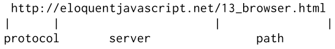
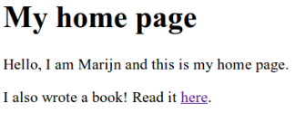

# JavaScript和浏览器

本书的下一章将讨论网络浏览器。 没有网络浏览器，就不会有JavaScript。 甚至即使没有，也没有人会对此予以关注。 Web技术从一开始就已分散，不仅在技术上而且在它的发展方式上也是如此。 各种浏览器供应商都以临时的，有时是经过深思熟虑的方式添加了新功能，然后有时最终被其他人采用，并最终按照标准设置。 这既是福也是祸。 一方面，它授权没有中央控制系统，但是可以通过松散协作（或偶尔公开敌视）的各方面对其进行改进。 另一方面，开发Web的随意方式意味着所得到的系统并不是内部一致性的光辉典范。 其中的某些部分令人困惑，构思不佳。

## 网络与互联网

自1950年代以来，计算机网络已经出现。如果在两台或多台计算机之间放置电缆，并允许它们通过这些电缆来回发送数据，则可以做各种出色的事情。

如果将两台机器连接到同一座建筑物中使我们能够做出色的事情，那么遍及全球的机器连接应该更好。开始实现这一愿景的技术是在1980年代开发的，最终的网络称为Internet。它履行了诺言。一台计算机可以使用此网络在另一台计算机上射击比特。为使位触发产生任何有效的通信，两端的计算机必须知道这些位应该代表什么。任何给定的位序列的含义完全取决于它要表达的事物的种类以及所使用的编码机制。

网络协议描述了通过网络进行通信的方式。有一些协议可以发送电子邮件，提取电子邮件，共享文件，甚至控制恰好被恶意软件感染的计算机。例如，超文本传输协议（HTTP）是一种用于检索命名资源（信息块，例如网页或图片）的协议。它指定发出请求的一方应以这样的行开头，并命名资源和要使用的协议版本：

```javascript
GET /index.html HTTP/1.1
```

关于请求者可以在请求中包含更多信息的方式以及返回资源的另一方打包其内容的方式，还有很多规则。我们将在第18章中更详细地介绍HTTP。
大多数协议都建立在其他协议之上。 HTTP将网络视为类似于流的设备，您可以在其中放入位，并使它们以正确的顺序到达正确的目的地。正如我们在第11章中看到的那样，确保这些事情已经是一个相当困难的问题。传输控制协议（TCP）是解决此问题的协议。所有连接到Internet的设备都会“说出”它，并且Internet上的大多数通信都建立在它之上。
TCP连接的工作方式如下：一台计算机必须正在等待或侦听，其他计算机才能开始与之对话。为了能够在一台机器上同时监听不同种类的通信，每个监听器都有一个与之关联的号码（称为端口）。大多数协议指定默认情况下应使用哪个端口。例如，当我们要使用SMTP协议发送电子邮件时，发送该邮件的计算机应该在端口25上侦听。然后，另一台计算机可以使用正确的端口号连接到目标计算机，从而建立连接。如果可以访问目标计算机并正在该端口上侦听，则说明连接已成功创建。
侦听计算机称为服务器，而连接计算机称为客户端。这样的连接就像一条双向管道，位可以流过该管道，两端的机器都可以将数据放入其中。一旦位被成功传输，另一端的机器可以再次读取它们。这是一个方便的模型。您可以说TCP提供了网络的抽象。

## The Web

万维网（不要与整个Internet混淆）是一组协议和格式，使我们可以在浏览器中访问网页。 名称中的“ Web”部分是指这样的页面，它们可以轻松地彼此链接，从而连接成一个巨大的网格供用户移动。 要成为Web的一部分，您需要做的就是将一台计算机连接到Internet，并使其通过HTTP协议在端口80上侦听，以便其他计算机可以向其索要文档。 Web上的每个文档均由统一资源定位符（URL）命名，如下所示：



第一部分告诉我们，此URL使用HTTP协议（例如，与加密的HTTP（https：//）相对）。然后是识别我们从哪个服务器请求文档的部分。最后是一个路径字符串，用于标识我们感兴趣的特定文档（或资源）。

连接到Internet的计算机获得一个IP地址，该地址可用于向该计算机发送消息，看起来像149.210.142.219或2001：4860：4860 :: 8888。但是，包含或多或少随机数的列表很难记住，而且很难键入，因此您可以为特定地址或一组地址注册一个域名。我注册eloquentjavascript.net指向我控制的计算机的IP地址，因此可以使用该域名来提供网页。

如果您在浏览器的地址栏中输入该URL，浏览器将尝试检索该URL并显示该文档。首先，您的浏览器必须找出eloquentjavascript.net所指的地址。然后，使用HTTP协议，它将在该地址建立到服务器的连接，并请求资源/13_browser.html。如果一切顺利，服务器将发送回一个文档，然后您的浏览器将其显示在屏幕上。

## HTML

HTML代表超文本标记语言，是用于网页的文档格式。 HTML文档包含文本以及为文本提供结构的标记，这些标记描述了诸如链接，段落和标题之类的内容。
简短的HTML文档可能如下所示：

```html
<!doctype html>
<html>
  <head>
    <meta charset="utf-8">
    <title>My home page</title>
  </head>
  <body>
    <h1>My home page</h1>
    <p>Hello, I am Marijn and this is my home page.</p>
    <p>I also wrote a book! Read it
    <a href="http://eloquentjavascript.net">here</a>.</p>
  </body>
</html>
```

这是这样的文档在浏览器中的外观：



标记以角括号（<和>）包装，提供有关文档结构的信息。其他文本只是纯文本。
文档以<!doctype html> 开头 ，它告诉浏览器将页面解释为现代HTML，而不是过去使用的各种方言。
HTML 文档具有头部和正文。头包含有关文档的信息，正文包含文档本身。在这种情况下，头声明本文档的标题是"My home page"，并且它使用 UTF-8 编码，这是将 Unicode 文本编码为二进制数据的一种方式。文档正文包含标题（\<h1\>，表示"标题 1", \<h2\> 到 \<h6\> 生成副标题）和两个段落 （\<p\> ）。
标记有多种形式。元素（如正文、段落或链接）由像 \<p\> 之类的开口标记启动，最后以 \</p\> 等结束标记结束。某些打开标记（如链接 （ \<a\> ） 的标记以 name="value"对的形式包含额外信息。这些称为属性。在这种情况下，链接的目标用 href="http://eloquentjavascript.net" ，其中 href 代表"超文本引用"。
某些类型的标记不包含在任何内容中，因此不需要关闭。元数据标\<meta charset="utf-8"\>就是这方面的一个例子。
为了能够在文档的文本中包含角度括号，即使它们在 HTML 中具有特殊含义，必须引入另一种形式的特殊表示法。普通开口角括号写成\&lt;（"less than"），和关闭括号写成\&gt;（"greater than"）。在 HTML 中，符号 （\&） 字符后跟名称或字符代码和分号 （;） 称为实体，并将替换为它编码的字符。
这类似于在 JavaScript 字符串中使用反斜杠的方式。由于这种机制也给符号字符赋予了特殊的含义，因此它们需要作为、\&amp;。内部属性值，以双引号包装，\&quot;可用于插入实际引号字符。
HTML 以一种非常容忍错误的方式解析。当缺少应有的标记时，浏览器将重建它们。完成此目的的方式已标准化，您可以依靠所有现代浏览器以同样的方式执行此操作。
以下文档将像前面所示的文档一样处理：

```html
<!doctype html>
<meta charset=utf-8>
<title>My home page</title>
<h1>My home page</h1>
<p>Hello, I am Marijn and this is my home page.
<p>I also wrote a book! Read it
<a href=http://eloquentjavascript.net>here</a>.
```

\<html\>、\<head\>, \<body\>标签都完全消失了。浏览器知道\<meta\>和\<title\>属于头部，\<h1\> 表示body已经开始。此外，我不再显式关闭段落，因为打开一个新的段落或结束文件将隐式关闭这些段落。属性值周围的引号也不见了。
这本书通常会省略例子中的\<html\>、\<head>和\<body\>标签，以保持它们简短和无杂乱。但我会关闭标记，并包含属性的报价。
我通常也会省略文档类型和字符集声明。这不能被视为鼓励从 HTML 文档中删除这些文档。当你忘记它们时，浏览器通常会做一些可笑的事情。您应该将文档类型和字符集元数据隐式存在于示例中，即使它们实际上未显示在文本中也是如此。

## HTML和Javascript

在本书的上下文中，最重要的HTML标记是, \<script\>。此标记允许我们在文档中包含一段 JavaScript。。

```html
<h1>Testing alert</h1>
<script>alert("hello!");</script>
```

在浏览器读取 HTML 时，一旦遇到\<script\>标记时，此脚本将立即运行。打开时，此页面将弹出一个对话框 — 警报功能类似于提示，因为它弹出一个小窗口，但仅显示一条消息，而不要求输入。
直接在 HTML 文档中包含大型程序通常不切实际。可以为\<script\>标记提供 src 属性，以便从 URL 获取脚本文件（包含 JavaScript 程序的文本文件）。

```html
<h1>Testing alert</h1>
<script src="code/hello.js"></script>
```

此处包含的code/hello.js 文件包含相同的程序alert("hello")。当 HTML 页引用其他 URL 作为自身的一部分时（例如，图像文件或脚本）Web 浏览器将立即检索它们并将其包含在页面中。
脚本标记必须始终用 \</script\> 关闭，即使它引用脚本文件并且不包含任何代码。如果您忘记了这一点，页面的其余部分将解释为脚本的一部分。
通过为\<script\>标记增加 type="module"属性，可以在浏览器中加载 ES 模块（参见第 10 章）。此类模块可以通过在导入声明中使用相对于自己的 URL 作为模块名称来依赖于其他模块。
某些属性还可以包含 JavaScript 程序。下一个显示的\<button\>按钮标记（显示为按钮）具有 onclick 属性。每当单击按钮时，将运行属性的值。

```html
<button onclick="alert('Boom!');">DO NOT PRESS</button>
```

请注意，我必须对 onclick 属性中的字符串使用单引号，因为双引号已用于引用整个属性。我也可以使用\&quot;

## 在沙盒中

运行从Internet下载的程序有潜在的危险。您对所访问的大多数网站的幕后工作人员了解不多，而且不一定意味深长。由不善良的人运行程序是您如何使计算机感染病毒，数据被盗以及帐户被黑。
然而，Web的吸引力在于您可以浏览它而不必完全信任您访问的所有页面。这就是为什么浏览器严格限制JavaScript程序可以执行的操作的原因：浏览器无法查看您计算机上的文件，也无法修改与其嵌入的网页无关的任何内容。
通过这种方式隔离编程环境称为沙箱，其思想是程序可以在沙箱中无害地播放。但是您应该想象这种特殊的沙箱是在其上面放有一个笼罩着粗钢条的沙箱，以使其中播放的程序实际上无法退出。
沙箱的困难之处在于，它允许程序有足够的空间来使用，但同时又限制了它们做任何危险的事情。
许多有用的功能（例如与其他服务器通信或读取复制粘贴剪贴板的内容）也可以用于处理有问题的，侵犯隐私的事情。
时不时地，有人想出一种新的方式来规避浏览器的局限性并做一些有害的事情，从泄漏少量私人信息到接管运行浏览器的整个计算机。
浏览器开发人员会通过修复漏洞来解决问题，一切都会好起来，直到发现下一个问题，并希望将其公开，而不是被某些政府机构或黑手党秘密利用。

## 兼容性和浏览器之战

在Web的早期阶段，称为Mosaic的浏览器主导了市场。几年后，余额转移到了Netscape，后来又被Microsoft的Internet Explorer大大取代了。在单一浏览器占主导地位的任何时候，该浏览器的供应商都将有资格单方面发明Web的新功能。由于大多数用户使用的是最受欢迎的浏览器，因此网站只会开始使用这些功能，而不必理会其他浏览器。
这是兼容性的黑暗时代，通常被称为浏览器之战。 Web开发人员没有一个统一的Web，而是两个或三个不兼容的平台。更糟的是，2003年左右使用的浏览器都充满了错误，当然每个浏览器的错误都不同。对于编写网页的人而言，生活很艰难。
Mozilla Firefox是Netscape的非盈利组织，它在2000年代后期挑战了Internet Explorer的地位。由于当时微软对保持竞争力并不特别感兴趣，因此Firefox夺走了很多市场份额。大约在同一时间，谷歌推出了其Chrome浏览器，而苹果的Safari浏览器获得了普及，从而导致了四个主要参与者，而不是一个。
新的参与者对标准和更好的工程实践持更加认真的态度，从而使我们减少了不兼容性和错误。微软看到其市场份额崩溃后，纷纷出现并在替代Internet Explorer的Edge浏览器中采用了这些态度。如果您今天开始学习Web开发，请认为自己很幸运。主要浏览器的最新版本行为相当一致，并且几乎没有错误。
