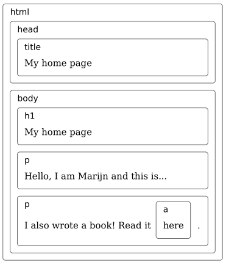
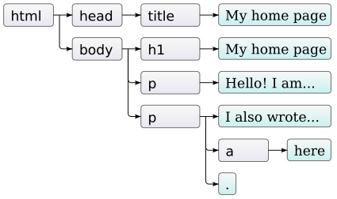
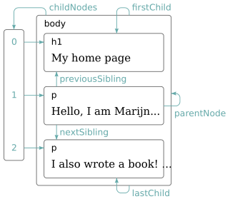
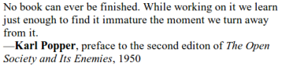
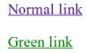
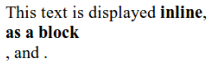
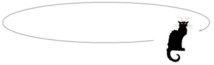
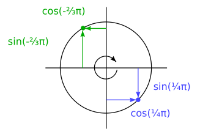

# 文档对象模型

当您在浏览器中打开网页时，浏览器会检索该页面的HTML文本并进行解析，就像第12章中的解析器分析程序的方式一样。 浏览器建立了文档结构的模型，并使用该模型在屏幕上绘制页面。
该文档的表示形式是JavaScript程序在其沙箱中可用的玩具之一。 它是您可以读取或修改的数据结构。 它充当实时数据结构：修改后，屏幕上的页面将更新以反映所做的更改。

## 文档结构

你可以把HTML文档想象成一组嵌套的盒子。标签\<body\>和\</body\>包含其他标签，依次包含其他标签或文本。 这是上一章中的示例文档：

```html
<!doctype html>
<html>
  <head>
    <title>My home page</title>
  </head>
  <body>
    <h1>My home page</h1>
    <p>Hello, I am Marijn and this is my home page.</p>
    <p>I also wrote a book! Read it
    <a href="http://eloquentjavascript.net">here</a>.</p>
  </body>
</html>
```

这个页面有如下结构：



浏览器用来表示文档的数据结构遵循此形状。 对于每个框，都有一个对象，我们可以与之交互以查找事物，例如它代表什么HTML标签以及它包含哪些框和文本。 这种表示形式称为文档对象模型，简称DOM。
全局绑定文档使我们可以访问这些对象。 它的documentElement属性引用表示\<html\>标签的对象。 因为每个HTML文档都有一个头和一个主体，所以它也具有头和主体的属性，指向这些元素。

## 树

回想一下第12章中的语法树。它们的结构与浏览器文档的结构非常相似。每个节点可以引用其他节点，子节点，而这些子节点又可以具有自己的子节点。这种形状是嵌套结构的典型特征，其中的元素可以包含与其自身相似的子元素。当数据结构具有分支结构，没有循环（节点可能不直接或间接包含自身）且具有单个定义明确的根时，我们称其为树。对于DOM，document.documentElement充当根。
树木在计算机科学中占了上风。除了表示递归结构（如HTML文档或程序）外，它们通常用于维护排序的数据集，因为通常可以在树中找到或插入元素比在平面数组中更有效地插入元素。典型的树具有不同种类的节点。 Egg语言的语法树具有标识符，值和应用程序节点。应用程序节点可能有子级，而标识符和值是叶子，或者没有子级的节点。 DOM也是如此。表示HTML标签的元素节点确定文档的结构。这些可以具有子节点。这样的节点的一个例子是document.body。这些子级中的一些可以是叶节点，例如一段文本或注释节点。每个DOM节点对象都有一个nodeType属性，该属性包含标识节点类型的代码（数字）。元素具有代码1，该代码也定义为常量属性Node.ELEMENT_NODE。表示文档中一部分文本的文本节点获得代码3（Node.TEXT_NODE）。注释的代码为8（Node.COMMENT_NODE）。
可视化我们的文档树的另一种方法如下：



叶子是文本节点，箭头指示节点之间的父子关系。

## 标准

使用神秘的数字代码表示节点类型并不是一件非常像JavaScript的事情。在本章的后面，我们将看到DOM界面的其他部分也很繁琐。原因是DOM并非仅针对JavaScript设计。相反，它试图成为一种与语言无关的界面，也可以在其他系统中使用-不仅适用于HTML，而且还适用于XML，XML是一种具有类似HTML语法的通用数据格式。这是不幸的。标准通常很有用。但是在这种情况下，优势（跨语言一致性）并不是那么吸引人。与熟悉的各种语言的界面相比，拥有与您使用的语言正确集成的界面可以节省更多时间。作为这种不良集成的示例，请考虑DOM中的元素节点具有的childNodes属性。此属性保存一个类似数组的对象，其长度属性和用数字标记的属性用于访问子节点。但这是NodeList类型的实例，而不是实际的数组，因此它没有诸如slice和map之类的方法。然后还有一些根本就是糟糕的设计问题。例如，无法创建新节点并立即向其添加子代或属性。相反，您必须先创建它，然后使用副作用逐个添加子项和属性。与DOM进行大量交互的代码往往会变得冗长，重复且丑陋。但是这些缺陷并不是致命的。由于JavaScript允许我们创建自己的抽象，因此可以设计改进的方式来表达您正在执行的操作。此类工具提供了许多用于浏览器编程的库。

## 遍历树

DOM节点包含到附近其他节点的大量链接。 下图说明了这些：



尽管该图仅显示每种类型的一个链接，但每个节点都有一个parentNode属性，该属性指向该节点所属的节点（如果有）。同样，每个元素节点（节点类型1）都有一个childNodes属性，该属性指向保存其子级的类似数组的对象。从理论上讲，您可以仅使用这些父链接和子链接移动到树中的任何位置。但是，JavaScript还使您可以访问许多其他便利链接。 firstChild和lastChild属性指向第一个和最后一个子元素，或者对于没有子节点的节点，其值为null。同样，previousSibling和nextSibling指向相邻节点，它们是具有相同父级的节点，紧接在节点本身之前或之后。对于第一个孩子，previousSibling将为null，对于最后一个孩子，nextSibling将为null。还有children属性，就像childNodes一样，但仅包含元素（类型1）子元素，而不包含其他类型的子节点。当您对文本节点不感兴趣时，这很有用。当处理这样的嵌套数据结构时，递归函数通常很有用。以下函数扫描文档以查找包含给定字符串的文本节点，并在找到一个字符串时返回true：

```javascript
function talksAbout(node, string) {
  if (node.nodeType == Node.ELEMENT_NODE) {
    for (let i = 0; i < node.childNodes.length; i++) {
      if (talksAbout(node.childNodes[i], string)) {
        return true;
      }
    }
    return false;
  } else if (node.nodeType == Node.TEXT_NODE) {
    return node.nodeValue.indexOf(string) > -1;
  }
}
console.log(talksAbout(document.body, "book"));
// → true
```

由于childNodes不是真正的数组，因此我们无法使用for / of对其进行循环，而必须使用常规的for循环或使用Array.from在索引范围内运行。 文本节点的nodeValue属性保存其表示的文本字符串。

## 寻找元素

在父母，子女和兄弟姐妹之间导航这些链接通常很有用。 但是，如果我们想在文档中找到一个特定的节点，则从document.body开始并遵循固定的属性路径来到达它是一个坏主意。 这样做使我们对程序的精确假设成为可能，该假设是您稍后可能需要更改的结构。 另一个复杂的因素是，甚至为节点之间的空白创建了文本节点。
示例文档的\<body\>标记不仅有3个子元素（\<h1\>和2个\<p\>元素），而且实际上有7个：这3个元素，以及它们之前，之后和之间的空格。因此，如果我们要获取该文档中链接的href属性，则不需要说“获取文档正文的第六个孩子的第二个孩子”之类的内容。 最好说“获取文档中的第一个链接”。 而且我们可以。

```javascript
let link = document.body.getElementsByTagName("a")[0];
console.log(link.href);
```

所有元素节点都有一个getElementsByTagName方法，该方法收集具有给定标签名称的所有元素，这些元素是该节点的后代（直接或间接子级），并将它们作为数组对象返回。 要查找特定的单个节点，可以为其指定id属性，而改用document.getElementById。

```html
<p>My ostrich Gertrude:</p>
<p></p>
<script>
  let ostrich = document.getElementById("gertrude");
  console.log(ostrich.src);
</script>
```

第三种类似的方法是getElementsByClassName，与getElementsByTagName一样，它搜索元素节点的内容并检索在其class属性中具有给定字符串的所有元素。

## 修改文档

关于DOM数据结构的几乎所有内容都可以更改。 可以通过更改父子关系来修改文档树的形状。 节点具有remove方法，可将其从当前父节点中删除。 要将子节点添加到元素节点，我们可以使用appendChild（将其放置在子项列表的末尾），或使用insertBefore（将作为第一个参数指定的节点插入在作为第二个参数指定的节点之前）。

```html
<p>One</p>
<p>Two</p>
<p>Three</p>
<script>
  let paragraphs = document.body.getElementsByTagName("p");
  document.body.insertBefore(paragraphs[2], paragraphs[0]);
</script>
```

一个节点只能在文档中的一个地方存在。 因此，在第一个段落的前面插入第三个段落将首先将其从文档末尾删除，然后将其插入在前面，得到第三个/一个/两个。 作为副作用，所有在某个位置插入节点的操作都会导致将其从当前位置删除（如果有的话）。

eplaceChild方法用于将一个子节点替换为另一个子节点。 它以两个节点为参数：新节点和要替换的节点。 替换的节点必须是调用该方法的元素的子元素。 请注意，replaceChild和insertBefore都将新节点作为其第一个参数。

## 创建节点

假设我们要编写一个脚本，用其alt属性中保留的文本替换文档中的所有图像（\标记），该脚本指定图像的替代文本表示形式。
这不仅涉及删除图像，还包括添加新的文本节点以替换它们。 文本节点是使用document.createTextNode方法创建的。

```html
<p>The  in the
  .</p>
<p><button onclick="replaceImages()">Replace</button></p>
<script>
  function replaceImages() {
    let images = document.body.getElementsByTagName("img");
    for (let i = images.length - 1; i >= 0; i--) {
      let image = images[i];
      if (image.alt) {
        let text = document.createTextNode(image.alt);
        image.parentNode.replaceChild(text, image);
      }
    }
  }
</script>
```

给定一个字符串，createTextNode为我们提供了一个文本节点，我们可以将其插入文档中以使其显示在屏幕上。 遍历图像的循环从列表的末尾开始。 这是必需的，因为由诸如getElementsByTagName之类的方法（或诸如childNodes之类的属性）返回的节点列表是活动的。 也就是说，它随着文档的更改而更新。 如果从头开始，则删除第一个图像将导致列表丢失其第一个元素，从而第二次重复循环，即i为1，它将停止，因为集合的长度现在也为1。 想要一个可靠的节点集合，而不是实时节点，您可以通过调用Array.from将集合转换为真实数组。

```javascript
let arrayish = {0: "one", 1: "two", length: 2};
let array = Array.from(arrayish);
console.log(array.map(s => s.toUpperCase()));
// → ["ONE", "TWO"]
```

要创建元素节点，可以使用document.createElement方法。 此方法采用标签名称，并返回给定类型的新空节点。 以下示例定义了一个实用程序elt，它创建一个元素节点，并将其其余参数作为该节点的子级。 然后，该函数用于为报价添加属性。

```html
<blockquote id="quote">
  No book can ever be finished. While working on it we learn
  just enough to find it immature the moment we turn away
  from it.
</blockquote>
<script>
  function elt(type, ...children) {
    let node = document.createElement(type);
    for (let child of children) {
      if (typeof child != "string") node.appendChild(child);
      else node.appendChild(document.createTextNode(child));
    }
    return node;
  }
  document.getElementById("quote").appendChild(
  elt("footer", —"",
      elt("strong", "Karl Popper"),
      ", preface to the second editon of ",
      elt("em", "The Open Society and Its Enemies"),
      ", 1950"));
</script>
```

结果文件如下所示：



## 属性

可以通过元素DOM对象上具有相同名称的属性来访问某些元素属性，例如链接的href。 最常用的标准属性就是这种情况。
但是HTML允许您设置节点上想要的任何属性。 这很有用，因为它使您可以在文档中存储其他信息。 不过，如果您使用自己的属性名称，则这些属性将不会作为属性出现在元素节点上。 相反，您必须使用getAttribute和setAttribute方法来使用它们。

```html
<p data-classified="secret">The launch code is 00000000.</p>
<p data-classified="unclassified">I have two feet.</p>
<script>
  let paras = document.body.getElementsByTagName("p");
  for (let para of Array.from(paras)) {
    if (para.getAttribute("data-classified") == "secret") {
      para.remove();
    }
  }
</script>
```

建议使用在此类虚构属性的名称前添加前缀data，以确保它们不会与任何其他属性冲突。
有一个常用的属性class，它是JavaScript语言中的关键字。 由于历史原因（某些旧的JavaScript实现无法处理与关键字匹配的属性名称），用于访问此属性的属性称为className。 您也可以使用getAttribute和setAttribute方法以其真实名称“ class”访问它。

## 布局

您可能已经注意到，不同类型的元素的布局不同。有些段落（如段落（\<p\>）或标题（\<h1\>））占据了文档的整个宽度，并在单独的行上呈现。这些称为块元素。诸如链接（\<a\>）或\<strong\>元素之类的其他元素则与周围的文本显示在同一行上。这些元素称为内联元素。对于任何给定的文档，浏览器都可以计算布局，该布局根据每个元素的类型和内容为其指定大小和位置。然后使用此布局实际绘制文档。元素的大小和位置可以从JavaScript访问。 offsetWidth和offsetHeight属性为您提供元素占用的空间（以像素为单位）。像素是浏览器中的基本度量单位。传统上，它对应于屏幕可以绘制的最小点，但是在现代显示器上，它可以绘制非常小的点，情况可能不再如此，浏览器像素可能跨越多个显示点。同样，clientWidth和clientHeight会为您提供元素内部空间的大小，而忽略边框宽度。

```html
<p style="border: 3px solid red">
  I'm boxed in
</p>
<script>
  let para = document.body.getElementsByTagName("p")[0];
  console.log("clientHeight:", para.clientHeight);
  console.log("offsetHeight:", para.offsetHeight);
</script>
```

```
clientHeight: 21
offsetHeight: 27
-> 27 = 21 + 3*2
```

在屏幕上查找元素精确位置的最有效方法是getBoundingClientRect方法。它返回一个具有top，bottom，left和right属性的对象，指示该元素的侧面相对于屏幕左上角的像素位置。如果希望它们相对于整个文档，则必须添加当前滚动位置，您可以在pageXOffset和pageYOffset绑定中找到它们。
布置文档可能需要大量工作。为了提高速度，浏览器引擎不会在每次更改文档时立即重新布局文档，而是会等待尽可能长的时间。当更改文档的JavaScript程序完成运行时，浏览器将必须计算新布局以将更改后的文档绘制到屏幕上。当程序通过读取诸如offsetHeight之类的属性或调用getBoundingClientRect来询问某物的位置或大小时，提供正确的信息还需要计算布局。
一个在读取DOM布局信息和更改DOM之间反复交替的程序会强制执行大量布局计算，因此运行速度非常慢。以下代码是一个示例。它包含两个不同的程序，这些程序建立了X字符行（2,000像素宽），并测量了每个字符所花费的时间。

```html
<p><span id="one"></span></p>
<p><span id="two"></span></p>
<script>
  function time(name, action) {
    let start = Date.now(); // Current time in milliseconds
    action();
    console.log(name, "took", Date.now() - start, "ms");
  }
  time("naive", () => {
    let target = document.getElementById("one");
    while (target.offsetWidth < 2000) {
      target.appendChild(document.createTextNode("X"));
    }
  });
  // → naive took 32 ms
  time("clever", function() {
    let target = document.getElementById("two");
    target.appendChild(document.createTextNode("XXXXX"));
    let total = Math.ceil(2000 / (target.offsetWidth / 5));
    target.firstChild.nodeValue = "X".repeat(total);
  });
  // → clever took 1 ms
</script>
```

## 样式

我们已经看到，不同的HTML元素绘制方式有所不同。 一些显示为块，其他显示为一行。 一些附加的样式-\<strong\>将其内容加粗，将\<a\>使其变为蓝色并加下划线。 \标签显示图像或\<a\>标签导致单击链接的方式与元素类型密切相关。 但是我们可以更改与元素关联的样式，例如文本颜色或下划线。 这是一个使用style属性的示例：

```html
<p><a href=".">Normal link</a></p>
<p><a href="." style="color: green">Green link</a></p>
```

第二个链接将用绿色替代默认颜色



样式属性可以包含一个或多个声明，这些声明是一个属性（例如color），后跟一个冒号和一个值（例如green）。 如果有多个声明，则必须用分号分隔，例如“ color：red; border：none”。
样式可能会影响文档的许多方面。 例如，显示属性控制元素是显示为块还是嵌入式元素。

```html
This text is displayed <strong>inline</strong>,
<strong style="display: block">as a block</strong>, and
<strong style="display: none">not at all</strong>.
```

由于块元素不会与其周围的文本一起内嵌显示，因此block标签将以其自己的行结尾。 最后一个标签根本不显示-display:none阻止元素显示在屏幕上。 这是一种隐藏元素的方法。 通常最好将它们从文档中完全删除，因为这样便于以后再次显示它们。



JavaScript代码可以通过元素的style属性直接操纵元素的样式。 此属性保存一个对象，该对象具有所有可能的样式属性的属性。 这些属性的值是字符串，我们可以写入这些字符串以更改元素样式的特定方面。

```html
<p id="para" style="color: purple">
  Nice text
</p>
<script>
  let para = document.getElementById("para");
  console.log(para.style.color);
  para.style.color = "magenta";
</script>
```

某些样式属性名称包含连字符，例如font-family。 由于此类属性名称在JavaScript中难以使用（您必须说style [“ font-family”]），因此样式对象中此类属性的属性名称会删除连字符，并在其后的字母大写（style.fontFamily)。

## 层叠样式

HTML的样式系统称为CSS，即级联样式表。 样式表是一组有关如何设置文档中元素样式的规则。 可以在\<style\>标记内给出。

```html
<style>
  strong {
    font-style: italic;
    color: gray;
  }
</style>
<p>Now <strong>strong text</strong> is italic and gray.</p>
```

名称中的级联是指将多个这样的规则组合在一起以产生元素的最终样式的事实。 在示例中，\<strong\>标记的默认样式（font-weight:bold）被\<style\>标记中的规则覆盖，该样式添加了font-style和color。
当多个规则为同一属性定义一个值时，最新读取的规则将具有更高的优先级并获胜。 因此，如果\<style\>标记中的规则包括font-weight:normal，与默认的font-weight规则相矛盾，则文本将是正常的，而不是粗体。 直接应用于节点的样式属性中的样式具有最高优先级，并且始终获胜。
在CSS规则中可以定位标签名称以外的内容。 .abc的规则适用于所有class属性中带有“abc”的元素。 #xyz的规则适用于id属性为“xyz”（在文档中应唯一）的元素。

```css
.subtle {
  color: gray;
  font-size: 80%;
}
#header {
  background: blue;
  color: white;
}
/* p elements with id main and with classes a and b */
p#main.a.b {
  margin-bottom: 20px;
}
```

支持最新定义的规则的优先规则仅在规则具有相同的特异性时适用。 规则的特殊性是衡量规则描述匹配元素的精确程度的一种度量标准，该元素由所需元素方面的数量和种类（标签，类或ID）决定。 例如，针对p.a的规则比针对p或仅针对.a的规则更具体，因此将优先于它们。
p> a…{}符号将给定样式应用于所有\<p\>标签的直接子元素\<a\>标签。 同样，p a…{}适用于\<p\>标记内的所有\<a\>标记，无论它们是直接还是间接子代。

## 查询选择器

本书中不会过多地使用样式表。 在浏览器中进行编程时，了解它们会有所帮助，但是它们非常复杂，需要单独购买书籍。
我之所以引入选择器语法的主要原因是选择器语法（样式表中用来确定一组样式适用于哪些元素的符号）是因为我们可以使用相同的迷你语言作为查找DOM元素的有效方法。
在文档对象和元素节点上都定义的querySelectorAll方法采用选择器字符串，并返回一个NodeList，其中包含与其匹配的所有元素。

```html
<p>And if you go chasing
  <span class="animal">rabbits</span>
</p>
<p>And you know you're going to fall</p>
<p>Tell 'em a 
  <span class="character">hookah smoking
    <span class="animal">caterpillar</span>
  </span>
</p>
<p>Has given you the call</p>
<script>
  function count(selector) {
    return document.querySelectorAll(selector).length;
  }
  console.log(count("p")); // All <p> elements
  // → 4
  console.log(count(".animal")); // Class animal
  // → 2
  console.log(count("p .animal")); // Animal inside of <p>
  // → 2
  console.log(count("p > .animal")); // Direct child of <p>
  // → 1
</script>
```

与getElementsByTagName之类的方法不同，querySelectorAll返回的对象不是活动的。 更改文档时不会更改。 但是，它仍然不是真正的数组，因此，如果您想将其视为一个数组，则仍然需要调用Array.from。 querySelector方法（不包含All部分）的工作方式类似。 如果您想要一个特定的单个元素，则此选项很有用。 它将仅返回第一个匹配的元素，或者当没有元素匹配时返回null。

## 定位和动画

位置样式属性以强大的方式影响布局。 默认情况下，它的值为static，这意味着该元素位于文档中的常规位置。 当将其设置为relative时，该元素仍然占据文档中的空间，但是现在top和left样式属性可用于相对于该正常位置移动它。 当position设置为absolute时，该元素将从常规文档流中删除-也就是说，它不再占用空间，并且可能与其他元素重叠。 此外，它的top和left属性可用于相对于位置属性不是static的最近封闭元素的左上角或相对于文档的绝对位置（如果不存在这种封闭元素）。我们可以使用它来创建动画。 以下文档显示了椭圆形移动的猫的图片：

```html
<p style="text-align: center">
  
</p>
<script>
  let cat = document.querySelector("img");
  let angle = Math.PI / 2;
  function animate(time, lastTime) {
    if (lastTime != null) {
      angle += (time - lastTime) * 0.001;
    }
    cat.style.top = (Math.sin(angle) * 20) + "px";
    cat.style.left = (Math.cos(angle) * 200) + "px";
    requestAnimationFrame(newTime => animate(newTime, time));
  }
  requestAnimationFrame(animate);
</script>
```

灰色箭头显示图像移动的路径。



我们的图片位于页面中心，并指定了相对位置。我们将反复更新该图片的顶部和左侧样式以将其移动。
该脚本使用requestAnimationFrame安排动画函数在浏览器准备重新绘制屏幕时运行。动画函数本身再次调用requestAnimationFrame安排下一次更新。当浏览器窗口（或选项卡）处于活动状态时，这将导致更新以每秒约60的速度发生，这往往会产生美观的动画。
如果我们只是循环更新DOM，则页面将冻结，并且屏幕上将不会显示任何内容。浏览器不会在JavaScript程序运行时更新其显示，也不允许与页面进行任何交互。这就是为什么我们需要requestAnimationFrame的原因-它使浏览器知道我们现在已经完成，并且可以继续执行浏览器要做的事情，例如更新屏幕和响应用户操作。
动画函数在当前时间作为参数传递。为了确保猫每毫秒的运动稳定，它基于角度的变化速度基于函数当前时间与上次运行时间之间的差值。如果仅以每步固定的角度移动角度，则例如在同一台计算机上运行的另一项繁重的任务要阻止此功能运行几分之一秒时，该动作将停顿。
使用三角函数Math.cos和Math.sin可以圆运动。对于不熟悉这些内容的人，我将简要介绍它们，因为我们有时会在本书中使用它们。
Math.cos和Math.sin可用于查找半径为1的点（0,0）周围的圆上的点。两个函数都将其自变量解释为该圆上的位置，零表示圆最右边的点，顺时针旋转直到2π（约6.28）使我们围绕整个圆。 Math.cos会告诉您与给定位置相对应的点的x坐标，而Math.sin会得出y坐标。大于2π或小于0的位置（或角度）有效-重复旋转，以便a + 2π表示与a相同的角度。
这种用于测量角度的单位称为弧度-一个完整的圆为2π弧度，类似于以度为单位的360度。常数π在JavaScript中可以作为Math.PI使用。



cat动画代码为动画的当前角度保留一个计数器angle，并在每次调用动画功能时将其递增。 然后，它可以使用该角度来计算图像元素的当前位置。 顶部样式用Math.sin计算并乘以20，这是椭圆的垂直半径。 左样式基于Math.cos并乘以200，因此椭圆比宽高得多。
请注意，样式通常需要单位。 在这种情况下，我们必须在数字后面加上“ px”，以告知浏览器我们正在以像素为单位（而不是厘米，“ ems”或其他单位）进行计数。 这很容易忘记。 使用不带单位的数字将导致您的样式被忽略-除非数字为0，否则无论它的单位如何，这总是意味着相同。

## 总结

JavaScript程序可能会通过称为DOM的数据结构检查并干扰浏览器正在显示的文档。 此数据结构表示浏览器的文档模型，JavaScript程序可以对其进行修改以更改可见的文档。
DOM的结构像一棵树，其中元素根据文档的结构进行分层排列。 表示元素的对象具有诸如parentNode和childNodes之类的属性，可用于在该树中导航。
样式可以影响文档的显示方式，既可以将样式直接附加到节点上，也可以定义与某些节点匹配的规则。有许多不同的样式属性，例如color或display。 JavaScript代码可以直接通过其style属性来操纵元素的样式。

## 练习

### 建立一个表格

HTML表使用以下标记结构构建：

```html
<table>
  <tr>
    <th>name</th>
    <th>height</th>
    <th>place</th>
  </tr>
  <tr>
    <td>Kilimanjaro</td>
    <td>5895</td>
    <td>Tanzania</td>
  </tr>
</table>
```

对于每一行，\<table\>标记包含一个\<tr\>标记。 在这些\<tr\>标记内，我们可以放置单元格元素：标题单元格（\<th\>）或常规单元格（\<td\>）。 给定一个山的数据集，一个具有name，height和place属性的对象数组将为枚举该对象的表生成DOM结构。 每个键应具有一列，每个对象应具有一行，并在顶部具有一个\<th\>元素的标题行，列出列名。 编写此代码，以便通过采用数据中第一个对象的属性名称来自动从对象派生列。
将结果表添加到id属性为“ mountains”的元素中，以使其在文档中可见。
完成此工作后，可通过将其数字样式设置为“ right”来使包含数字值的单元格右对齐。

```html
<!doctype html>
<html>
  <head>
    <meta charset="utf-8">
    <title>My home page</title>
  </head>
  <body>
    <h1>Mountains</h1>

    <div id="mountains"></div>
    <script>
      const MOUNTAINS = [
    {name: "Kilimanjaro", height: 5895, place: "Tanzania"},
    {name: "Everest", height: 8848, place: "Nepal"},
    {name: "Mount Fuji", height: 3776, place: "Japan"},
    {name: "Vaalserberg", height: 323, place: "Netherlands"},
    {name: "Denali", height: 6168, place: "United States"},
    {name: "Popocatepetl", height: 5465, place: "Mexico"},
    {name: "Mont Blanc", height: 4808, place: "Italy/France"}
  ];
      function buildTable(data) {
        let table = document.createElement("table");

        let fields = Object.keys(data[0]);
        let headRow = document.createElement("tr");
        fields.forEach(function(field){
          let headCell = document.createElement("th");
          headCell.appendChild(document.createTextNode(field));
          headRow.appendChild(headCell);
        });
        table.appendChild(headRow);
        data.forEach(function(object){
          let row = document.createElement("tr");
          fields.forEach(function(field){
            let cell = document.createElement("td");
            cell.appendChild(document.createTextNode(object[field]));
            if (typeof object[field]== "number") {
              cell.style.textAlign = "right";
            }
            row.appendChild(cell);
          });
          table.appendChild(row);
        });
        return table;
      }
      document.querySelector("#mountains").appendChild(buildTable(MOUNTAINS));
    </script>
  </body>
</html>
```

### 按标签名称的元素

document.getElementsByTagName方法返回具有给定标签名称的所有子元素。 将您自己的版本实现为一个函数，该函数将节点和字符串（标记名称）作为参数，并返回一个包含所有具有给定标记名称的后代元素节点的数组。
要查找元素的标签名称，请使用其nodeName属性。 但是请注意，这将以全部大写形式返回标签名称。 使用toLowerCase或toUpperCase字符串方法对此进行补偿。

```html
<!doctype html>

<h1>Heading with a <span>span</span> element.</h1>
<p>A paragraph with <span>one</span>, <span>two</span>
  spans.</p>

<script>
  function byTagName(node, tagName) {
    let found = [];
    tagName = tagName.toUpperCase();

    function explore(node) {
      for (let i = 0; i < node.childNodes.length; i++) {
        let child = node.childNodes[i];
        if (child.nodeType == document.ELEMENT_NODE) {
          if (child.nodeName == tagName) found.push(child);
          explore(child);
        }
      }
    }

    explore(node);
    return found;
  }

  console.log(byTagName(document.body, "h1").length);
  // → 1
  console.log(byTagName(document.body, "span").length);
  // → 3
  let para = document.querySelector("p");
  console.log(byTagName(para, "span").length);
  // → 2
</script>
```

### The cat's hat

扩展先前定义的猫动画，以使猫和他的帽子（）都在椭圆的相对两侧旋转。
或使帽子绕猫转一圈。 或以其他有趣的方式更改动画。
为了使定位多个对象更容易，最好切换到绝对定位。 这意味着顶部和左侧是相对于文档的左上角计算的。 为避免使用负坐标，这将导致图像移至可见页面之外，可以向位置值添加固定数量的像素。

```html
<!doctype html>

<meta charset="utf8">

<base href="https://eloquentjavascript.net/">

<style>body { min-height: 200px }</style>


<script>
  let cat = document.querySelector("#cat");
  let hat = document.querySelector("#hat");

  let angle = 0;
  let lastTime = null;
  function animate(time) {
    if (lastTime != null) angle += (time - lastTime) * 0.001;
    lastTime = time;
    cat.style.top = (Math.sin(angle) * 40 + 40) + "px";
    cat.style.left = (Math.cos(angle) * 200 + 230) + "px";
    hat.style.top = (Math.sin(angle + Math.PI) * 40 + 40) + "px";
    hat.style.left = (Math.cos(angle + Math.PI) * 200 + 230) + "px";

    requestAnimationFrame(animate);
  }
  requestAnimationFrame(animate);
</script>
```

