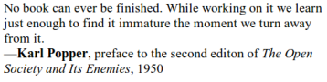
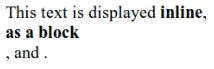
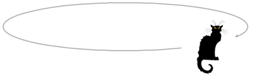

# 处理事件

某些程序可通过直接用户输入来工作，例如鼠标和键盘操作。 这类输入无法作为组织良好的数据结构使用，它是实时的，逐段的，程序有望在发生时对其进行响应。

## 事件处理程序

想象一下一个界面，找出键盘是否被按下的唯一方法就是读取该键的当前状态。为了能够对按键做出反应，您必须不断读取按键的状态，以便在再次释放按键之前就可以捕捉到它。执行其他耗时的计算会很危险，因为您可能会错过按键操作。
一些原始机器确实会像这样处理输入。硬件或操作系统需要注意的是将按键按下并排入队列。然后，程序可以定期检查队列中是否有新事件，并对在此发现的事件做出反应。
当然，它必须记住要经常查看队列，因为在按下按键和程序通知事件之间的任何时间都会使软件感到无响应。这种方法称为轮询。大多数程序员都喜欢避免这种情况。更好的机制是让系统在事件发生时主动通知我们的代码。浏览器通过允许我们将函数注册为特定事件的处理程序来实现此目的。

```html
<p>Click this document to activate the handler.</p>
<script>
  window.addEventListener("click", () => {
    console.log("You knocked?");
  });
</script>
```

窗口绑定是指浏览器提供的内置对象。 它表示包含文档的浏览器窗口。 每当其第一个参数描述的事件发生时，调用其addEventListener方法都会注册要调用的第二个参数。

## 事件和DOM节点

每个浏览器事件处理程序都在上下文中注册。 在前面的示例中，我们在窗口对象上调用addEventListener来注册整个窗口的处理程序。 也可以在DOM元素和某些其他类型的对象上找到这种方法。 仅当事件发生在其注册对象的上下文中时，才调用事件侦听器。

```html
<button>Click me</button>
<p>No handler here.</p>
<script>
  let button = document.querySelector("button");
  button.addEventListener("click", () => {
    console.log("Button clicked.");
  });
</script>
```

该示例将处理程序附加到按钮节点。 单击按钮将导致该处理程序运行，但是单击该文档的其余部分则不会。
为节点提供onclick属性具有类似的效果。 这适用于大多数类型的事件-您可以通过名称为事件名称的属性附加处理程序，该属性位于事件名称的前面。
但是一个节点只能有一个onclick属性，因此您只能以这种方式在每个节点上注册一个处理程序。 addEventListener方法允许您添加任意数量的处理程序，因此即使元素上已经存在另一个处理程序，也可以安全地添加处理程序。
用类似于addEventListener的参数调用的removeEventListener方法将删除处理程序。

```html
<button>Act-once button</button>
<script>
  let button = document.querySelector("button");
  function once() {
    console.log("Done.");
    button.removeEventListener("click", once);
  }
  button.addEventListener("click", once);
</script>
```

给removeEventListener提供的功能必须与给addEventListener提供的功能值相同。 因此，要取消注册处理程序，您需要为函数命名（示例中为一次），以便能够将相同的函数值传递给这两种方法。

## 事件对象

尽管到目前为止我们都忽略了它，但是事件处理函数被传递了一个参数：事件对象。 该对象保存有关事件的其他信息。 例如，如果我们想知道按下了哪个鼠标按钮，可以查看事件对象的button属性。

```html
<button>Click me any way you want</button>
<script>
  let button = document.querySelector("button");
  button.addEventListener("mousedown", event => {
    if (event.button == 0) {
      console.log("Left button");
    } else if (event.button == 1) {
      console.log("Middle button");
    } else if (event.button == 2) {
      console.log("Right button");
    }
  });
</script>
```

事件对象中存储的信息因事件类型而异。 我们将在本章后面讨论不同的类型。 对象的type属性始终包含标识事件的字符串（例如“ click”或“ mousedown”）。

## 传播

对于大多数事件类型，在具有子节点的节点上注册的处理程序也将接收在子节点中发生的事件。如果单击了段落内的按钮，则该段落上的事件处理程序还将看到click事件。
但是，如果段落和按钮都具有处理程序，则更具体的处理程序（位于按钮上的处理程序）将首先进入。据说该事件是从事件发生的节点传播到该节点的父节点，再到文档的根部向外传播。最终，在特定节点上注册的所有处理程序轮到他们使用后，在整个窗口上注册的处理程序都有机会响应该事件。
事件处理程序可以随时在事件对象上调用stopPropagation方法，以防止处理程序进一步接收该事件。例如，当您在另一个可点击的元素内有一个按钮并且不想单击按钮以激活外部元素的点击行为时，此功能很有用。
下面的示例在按钮及其周围的段落上同时注册“ mousedown”处理程序。当用鼠标右键单击时，该按钮的处理程序将调用stopPropagation，这将阻止该段落上的处理程序运行。当用另一个鼠标按钮单击该按钮时，两个处理程序都将运行。

```html
<p>A paragraph with a <button>button</button>.</p>
<script>
  let para = document.querySelector("p");
  let button = document.querySelector("button");
  para.addEventListener("mousedown", () => {
    console.log("Handler for paragraph.");
  });
  button.addEventListener("mousedown", event => {
    console.log("Handler for button.");
    if (event.button == 2) event.stopPropagation();
  });
</script>
```

大多数事件对象都有一个target属性，该属性引用了它们起源的节点。 您可以使用此属性来确保您不会意外处理从不想处理的节点向上传播的内容。
也可以使用target属性为特定类型的事件投射宽广的网络。 例如，如果您的节点包含一长列按钮，则在外部节点上注册一个单击处理程序，并使其使用target属性来确定是否单击了按钮，而不是单独注册一个按钮，可能会更方便。 所有按钮上的处理程序。

```html
<button>A</button>
<button>B</button>
<button>C</button>
<script>
  document.body.addEventListener("click", event => {
    if (event.target.nodeName == "BUTTON") {
      console.log("Clicked", event.target.textContent);
    }
  });
</script>
```


## 默认动作

许多事件都有与之关联的默认操作。 如果单击链接，则将转到该链接的目标。 如果按下向下箭头，浏览器将向下滚动页面。 如果右键单击，将获得一个上下文菜单。 等等。
对于大多数类型的事件，将在发生默认行为之前调用JavaScript事件处理程序。 如果处理程序不希望发生这种正常行为（通常是因为它已经处理了事件），则可以在事件对象上调用preventDefault方法。
这可以用来实现自己的键盘快捷键或上下文菜单。 它也可以用来讨厌地干扰用户期望的行为。 例如，这是一个无法跟踪的链接：

```html
<a href="https://developer.mozilla.org/">MDN</a>
<script>
  let link = document.querySelector("a");
  link.addEventListener("click", event => {
    console.log("Nope.");
    event.preventDefault();
  });
</script>
```

除非您有充分的理由，否则请不要这样做。 当预期行为被破坏时，这对于使用您的页面的人来说是不愉快的。 视浏览器而定，某些事件根本无法被拦截。 例如，在Chrome上，JavaScript无法处理用于关闭当前标签页的键盘快捷键（control-W或Command-W）。

## 按键事件

当按下键盘上的某个键时，您的浏览器将触发“ keydown”事件。 当它松开时，您会收到一个“ keyup”事件。

```html
<p>This page turns violet when you hold the V key.</p>
<script>
  window.addEventListener("keydown", event => {
    if (event.key == "v") {
      document.body.style.background = "violet";
    }
  });
  window.addEventListener("keyup", event => {
    if (event.key == "v") {
      document.body.style.background = "";
    }
  });
</script>
```

尽管其名称如此，“ keydown”不仅会在物理按下按键时触发。 按住某个键时，每次重复该键都会再次触发该事件。 有时您必须对此小心。 例如，如果您在按下某个键时将一个按钮添加到DOM中，而在释放该键时再次将其删除，则当您按住该键的时间更长时，可能会意外地添加数百个按钮。

该示例查看了事件对象的key属性，以查看事件与哪个键有关。 此属性包含一个字符串，对于大多数键，该字符串与按下该键将要键入的内容相对应。 对于诸如回车之类的特殊键，它包含一个名称为键的字符串（在本例中为“ Enter”）。 如果在按住某个键的同时按住Shift键，则这也可能会影响该键的名称-“ v”变为“ V”，而“ 1”可能变为“！”，这是按shift-1在键盘上产生的。

修改键，例如shift，control，alt和meta（在Mac上为Command），会像普通键一样生成键事件。 但是，在查找键组合时，您还可以通过查看键盘和鼠标事件的shiftKey，ctrlKey，altKey和metaKey属性来确定是否按住了这些键。

```html
<p>Press Control-Space to continue.</p>
<script>
  window.addEventListener("keydown", event => {
    if (event.key == " " && event.ctrlKey) {
      console.log("Continuing!");
    }
  });
</script>
```

按键事件起源的DOM节点取决于按下按键时具有焦点的元素。除非您为它们提供tabindex属性，否则大多数节点都无法获得焦点，但是链接，按钮和表单字段之类的东西却可以。我们将回到第18章中的表格字段。当没有特别注意的地方时，document.body将充当关键事件的目标节点。
当用户键入文本时，使用按键事件找出正在键入的内容是有问题的。某些平台（尤其是Android手机上的虚拟键盘）不会触发按键事件。但是，即使您使用的是老式键盘，某些类型的文本输入也无法以直接的方式与按键匹配，例如脚本不适合键盘的人所使用的输入法编辑器（IME）软件，多个按键组合在一起以创建字符。
为了得到，诸如\<input\>和\<textarea\>标记之类的可以键入的元素，何时键入的通知，只要用户更改内容，“ input”事件就会触发。要获取键入的实际内容，最好直接从焦点领域读取。第18章将说明如何操作。

## 鼠标事件

假设我们要编写一个脚本，用其alt属性中保留的文本替换文档中的所有图像（\标记），该脚本指定图像的替代文本表示形式。
这不仅涉及删除图像，还包括添加新的文本节点以替换它们。 文本节点是使用document.createTextNode方法创建的。

```html
<p>The  in the
  .</p>
<p><button onclick="replaceImages()">Replace</button></p>
<script>
  function replaceImages() {
    let images = document.body.getElementsByTagName("img");
    for (let i = images.length - 1; i >= 0; i--) {
      let image = images[i];
      if (image.alt) {
        let text = document.createTextNode(image.alt);
        image.parentNode.replaceChild(text, image);
      }
    }
  }
</script>
```

给定一个字符串，createTextNode为我们提供了一个文本节点，我们可以将其插入文档中以使其显示在屏幕上。 遍历图像的循环从列表的末尾开始。 这是必需的，因为由诸如getElementsByTagName之类的方法（或诸如childNodes之类的属性）返回的节点列表是活动的。 也就是说，它随着文档的更改而更新。 如果从头开始，则删除第一个图像将导致列表丢失其第一个元素，从而第二次重复循环，即i为1，它将停止，因为集合的长度现在也为1。 想要一个可靠的节点集合，而不是实时节点，您可以通过调用Array.from将集合转换为真实数组。

```javascript
let arrayish = {0: "one", 1: "two", length: 2};
let array = Array.from(arrayish);
console.log(array.map(s => s.toUpperCase()));
// → ["ONE", "TWO"]
```

要创建元素节点，可以使用document.createElement方法。 此方法采用标签名称，并返回给定类型的新空节点。 以下示例定义了一个实用程序elt，它创建一个元素节点，并将其其余参数作为该节点的子级。 然后，该函数用于为报价添加属性。

```html
<blockquote id="quote">
  No book can ever be finished. While working on it we learn
  just enough to find it immature the moment we turn away
  from it.
</blockquote>
<script>
  function elt(type, ...children) {
    let node = document.createElement(type);
    for (let child of children) {
      if (typeof child != "string") node.appendChild(child);
      else node.appendChild(document.createTextNode(child));
    }
    return node;
  }
  document.getElementById("quote").appendChild(
  elt("footer", —"",
      elt("strong", "Karl Popper"),
      ", preface to the second editon of ",
      elt("em", "The Open Society and Its Enemies"),
      ", 1950"));
</script>
```

结果文件如下所示：



## 属性

可以通过元素DOM对象上具有相同名称的属性来访问某些元素属性，例如链接的href。 最常用的标准属性就是这种情况。
但是HTML允许您设置节点上想要的任何属性。 这很有用，因为它使您可以在文档中存储其他信息。 不过，如果您使用自己的属性名称，则这些属性将不会作为属性出现在元素节点上。 相反，您必须使用getAttribute和setAttribute方法来使用它们。

```html
<p data-classified="secret">The launch code is 00000000.</p>
<p data-classified="unclassified">I have two feet.</p>
<script>
  let paras = document.body.getElementsByTagName("p");
  for (let para of Array.from(paras)) {
    if (para.getAttribute("data-classified") == "secret") {
      para.remove();
    }
  }
</script>
```

建议使用在此类虚构属性的名称前添加前缀data，以确保它们不会与任何其他属性冲突。
有一个常用的属性class，它是JavaScript语言中的关键字。 由于历史原因（某些旧的JavaScript实现无法处理与关键字匹配的属性名称），用于访问此属性的属性称为className。 您也可以使用getAttribute和setAttribute方法以其真实名称“ class”访问它。

## 布局

您可能已经注意到，不同类型的元素的布局不同。有些段落（如段落（\<p\>）或标题（\<h1\>））占据了文档的整个宽度，并在单独的行上呈现。这些称为块元素。诸如链接（\<a\>）或\<strong\>元素之类的其他元素则与周围的文本显示在同一行上。这些元素称为内联元素。对于任何给定的文档，浏览器都可以计算布局，该布局根据每个元素的类型和内容为其指定大小和位置。然后使用此布局实际绘制文档。元素的大小和位置可以从JavaScript访问。 offsetWidth和offsetHeight属性为您提供元素占用的空间（以像素为单位）。像素是浏览器中的基本度量单位。传统上，它对应于屏幕可以绘制的最小点，但是在现代显示器上，它可以绘制非常小的点，情况可能不再如此，浏览器像素可能跨越多个显示点。同样，clientWidth和clientHeight会为您提供元素内部空间的大小，而忽略边框宽度。

```html
<p style="border: 3px solid red">
  I'm boxed in
</p>
<script>
  let para = document.body.getElementsByTagName("p")[0];
  console.log("clientHeight:", para.clientHeight);
  console.log("offsetHeight:", para.offsetHeight);
</script>
```

```
clientHeight: 21
offsetHeight: 27
-> 27 = 21 + 3*2
```

在屏幕上查找元素精确位置的最有效方法是getBoundingClientRect方法。它返回一个具有top，bottom，left和right属性的对象，指示该元素的侧面相对于屏幕左上角的像素位置。如果希望它们相对于整个文档，则必须添加当前滚动位置，您可以在pageXOffset和pageYOffset绑定中找到它们。
布置文档可能需要大量工作。为了提高速度，浏览器引擎不会在每次更改文档时立即重新布局文档，而是会等待尽可能长的时间。当更改文档的JavaScript程序完成运行时，浏览器将必须计算新布局以将更改后的文档绘制到屏幕上。当程序通过读取诸如offsetHeight之类的属性或调用getBoundingClientRect来询问某物的位置或大小时，提供正确的信息还需要计算布局。
一个在读取DOM布局信息和更改DOM之间反复交替的程序会强制执行大量布局计算，因此运行速度非常慢。以下代码是一个示例。它包含两个不同的程序，这些程序建立了X字符行（2,000像素宽），并测量了每个字符所花费的时间。

```html
<p><span id="one"></span></p>
<p><span id="two"></span></p>
<script>
  function time(name, action) {
    let start = Date.now(); // Current time in milliseconds
    action();
    console.log(name, "took", Date.now() - start, "ms");
  }
  time("naive", () => {
    let target = document.getElementById("one");
    while (target.offsetWidth < 2000) {
      target.appendChild(document.createTextNode("X"));
    }
  });
  // → naive took 32 ms
  time("clever", function() {
    let target = document.getElementById("two");
    target.appendChild(document.createTextNode("XXXXX"));
    let total = Math.ceil(2000 / (target.offsetWidth / 5));
    target.firstChild.nodeValue = "X".repeat(total);
  });
  // → clever took 1 ms
</script>
```

## 样式

我们已经看到，不同的HTML元素绘制方式有所不同。 一些显示为块，其他显示为一行。 一些附加的样式-\<strong\>将其内容加粗，将\<a\>使其变为蓝色并加下划线。 \标签显示图像或\<a\>标签导致单击链接的方式与元素类型密切相关。 但是我们可以更改与元素关联的样式，例如文本颜色或下划线。 这是一个使用style属性的示例：

```html
<p><a href=".">Normal link</a></p>
<p><a href="." style="color: green">Green link</a></p>
```

第二个链接将用绿色替代默认颜色


样式属性可以包含一个或多个声明，这些声明是一个属性（例如color），后跟一个冒号和一个值（例如green）。 如果有多个声明，则必须用分号分隔，例如“ color：red; border：none”。
样式可能会影响文档的许多方面。 例如，显示属性控制元素是显示为块还是嵌入式元素。

```html
This text is displayed <strong>inline</strong>,
<strong style="display: block">as a block</strong>, and
<strong style="display: none">not at all</strong>.
```

由于块元素不会与其周围的文本一起内嵌显示，因此block标签将以其自己的行结尾。 最后一个标签根本不显示-display:none阻止元素显示在屏幕上。 这是一种隐藏元素的方法。 通常最好将它们从文档中完全删除，因为这样便于以后再次显示它们。



JavaScript代码可以通过元素的style属性直接操纵元素的样式。 此属性保存一个对象，该对象具有所有可能的样式属性的属性。 这些属性的值是字符串，我们可以写入这些字符串以更改元素样式的特定方面。

```html
<p id="para" style="color: purple">
  Nice text
</p>
<script>
  let para = document.getElementById("para");
  console.log(para.style.color);
  para.style.color = "magenta";
</script>
```

某些样式属性名称包含连字符，例如font-family。 由于此类属性名称在JavaScript中难以使用（您必须说style [“ font-family”]），因此样式对象中此类属性的属性名称会删除连字符，并在其后的字母大写（style.fontFamily)。

## 层叠样式

HTML的样式系统称为CSS，即级联样式表。 样式表是一组有关如何设置文档中元素样式的规则。 可以在\<style\>标记内给出。

```html
<style>
  strong {
    font-style: italic;
    color: gray;
  }
</style>
<p>Now <strong>strong text</strong> is italic and gray.</p>
```

名称中的级联是指将多个这样的规则组合在一起以产生元素的最终样式的事实。 在示例中，\<strong\>标记的默认样式（font-weight:bold）被\<style\>标记中的规则覆盖，该样式添加了font-style和color。
当多个规则为同一属性定义一个值时，最新读取的规则将具有更高的优先级并获胜。 因此，如果\<style\>标记中的规则包括font-weight:normal，与默认的font-weight规则相矛盾，则文本将是正常的，而不是粗体。 直接应用于节点的样式属性中的样式具有最高优先级，并且始终获胜。
在CSS规则中可以定位标签名称以外的内容。 .abc的规则适用于所有class属性中带有“abc”的元素。 #xyz的规则适用于id属性为“xyz”（在文档中应唯一）的元素。

```css
.subtle {
  color: gray;
  font-size: 80%;
}
#header {
  background: blue;
  color: white;
}
/* p elements with id main and with classes a and b */
p#main.a.b {
  margin-bottom: 20px;
}
```

支持最新定义的规则的优先规则仅在规则具有相同的特异性时适用。 规则的特殊性是衡量规则描述匹配元素的精确程度的一种度量标准，该元素由所需元素方面的数量和种类（标签，类或ID）决定。 例如，针对p.a的规则比针对p或仅针对.a的规则更具体，因此将优先于它们。
p> a…{}符号将给定样式应用于所有\<p\>标签的直接子元素\<a\>标签。 同样，p a…{}适用于\<p\>标记内的所有\<a\>标记，无论它们是直接还是间接子代。

## 查询选择器

本书中不会过多地使用样式表。 在浏览器中进行编程时，了解它们会有所帮助，但是它们非常复杂，需要单独购买书籍。
我之所以引入选择器语法的主要原因是选择器语法（样式表中用来确定一组样式适用于哪些元素的符号）是因为我们可以使用相同的迷你语言作为查找DOM元素的有效方法。
在文档对象和元素节点上都定义的querySelectorAll方法采用选择器字符串，并返回一个NodeList，其中包含与其匹配的所有元素。

```html
<p>And if you go chasing
  <span class="animal">rabbits</span>
</p>
<p>And you know you're going to fall</p>
<p>Tell 'em a 
  <span class="character">hookah smoking
    <span class="animal">caterpillar</span>
  </span>
</p>
<p>Has given you the call</p>
<script>
  function count(selector) {
    return document.querySelectorAll(selector).length;
  }
  console.log(count("p")); // All <p> elements
  // → 4
  console.log(count(".animal")); // Class animal
  // → 2
  console.log(count("p .animal")); // Animal inside of <p>
  // → 2
  console.log(count("p > .animal")); // Direct child of <p>
  // → 1
</script>
```

与getElementsByTagName之类的方法不同，querySelectorAll返回的对象不是活动的。 更改文档时不会更改。 但是，它仍然不是真正的数组，因此，如果您想将其视为一个数组，则仍然需要调用Array.from。 querySelector方法（不包含All部分）的工作方式类似。 如果您想要一个特定的单个元素，则此选项很有用。 它将仅返回第一个匹配的元素，或者当没有元素匹配时返回null。

## 定位和动画

位置样式属性以强大的方式影响布局。 默认情况下，它的值为static，这意味着该元素位于文档中的常规位置。 当将其设置为relative时，该元素仍然占据文档中的空间，但是现在top和left样式属性可用于相对于该正常位置移动它。 当position设置为absolute时，该元素将从常规文档流中删除-也就是说，它不再占用空间，并且可能与其他元素重叠。 此外，它的top和left属性可用于相对于位置属性不是static的最近封闭元素的左上角或相对于文档的绝对位置（如果不存在这种封闭元素）。我们可以使用它来创建动画。 以下文档显示了椭圆形移动的猫的图片：

```html
<p style="text-align: center">
  
</p>
<script>
  let cat = document.querySelector("img");
  let angle = Math.PI / 2;
  function animate(time, lastTime) {
    if (lastTime != null) {
      angle += (time - lastTime) * 0.001;
    }
    cat.style.top = (Math.sin(angle) * 20) + "px";
    cat.style.left = (Math.cos(angle) * 200) + "px";
    requestAnimationFrame(newTime => animate(newTime, time));
  }
  requestAnimationFrame(animate);
</script>
```

灰色箭头显示图像移动的路径。



我们的图片位于页面中心，并指定了相对位置。我们将反复更新该图片的顶部和左侧样式以将其移动。
该脚本使用requestAnimationFrame安排动画函数在浏览器准备重新绘制屏幕时运行。动画函数本身再次调用requestAnimationFrame安排下一次更新。当浏览器窗口（或选项卡）处于活动状态时，这将导致更新以每秒约60的速度发生，这往往会产生美观的动画。
如果我们只是循环更新DOM，则页面将冻结，并且屏幕上将不会显示任何内容。浏览器不会在JavaScript程序运行时更新其显示，也不允许与页面进行任何交互。这就是为什么我们需要requestAnimationFrame的原因-它使浏览器知道我们现在已经完成，并且可以继续执行浏览器要做的事情，例如更新屏幕和响应用户操作。
动画函数在当前时间作为参数传递。为了确保猫每毫秒的运动稳定，它基于角度的变化速度基于函数当前时间与上次运行时间之间的差值。如果仅以每步固定的角度移动角度，则例如在同一台计算机上运行的另一项繁重的任务要阻止此功能运行几分之一秒时，该动作将停顿。
使用三角函数Math.cos和Math.sin可以圆运动。对于不熟悉这些内容的人，我将简要介绍它们，因为我们有时会在本书中使用它们。
Math.cos和Math.sin可用于查找半径为1的点（0,0）周围的圆上的点。两个函数都将其自变量解释为该圆上的位置，零表示圆最右边的点，顺时针旋转直到2π（约6.28）使我们围绕整个圆。 Math.cos会告诉您与给定位置相对应的点的x坐标，而Math.sin会得出y坐标。大于2π或小于0的位置（或角度）有效-重复旋转，以便a + 2π表示与a相同的角度。
这种用于测量角度的单位称为弧度-一个完整的圆为2π弧度，类似于以度为单位的360度。常数π在JavaScript中可以作为Math.PI使用。


cat动画代码为动画的当前角度保留一个计数器angle，并在每次调用动画功能时将其递增。 然后，它可以使用该角度来计算图像元素的当前位置。 顶部样式用Math.sin计算并乘以20，这是椭圆的垂直半径。 左样式基于Math.cos并乘以200，因此椭圆比宽高得多。
请注意，样式通常需要单位。 在这种情况下，我们必须在数字后面加上“ px”，以告知浏览器我们正在以像素为单位（而不是厘米，“ ems”或其他单位）进行计数。 这很容易忘记。 使用不带单位的数字将导致您的样式被忽略-除非数字为0，否则无论它的单位如何，这总是意味着相同。

## 总结

JavaScript程序可能会通过称为DOM的数据结构检查并干扰浏览器正在显示的文档。 此数据结构表示浏览器的文档模型，JavaScript程序可以对其进行修改以更改可见的文档。
DOM的结构像一棵树，其中元素根据文档的结构进行分层排列。 表示元素的对象具有诸如parentNode和childNodes之类的属性，可用于在该树中导航。
样式可以影响文档的显示方式，既可以将样式直接附加到节点上，也可以定义与某些节点匹配的规则。有许多不同的样式属性，例如color或display。 JavaScript代码可以直接通过其style属性来操纵元素的样式。

## 练习

### 建立一个表格

HTML表使用以下标记结构构建：

```html
<table>
  <tr>
    <th>name</th>
    <th>height</th>
    <th>place</th>
  </tr>
  <tr>
    <td>Kilimanjaro</td>
    <td>5895</td>
    <td>Tanzania</td>
  </tr>
</table>
```

对于每一行，\<table\>标记包含一个\<tr\>标记。 在这些\<tr\>标记内，我们可以放置单元格元素：标题单元格（\<th\>）或常规单元格（\<td\>）。 给定一个山的数据集，一个具有name，height和place属性的对象数组将为枚举该对象的表生成DOM结构。 每个键应具有一列，每个对象应具有一行，并在顶部具有一个\<th\>元素的标题行，列出列名。 编写此代码，以便通过采用数据中第一个对象的属性名称来自动从对象派生列。
将结果表添加到id属性为“ mountains”的元素中，以使其在文档中可见。
完成此工作后，可通过将其数字样式设置为“ right”来使包含数字值的单元格右对齐。

```html
<!doctype html>
<html>
  <head>
    <meta charset="utf-8">
    <title>My home page</title>
  </head>
  <body>
    <h1>Mountains</h1>

    <div id="mountains"></div>
    <script>
      const MOUNTAINS = [
    {name: "Kilimanjaro", height: 5895, place: "Tanzania"},
    {name: "Everest", height: 8848, place: "Nepal"},
    {name: "Mount Fuji", height: 3776, place: "Japan"},
    {name: "Vaalserberg", height: 323, place: "Netherlands"},
    {name: "Denali", height: 6168, place: "United States"},
    {name: "Popocatepetl", height: 5465, place: "Mexico"},
    {name: "Mont Blanc", height: 4808, place: "Italy/France"}
  ];
      function buildTable(data) {
        let table = document.createElement("table");

        let fields = Object.keys(data[0]);
        let headRow = document.createElement("tr");
        fields.forEach(function(field){
          let headCell = document.createElement("th");
          headCell.appendChild(document.createTextNode(field));
          headRow.appendChild(headCell);
        });
        table.appendChild(headRow);
        data.forEach(function(object){
          let row = document.createElement("tr");
          fields.forEach(function(field){
            let cell = document.createElement("td");
            cell.appendChild(document.createTextNode(object[field]));
            if (typeof object[field]== "number") {
              cell.style.textAlign = "right";
            }
            row.appendChild(cell);
          });
          table.appendChild(row);
        });
        return table;
      }
      document.querySelector("#mountains").appendChild(buildTable(MOUNTAINS));
    </script>
  </body>
</html>
```

### 按标签名称的元素

document.getElementsByTagName方法返回具有给定标签名称的所有子元素。 将您自己的版本实现为一个函数，该函数将节点和字符串（标记名称）作为参数，并返回一个包含所有具有给定标记名称的后代元素节点的数组。
要查找元素的标签名称，请使用其nodeName属性。 但是请注意，这将以全部大写形式返回标签名称。 使用toLowerCase或toUpperCase字符串方法对此进行补偿。

```html
<!doctype html>

<h1>Heading with a <span>span</span> element.</h1>
<p>A paragraph with <span>one</span>, <span>two</span>
  spans.</p>

<script>
  function byTagName(node, tagName) {
    let found = [];
    tagName = tagName.toUpperCase();

    function explore(node) {
      for (let i = 0; i < node.childNodes.length; i++) {
        let child = node.childNodes[i];
        if (child.nodeType == document.ELEMENT_NODE) {
          if (child.nodeName == tagName) found.push(child);
          explore(child);
        }
      }
    }

    explore(node);
    return found;
  }

  console.log(byTagName(document.body, "h1").length);
  // → 1
  console.log(byTagName(document.body, "span").length);
  // → 3
  let para = document.querySelector("p");
  console.log(byTagName(para, "span").length);
  // → 2
</script>
```

### The cat's hat

扩展先前定义的猫动画，以使猫和他的帽子（）都在椭圆的相对两侧旋转。
或使帽子绕猫转一圈。 或以其他有趣的方式更改动画。
为了使定位多个对象更容易，最好切换到绝对定位。 这意味着顶部和左侧是相对于文档的左上角计算的。 为避免使用负坐标，这将导致图像移至可见页面之外，可以向位置值添加固定数量的像素。

```html
<!doctype html>

<meta charset="utf8">

<base href="https://eloquentjavascript.net/">

<style>body { min-height: 200px }</style>


<script>
  let cat = document.querySelector("#cat");
  let hat = document.querySelector("#hat");

  let angle = 0;
  let lastTime = null;
  function animate(time) {
    if (lastTime != null) angle += (time - lastTime) * 0.001;
    lastTime = time;
    cat.style.top = (Math.sin(angle) * 40 + 40) + "px";
    cat.style.left = (Math.cos(angle) * 200 + 230) + "px";
    hat.style.top = (Math.sin(angle + Math.PI) * 40 + 40) + "px";
    hat.style.left = (Math.cos(angle + Math.PI) * 200 + 230) + "px";

    requestAnimationFrame(animate);
  }
  requestAnimationFrame(animate);
</script>
```

